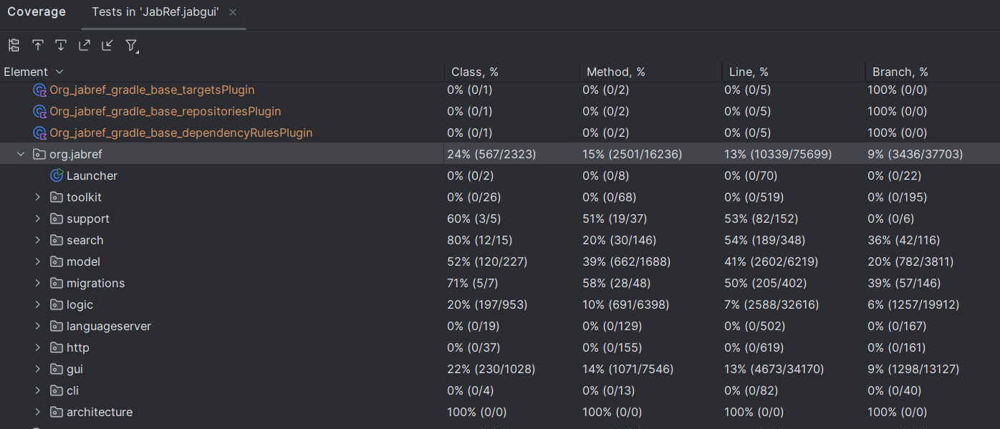
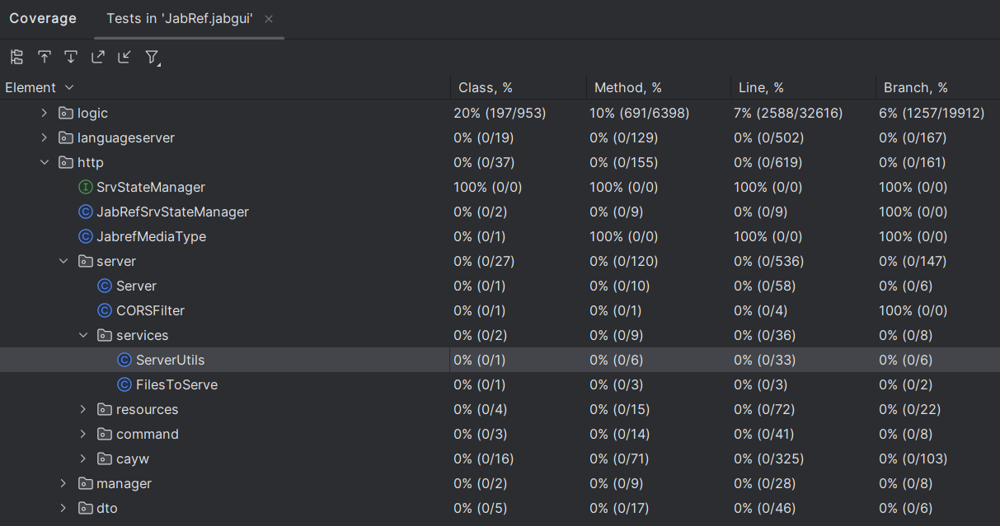
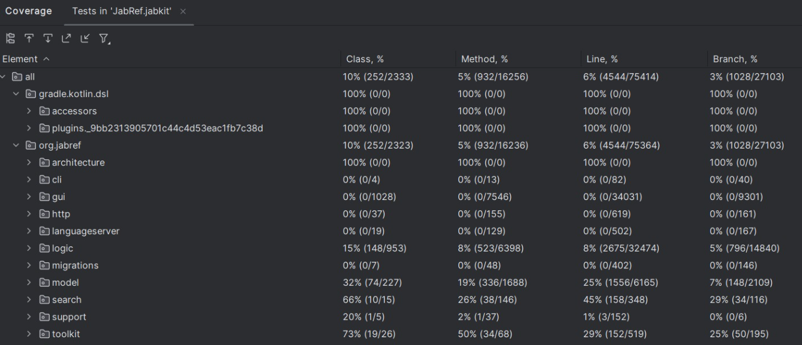
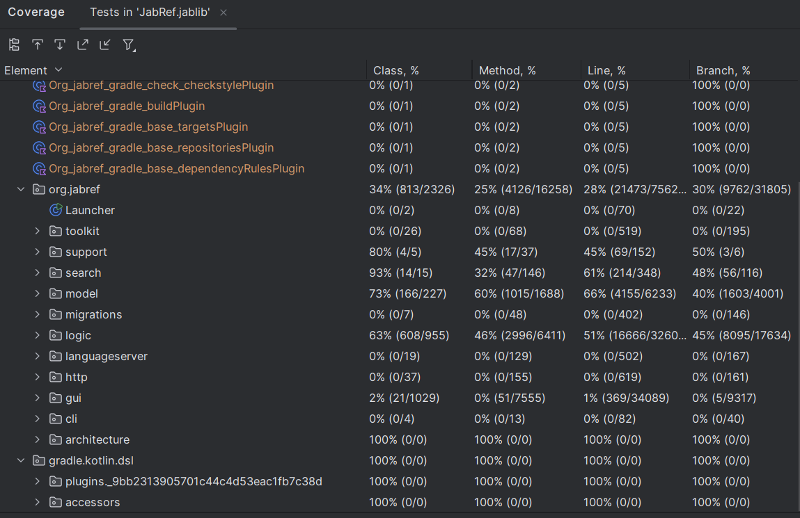
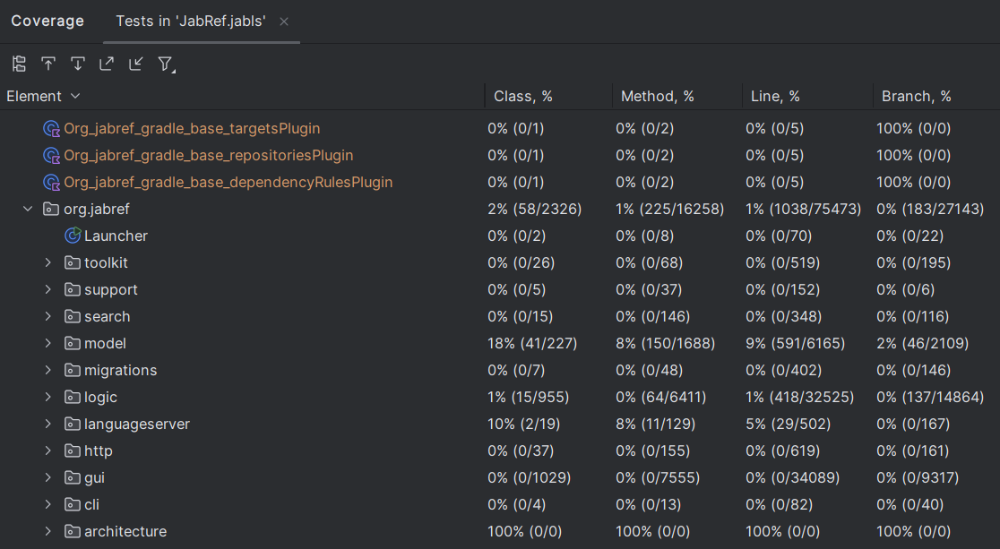
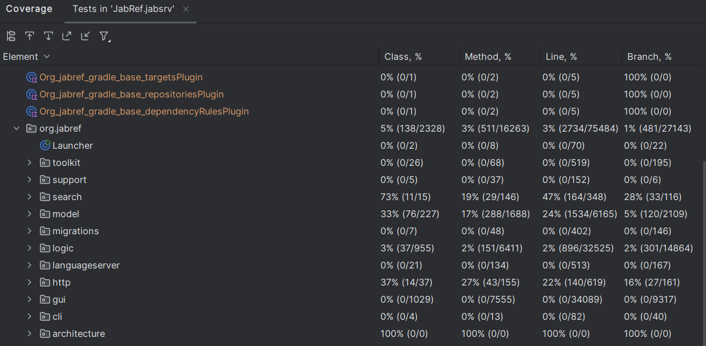

O grupo gerou o relatório de cobertura para todos os módulos que possuem pasta de testes.

Para gerar os testes do item (#G), decidiu-se focar no módulo da interface gráfica (GUI), escolhendo classes com métodos com ramificações para aumentar a cobertura.

**Branch coverage para o jabgui, o módulo do projeto responsável pela interface gráfica:**

Exemplo ampliado:

**Branch coverage para o jabkit, o módulo do projeto responsável por ferramentas internas e utilitários:**

**Branch coverage para o jablib, o módulo do projeto responsável pelo núcleo da lógica do projeto:**

**Branch coverage para o jabls (live search), o módulo do projeto responsável pelas lógicas de busca:**

**Branch coverage para o jabsrv, o módulo que permite rodar o projeto como servidor local ou remoto:**

