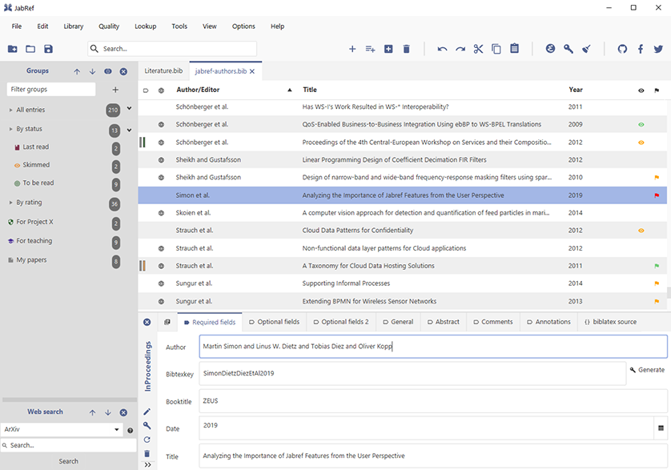

# JabRef Bibliography Management [](https://apidia.net/java/JabRef/main)

JabRef is an open-source, cross-platform citation and reference management tool.

Stay on top of your literature: JabRef helps you to collect and organize sources, find the paper you need and discover the latest research.



## Features

JabRef is available free of charge and is actively developed.
It supports you in every step of your research work.

### Collect

- Search across many online scientific catalogues like CiteSeer, CrossRef, Google Scholar, IEEEXplore, INSPIRE-HEP, Medline PubMed, MathSciNet, Springer, arXiv, and zbMATH
- Import options for over 15 reference formats
- Easily retrieve and link full-text articles
- Fetch complete bibliographic information based on ISBN, DOI, PubMed-ID and arXiv-ID
- Extract metadata from PDFs
- Import new references directly from the browser with one click using the [official browser extension](https://github.com/JabRef/JabRef-Browser-Extension) for [Firefox](https://addons.mozilla.org/en-US/firefox/addon/jabref/?src=external-github),  [Chrome](https://chrome.google.com/webstore/detail/jabref-browser-extension/bifehkofibaamoeaopjglfkddgkijdlh), [Edge](https://microsoftedge.microsoft.com/addons/detail/pgkajmkfgbehiomipedjhoddkejohfna), and [Vivaldi](https://chrome.google.com/webstore/detail/jabref-browser-extension/bifehkofibaamoeaopjglfkddgkijdlh)

### Organize

- Group your research into hierarchical collections and organize research items based on keywords/tags, search terms, or your manual assignments
- Advanced search and filter features
- Complete and fix bibliographic data by comparing with curated online catalogs such as Google Scholar, Springer, or MathSciNet
- Customizable citation key generator
- Customize and add new metadata fields or reference types
- Find and merge duplicates
- Attach related documents: 20 different kinds of documents supported out of the box, completely customizable and extendable
- Automatically rename and move associated documents according to customizable rules
- Keep track of what you read: ranking, priority, printed, quality-assured

### Cite

- Native BibTeX and BibLaTeX support
- Cite-as-you-write functionality for external applications such as Emacs, Kile, LyX, Texmaker, TeXstudio, Vim and WinEdt.
- Format references using one of thousands of built-in citation styles or create your own style
- Support for Word and LibreOffice/OpenOffice for inserting and formatting citations

### Share

- Many built-in export options or create your export format
- Library is saved as a simple text file, and thus it is easy to share with others via Dropbox and is version-control friendly
- Work in a team: sync the contents of your library via a SQL database

## Installation

Fresh development builds are available at [builds.jabref.org](https://builds.jabref.org/main/).
The [latest stable release is available at FossHub](https://downloads.jabref.org/).

Please see our [Installation Guide](https://docs.jabref.org/installation).

## JabKit

JabRef offers a CLI application.

You can run it using JBang.
We provide details at [`.jbang/README.md`](.jbang/README.md).

You can also run JabKit using docker:

```terminal
docker run ghcr.io/jabref/jabkit:edge --help
```

## Bug Reports, Suggestions, Other Feedback

[](https://donations.jabref.org)
[](https://paypal.me/JabRef)

We are thankful for any bug reports or other feedback.
If you have ideas for new features you want to be included in JabRef, tell us in [the feature section](http://discourse.jabref.org/c/features) of our forum!
If you need support in using JabRef, please read the [user documentation](https://docs.jabref.org/), especially the [frequently asked questions (FAQ)](https://docs.jabref.org/faq) and also take a look at our [community forum](https://discourse.jabref.org/c/help/7).
You can use our [GitHub issue tracker](https://github.com/JabRef/jabref/issues) to file bug reports.

An explanation of donation possibilities and usage of donations is available at our [donations page](https://donations.jabref.org).

## Contributing

Want to be part of a free and open-source project that tens of thousands of researchers use every day?
Please take a look at our [guidelines for contributing](CONTRIBUTING.md).

## Building from Source

Please see [Building from source](https://docs.jabref.org/installation#building-from-source) for instructions on how to build JabRef from sources.

## Research and Education

JabRef welcomes research applied to it.
The current list of papers where JabRef helped to enhance science is maintained at <https://github.com/JabRef/jabref/wiki/JabRef-in-the-Media>.

The JabRef team also fosters to use JabRef in Software Engineering training.
We offer guidelines for this at <https://devdocs.jabref.org/teaching.html>.

When citing JabRef, please use the following citation:

```bibtex
@Article{jabref,
  author  = {Oliver Kopp and Carl Christian Snethlage and Christoph Schwentker},
  title   = {JabRef: BibTeX-based literature management software},
  journal = {TUGboat},
  volume  = {44},
  number  = {3},
  pages   = {441--447},
  doi     = {10.47397/tb/44-3/tb138kopp-jabref},
  issn    = {0896-3207},
  issue   = {138},
  year    = {2023},
}
```

DOI (also includes [full text](https://tug.org/TUGboat/tb44-3/tb138kopp-jabref.pdf)): [10.47397/tb/44-3/tb138kopp-jabref](https://doi.org/10.47397/tb/44-3/tb138kopp-jabref).

## Sponsoring

JabRef development is powered by YourKit Java Profiler  
[](https://www.yourkit.com/java/profiler/)

## ProductMap File Analysis Result

This section contains an analysis of ProductMap files. Each file has a link to its source.

| Github File | ProductMap File URL |
|-------------|---------------------|
| [src/main/java/org/jabref/gui/maintable/MainTableTooltip.java](https://github.com/JabRef/jabref/blob/main/src/main/java/org/jabref/gui/maintable/MainTableTooltip.java) | [View File](https://product-map.ai/app/public?url=https://github.com/JabRef/jabref/blob/main/src/main/java/org/jabref/gui/maintable/MainTableTooltip.java ) |

### ProductMap - Contact Us

For any inquiries, feel free to [contact ProductMap.ai](https://product-map.ai).

## License

This project is licensed under the terms described in the [LICENSE](LICENSE) file.

JabRef is distributed under the **MIT License**,  
which allows users to freely **use**, **modify**, and **distribute** the software  
in accordance with the license terms.

By using JabRef, you acknowledge and accept these terms.  
For complete details, please refer to the [LICENSE](LICENSE) file included in this repository.

