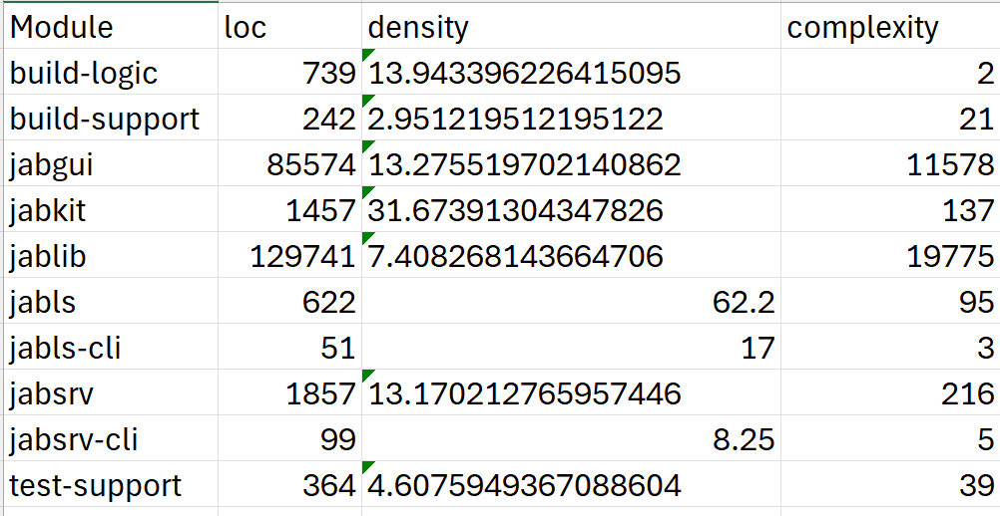

This shows how to recreate the results generated via Metrics code and Test Metrics.

# Key Metrics:
## Code Structure: 
### 1. LOC (per file/module)
### 2. Comment Density 
### 3. Cyclomatic Complexity
### 4. Number of Unit Tests

## **Modules**:
|    Module    |    Module    |
| ------------- | ------------- |
| build-logic   | build-support |
| jabgui        | jabkit        |
| jablib        | jabls         |
| jabsrv       | jabsrv-cli    |

#### + build-logic
#### + build-support
#### + jabgui
#### + jabkit
#### + jablib
#### + jabls
#### + jabls-cli
#### + jabsrv
#### + jabsrv-cli
#### + test-support



These *modules* were chosen as they contained the 'src' code for major contributions to the project, their file extensions includes: .kts (kotlin), .java, and .css


## Library 

The libraries used were a mixture of **lizard** and **pygount**. Although, the script was written in Python, these libraries support the analysis of many languages via source code from files. 

### Steps to Recreate: 

1. main() 
	- Get the root dir path os.path.abs(path(os.curdir))
	- Get all paths that have 'src' folders, save as a list
	- Create a for loop that iterates through the path list
2. Filter files
	- Filter files in that src folder to disregard any resources (.png, .tff, etc.)
	- Return this list to the main for loop 
3. Evaluate files 
	- This is the heartbeat of the program that computes the metrics.
	```python
 
	for file in files:
		i = lizard.analyze_file(file) 
        	loc = i.__dict__.get("nloc") 
        	analyze = SourceAnalysis.from_file(file, "pygount") 
        	comments = analyze.documentation_count # typeof int
        	for func in i.function_list:
                	cc = func.__dict__.get('cyclomatic_complexity')
		return dict
   ```
	- Then calculate the comment density, LOC, and cyclomatic complexity
4. Print results 
	- Use CSV library to print the list of dictionaries 
5. Run the testMetrics.py file using any python interpreter. Results will be output into the terminal. Current number of tests = 3643
