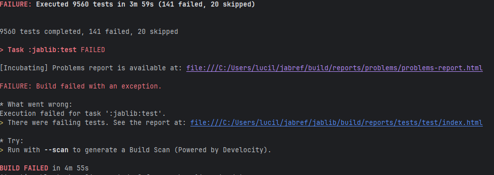
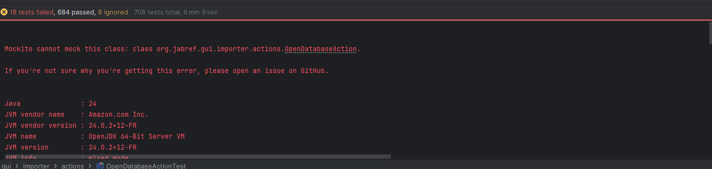
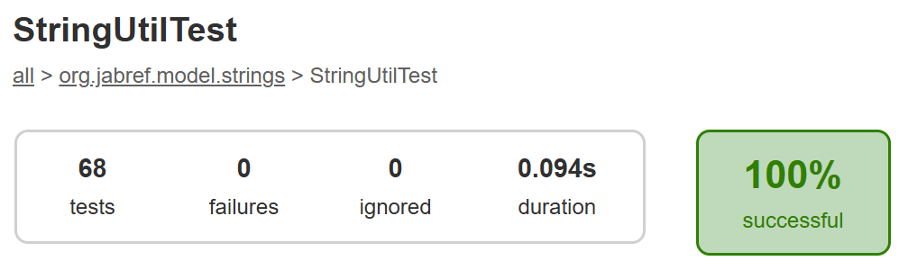

## To Run Tests

### New test cases
These test cases were added in order to assist with the lack of code coverage on certain branches: specifically, the citationstyle and formatter modules.

In order to recreate the following: 
- Import assertThrows and assertNotEquals
- JabRefDataItemDataProvider.java
- FormatterTest.java

### Test Cases

 Class Name | Test Case                               | Rational
------------|-----------------------------------------|----------
JabRefDataItemProvider | toJsonMultipleAuthorOneEntry            | Test that the citationstyle module correctly formats a citation with multiple authors
JabRefDataItemProvider | toJsonNoEntryType                       | Test that the citationstyle module correctly handles an entry with no entry type
FormatterTest | getFormatTestWhiteSpace                 | Test that the formatter module correctly handles a whitespace character in the input
FormatterTest | getHugeInputSize                        | Test that the formatter module correctly handles a large input size
FormatterTest | testNonASCIICharacters                  | Test that the formatter module correctly handles non-ascii characters
JournalAbbreviationTest | noMatch_returnsOriginal                 |  Tests behevior that there is  no matching abbrevation when it should not exist. Since the return is an Optional, we need to check that it returns empty rather than give a null value
JournalAbbreviationTest | multipleSameScore_tieBreakDeterministic | Tests if fuzzy matching produces the same results when there are mulptible enteries with similar scores. This checks how the class breaks dies of similar abbrevations, and ensures it doesnt return a random result each time
JournalAbbreviationTest | trimsWhitespaceAndPunctuation           | Tests if abbrevation handles messy inputs, and removes white spaces
BstCaseTest | changeCase_empty_noChange               |  Tests that the BstCase class correctly handles an empty string,by keep it empty for each format type rather than assign a random value to it
BstCaseTest | changeCase_titleCase_wordBoundarie  | Test that the BstCase class correctly handles a title case string of different character properting into lower case, while preserving word boundries/whitespace, and special characters

## To replicate JabRefDataItemProvider: 
- **toJsonMultipleAuthorOneEntry**
  - Create BibDatabase
  - iniatlize entry with 'and' between two authors
  - assertEquals
- **toJsonNoEntryType**
  - Create BibDatabase
  - iniatlize entry, excepted value will contain a field that does not exist in the regular
  - assertNotEquals

## To replicate FormatterTest: 
-  **testNonASCIICharacters**
  - assertNotEquals(" ", result) 
- **getHugeInputSize**
  - Initalize a large input then assertNotNull(result)
- **getFormatTestWhiteSpace**
  - assertNotThrow non-ascii

#To Run Specific Test Cases
 - Run JabRefDataItemProviderTest.java
 - Run FormatterTest.java
 - Run JournalAbbreviationTest.java
 - Run BstCaseTest.java

## New Test Results

Coverage improvement analysis (compare with Baseline)

##New Test Coverage
**Rationale**:
- The Multiple author one entry test was created as the current tests lacked testing of multiple authors in a single entry, only one author per entry (even two authories one entry)
- The no entry type checks that a field that does not match the result field from the jabref object.
- testNonASCIICharacters, they test plain text so far, so added a test to check different unicodes.
- There is no performance tests so far, so added an input one.
- No one tested if the user simply enters a white space, no need to compute power...

## Test Results

Coverage improvement analysis (compare with Baseline)

## StringUtilTests Added

| Test name | Description / rationale |
|-----------|----------------------------|
| normalizeAuthorName_trimsAndReorders | Test that author names with “Last, First” normalize correctly |
| normalizeAuthorName_handlesSingleName | Ensure single-name strings are left intact |
| normalizeAuthorName_nullOrEmpty_returnsEmpty | Edge / null handling—no NullPointerException |
| generateSafeFilename_replacesIllegalChars | FileNameUtil must sanitize illegal file system characters |
| mergeBibEntries_overwritesOrKeepsNonEmpty | Merging logic should override or fill fields correctly |
| mergeBibEntries_nullOverride_throws | Robustness: null override should cause exception |

## Test Results

