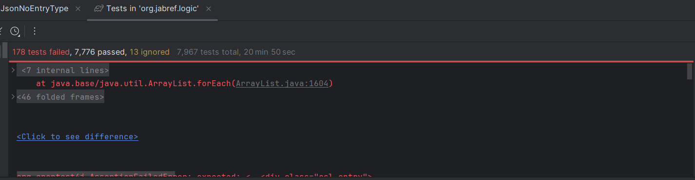

## To Run Tests

### New test cases
These test cases were added in order to assist with the lack of code coverage on certain branches: specifically, the citationstyle and formatter modules.

In order to recreate the following: 
- Import assertThrows and assertNotEquals
- JabRefDataItemDataProvider.java
- FormatterTest.java

### Test Cases

JabRefDataItemProvider             | FormatterTest
----------------------------------|---------------------------
| toJsonMultipleAuthorOneEntry       | getFormatTestWhiteSpace |
| toJsonNoEntryType                  | getHugeInputSize |
| -                                 | testNonASCIICharacters |

## To replicate JabRefDataItemProvider: 
- **toJsonMultipleAuthorOneEntry**
  - Create BibDatabase
  - iniatlize entry with 'and' between two authors
  - assertEquals
- **toJsonNoEntryType**
  - Create BibDatabase
  - iniatlize entry, excepted value will contain a field that does not exist in the regular
  - assertNotEquals

## To replicate FormatterTest: 
-  **testNonASCIICharacters**
  - assertNotEquals(" ", result) 
- **getHugeInputSize**
  - Initalize a large input then assertNotNull(result)
- **getFormatTestWhiteSpace**
  - assertNotThrow non-ascii
**Rationale**:
- The Multiple author one entry test was created as the current tests lacked testing of multiple authors in a single entry, only one author per entry (even two authories one entry)
- The no entry type checks that a field that does not match the result field from the jabref object.
- testNonASCIICharacters, they test plain text so far, so added a test to check different unicodes.
- There is no performance tests so far, so added an input one.
- No one tested if the user simply enters a white space, no need to compute power...

## Test Results

Coverage improvement analysis (compare with Baseline)
