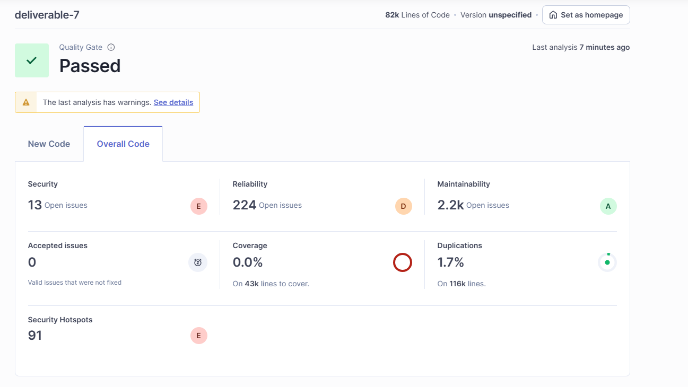

# Static Analysis
---

## Tool Used:
SonarQube

---
## Key findings:
The SonarQube static analysis was run on the `jablib` module using the Gradle SonarQube plugin.  
The analysis detected several code quality issues categorized as **Code Smells** and **Maintainability** concerns.

---
## Fix summary

###
**Module:** java/org/jabref/logic
**File:** ModsImporter.java

**Type:**: XML External Entity (XXE) Injection & High code complexity
**Description:**: Since there is not garntee that the XMLStream Reader interpates the files correctly,explotation could cause local files to be exposed or corrupted.Similar there is a lot of reputition in event handle and some redunant reader.next() calls cause for a high complexity in the function.  

**Before**
```java
private void parseOriginInfo(XMLStreamReader reader, Map<Field, String> fields) throws XMLStreamException {
        List<String> places = new ArrayList<>();

        while (reader.hasNext()) {
            reader.next();

            if (isStartXMLEvent(reader)) {
                String elementName = reader.getName().getLocalPart();
                switch (elementName) {
                    case "issuance" -> {
                        reader.next();
                        if (isCharacterXMLEvent(reader)) {
                            putIfValueNotNull(fields, new UnknownField("issuance"), reader.getText());
                        }
                    }
                    case "placeTerm" -> {
                        reader.next();
                        if (isCharacterXMLEvent(reader)) {
                            appendIfValueNotNullOrBlank(places, reader.getText());
                        }
                    }
                    case "publisher" -> {
                        reader.next();
                        if (isCharacterXMLEvent(reader)) {
                            putIfValueNotNull(fields, StandardField.PUBLISHER, reader.getText());
                        }
                    }
                    case "edition" -> {
                        reader.next();
                        if (isCharacterXMLEvent(reader)) {
                            putIfValueNotNull(fields, StandardField.EDITION, reader.getText());
                        }
                    }
                    case "dateIssued",
                         "dateCreated",
                         "dateCaptured",
                         "dateModified" -> {
                        reader.next();
                        if (isCharacterXMLEvent(reader)) {
                            putDate(fields, elementName, reader.getText());
                        }
                    }
                }
            }

            if (isEndXMLEvent(reader) && "originInfo".equals(reader.getName().getLocalPart())) {
                break;
            }
        }

        putIfListIsNotEmpty(fields, places, StandardField.ADDRESS, ", ");
    }
```

**After:**
```java
    private void parseOriginInfo(XMLStreamReader reader, Map<Field, String> fields) throws XMLStreamException {
    List<String> places = new ArrayList<>();

    while (reader.hasNext()) {
        reader.next();

        if (isStartXMLEvent(reader)) {
            String elementName = reader.getName().getLocalPart();


            if (isCharacterXMLEvent(reader)) {
                continue;
            }
            String text = getElementTextSafely(reader);
            switch (elementName) {
                case "issuance" ->
                        putIfValueNotNull(fields, new UnknownField("issuance"), text);
                case "placeTerm" ->
                        appendIfValueNotNullOrBlank(places, text);
                case "publisher" ->
                        putIfValueNotNull(fields, StandardField.PUBLISHER, text);
                case "edition" ->
                        putIfValueNotNull(fields, StandardField.EDITION, text);
                case "dateIssued", "dateCreated", "dateCaptured", "dateModified" ->
                        putDate(fields, elementName, text);
            }
        }

        if (isEndXMLEvent(reader) && "originInfo".equals(reader.getLocalName())) {
            break;
        }
    }

    putIfListIsNotEmpty(fields, places, StandardField.ADDRESS, ", ");
}

private String getElementTextSafely(XMLStreamReader reader) throws XMLStreamException {
    while (reader.hasNext()) {
        reader.next();

        if (isCharacterXMLEvent(reader)) {
            return reader.getText();
        }

        if (isEndXMLEvent(reader)) {
            return null;
        }
    }
    return null;
}
```
**Fix:** Reduce overall code complexity making use of java's XML library, and spilt getting the election to its own function. 
### Added security checks

**Module:** Jablib /java/org/jabref/logic/xmp

**File:**`XmpUtilWriter.java`

**Type:** Security Vulnerability

**Description:** Assures best Java practices to have file creation in try/catch block.

**Before**
```java 
public void writeXmp(){ 
    .
    .
    .
// Read from another file
// Reason: Apache PDFBox does not support writing while the file is opened
// See https://issues.apache.org/jira/browse/PDFBOX-4028
Path newFile = Files.createTempFile("JabRef", "pdf");
Make sure publicly writable directories are used safely here.
try (PDDocument document = Loader.loadPDF(path.toFile())) {
    if (document.isEncrypted()) {
        throw new EncryptedPdfsNotSupportedException();
    }
    // Write schemas (PDDocumentInformation and DublinCoreSchema) to the document metadata
    if (!resolvedEntries.isEmpty()) {
        writeDocumentInformation(document, resolvedEntries.getFirst(), null);
        writeDublinCore(document, resolvedEntries, null);
    }
}
```
**After**
```java 
public void writeXmp() {
    .
    .
    .
    // Read from another file
        // Reason: Apache PDFBox does not support writing while the file is opened
        // See https://issues.apache.org/jira/browse/PDFBOX-4028
        try {
            Path newFile = Files.createTempFile("JabRef", "pdf");

            try (PDDocument document = Loader.loadPDF(path.toFile())) {
                if (document.isEncrypted()) {
                    throw new EncryptedPdfsNotSupportedException();
                }

                // Write schemas (PDDocumentInformation and DublinCoreSchema) to the document metadata
                if (!resolvedEntries.isEmpty()) {
                    writeDocumentInformation(document, resolvedEntries.getFirst(), null);
                    writeDublinCore(document, resolvedEntries, null);
                }

                // Save updates to original file
                try {
                    document.save(newFile.toFile());
                    FileUtil.copyFile(newFile, path, true);
                } catch (IOException e) {
                    LOGGER.debug("Could not write XMP metadata", e);
                    throw new TransformerException("Could not write XMP metadata: " + e.getLocalizedMessage(), e);
                }
            }
        } finally {
            Files.delete(newFile); // Files.deleteIfExists(newFile);
        }
    }
```
**Fix**
Try/catch/finally block was added to ensure publicly writable directories are used safely here.


### Fixed Code Smell: Missing Default Clause in Switch Statement

**File:** `Formatters.java`  
**Issue Type:** Code Smell (Sonar Rule S131)  
**Description:**  
SonarQube reported that the `switch` statement in `getFormatterForModifier()` lacked a `default` case.  
Defensive programming best practices recommend including a default branch to handle unexpected values.
**Before:**
```java
public static Optional<Formatter> getFormatterForModifier(@NonNull String modifier) {
    switch (modifier) {
        case "lower":
            return Optional.of(new LowerCaseFormatter());
        case "upper":
            return Optional.of(new UpperCaseFormatter());
        case "capitalize":
            return Optional.of(new CapitalizeFormatter());
        case "titlecase":
            return Optional.of(new TitleCaseFormatter());
        case "sentencecase":
            return Optional.of(new SentenceCaseFormatter());
        case "veryshorttitle":
            return Optional.of(new VeryShortTitleFormatter());
        case "shorttitle":
            return Optional.of(new ShortTitleFormatter());
    }
}
```
**After:**
```java
public static Optional<Formatter> getFormatterForModifier(@NonNull String modifier) {
    switch (modifier) {
        case "lower":
            return Optional.of(new LowerCaseFormatter());
        case "upper":
            return Optional.of(new UpperCaseFormatter());
        case "capitalize":
            return Optional.of(new CapitalizeFormatter());
        case "titlecase":
            return Optional.of(new TitleCaseFormatter());
        case "sentencecase":
            return Optional.of(new SentenceCaseFormatter());
        case "veryshorttitle":
            return Optional.of(new VeryShortTitleFormatter());
        case "shorttitle":
            return Optional.of(new ShortTitleFormatter());
        default:
            // No matching explicit case found; handled below
            break;
    }
}
```
**Fix**  
Added a `default:` branch with a comment and `break;` statement to satisfy SonarQube rule S131.  
This provides defensive handling for future modifier types without altering functionality.

--- 

Previous results:


Updated result:
No significant change.

## Overall
Due to the complexity of the project, no major changes in SonarQube result as compared to project size these were small additions.

---
## Group Contributions

| Member | Task                                                         | Notes                                                                 |
| -------- |--------------------------------------------------------------|-----------------------------------------------------------------------|
| Lucille | Fix Code Smell: Code Complexity and possibl XML Injection    | Removed redunacy and added helper function to safely get the xml text |
| Geoffrey | Fixed Code Smell: Missing Default Clause in Switch Statement | Added simple comment and break                                        |
| Vanessa | Setup SonarQ configurations                                  | In Config files (build.gradle)                                        |


On Unix-like systems:
./gradlew build sonar
