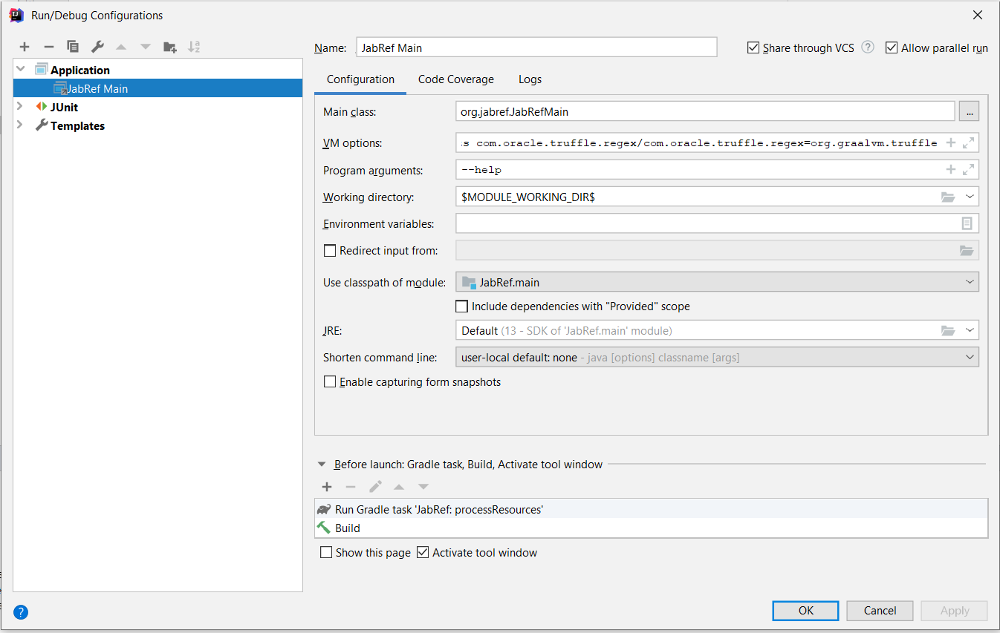

# Develop JabRef

This page presents all development informatation around JabRef. For users documentation see <https://docs.jabref.org>.

## How tos

- [Sync your fork with the JabRef repository](https://help.github.com/articles/syncing-a-fork/)

## Command Line

The package `org.jabref.cli` is responsible for handling the command line options.

During development, one can configure IntelliJ to pass command line paramters:

Passing command line arguments using gradle is currently not possible as all arguments (such as `-Dfile.encoding=windows-1252`) are passed to the application.

Without jlink, it is not possible to generate a fat jar any more. During development, the capabilities of the IDE has to be used.

## Groups

UML diagram showing aspects of groups: [Groups.uml](Gropus.uml).

## Decision Records

This log lists the decisions for JabRef.

<!-- adrlog -->

- [ADR-0000](0000-use-markdown-architectural-decision-records.md) - Use Markdown Architectural Decision Records
- [ADR-0001](0001-use-crowdin-for-translations.md) - Use Crowdin for translations
- [ADR-0002](0002-use-slf4j-for-logging.md) - Use slf4j together with log4j2 for logging
- [ADR-0003](0003-use-gradle-as-build-tool.md) - Use Gradle as build tool
- [ADR-0003](0003-use-openjson-as-replacement-for-org-json.md) - Use openjson as replacement for org.json
- [ADR-0004](0004-use-mariadb-connector.md) - Use MariaDB Connector
- [ADR-0005](0005-fully-support-utf8-only-for-latex-files.md) - Fully Support UTF-8 Only For LaTeX Files
- [ADR-0006](0006-only-translated-strings-in-language-file.md) - Only translated strings in language file
- [ADR-0007](0007-human-readable-changelog.md) - Provide a human-readable changelog

<!-- adrlogstop -->

For new ADRs, please use [docs/template.md](docs/template.md) as basis.
More information on MADR is available at <https://adr.github.io/madr/>.
General information about architectural decision records is available at <https://adr.github.io/>.
