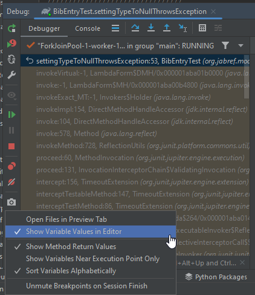

# IntelliJ Hints

{: .highlight }
Did you know that [IntelliJ allows for reformatting selected code](https://www.jetbrains.com/help/idea/reformat-and-rearrange-code.html#reformat\_code) if you press <kbd>Ctrl</kbd> + <kbd>Alt</kbd> + <kbd>L</kbd>?

## Key hints for IntelliJ

* <kbd>Shift</kbd>+<kbd>Shift</kbd> (AKA double-shift): Open the search dialog.
* <kbd>Ctrl</kbd>+<kbd>N</kbd>: Open the search dialog and select search for a class.
* <kbd>Ctrl</kbd>+<kbd>Shift</kbd>+<kbd>F</kbd>: Search everywhere in the code base.
* <kbd>Alt</kbd>+<kbd>F1</kbd> and then <kbd>Enter</kbd>: Locate the file in the search bar on the left side.
* <kbd>Ctrl</kbd>+<kbd>Shift</kbd>+<kbd>T</kbd>: Navigate from a class to the test class.

## Show variable values in IntelliJ

1. Go to a test case (example: [`org.jabref.model.entry.BibEntryTest#settingTypeToNullThrowsException`](https://github.com/JabRef/jabref/blob/main/src/test/java/org/jabref/model/entry/BibEntryTest.java#L52-L52)
2. Set the breakpoint to the first line
3. Execute the test
4. Go to the settings of the debugger and activate "Show Variable Values in Editor" and "Show Method Return Values"
   <figure>
     
     <figcaption>Debugger Configuration</figcaption>
   </figure>

<!-- markdownlint-disable-file MD033 -->
