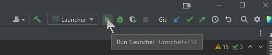

# IntelliJ Hints

{: .highlight }
Did you know that [IntelliJ allows for reformatting selected code](https://www.jetbrains.com/help/idea/reformat-and-rearrange-code.html#reformat\_code) if you press <kbd>Ctrl</kbd> + <kbd>Alt</kbd> + <kbd>L</kbd>?

## Key hints for IntelliJ

* <kbd>Shift</kbd>+<kbd>Shift</kbd> (AKA double-shift): Open the search dialog.
* <kbd>Ctrl</kbd>+<kbd>N</kbd>: Open the search dialog and select search for a class.
* <kbd>Ctrl</kbd>+<kbd>Shift</kbd>+<kbd>F</kbd>: Search everywhere in the code base.
* <kbd>Alt</kbd>+<kbd>F1</kbd> and then <kbd>Enter</kbd>: Locate the file in the search bar on the left side.
* <kbd>Ctrl</kbd>+<kbd>Shift</kbd>+<kbd>T</kbd>: Navigate from a class to the test class.

---
parent: Set up a local workspace
grand_parent: Getting into the code
nav_order: 49
---

## Other notes on IntelliJ

{: .note}
Here, some notes on IntelliJ setup are written down.
These are intended for pro users.

You should use IntelliJ IDEA's internal build system for compiling and running JabRef tests during development, because it is usually more responsive.
Essentially, you now have the best of both worlds:
You can run Gradle tasks using the Gradle Tool Window.
You can compile and run tests with IntelliJ's faster internal build system
(unless you haven't made changes to input files that generate sources).

{: .important}
When using IntelliJ's build system, **it is important** that you understand that JabRef relies on generated sources which are only built through Gradle.
Therefore, to build or update these dependencies you need to run the `run` (or `assemble`) Gradle task at least once.
When you followed this guide, you should have done it in the Gradle setup.

Running JabRef itself through IntelliJ's build system is **not** possible as we encounter difficulties when reading resources though `.class.getResource(...)`.
Although solutions are discussed in length [on stackoverflow](https://stackoverflow.com/q/26328040/873282), there is no "good" solution for us.

## Running JabRef using IntelliJ's build system

{ :note }
Maybe does not work

To run JabRef from IntelliJ, we let IntelliJ create a launch configuration:

Locate the class `Launcher`:
Press <kbd>Ctrl</kbd>+<kbd>N</kbd>.
Then, the "Search for classes dialog" pops up.
Enter `Launcher`.
Now, only one class should have been found:





Press <kbd>Enter</kbd> to jump to that class.

Hover on the green play button.





Then, click on it.
A popup menu opens.
Choose the first entry and click on it.





Then, JabRef starts.

You also have an entry in the Launch configurations to directly launch the JabRef GUI:





You can also click on the debug symbol next to it to enable stopping at breakpoints.
