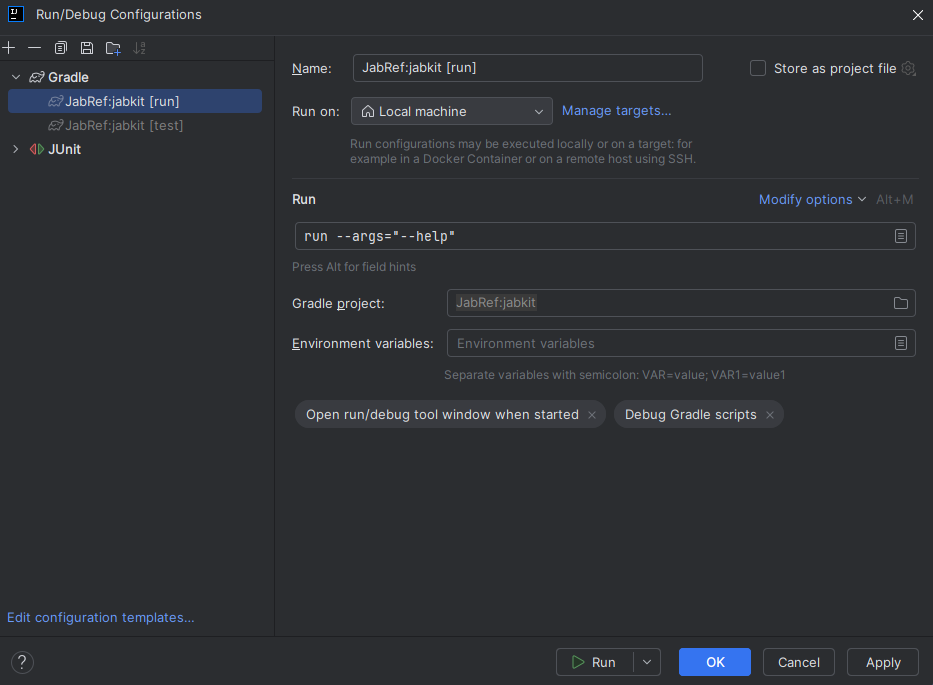

# Command Line Interface

The module `jabkit` is mainly responsible for handling the command line options. The module `jabgui` also provides some rudimentary functionality, mainly responsible for command line interaction with the gui.

In both modules, the package `org.jabref.cli` uses the PicoCli library to process arguments.

During development, one can configure IntelliJ to pass command line parameters:

Passing command line arguments using gradle is possible by adding the arguments to the run command with the `--args` option.

Without [jlink](https://docs.oracle.com/en/java/javase/11/tools/jlink.html), it is not possible to generate a fat jar anymore. During development, the capabilities of the IDE has to be used.
