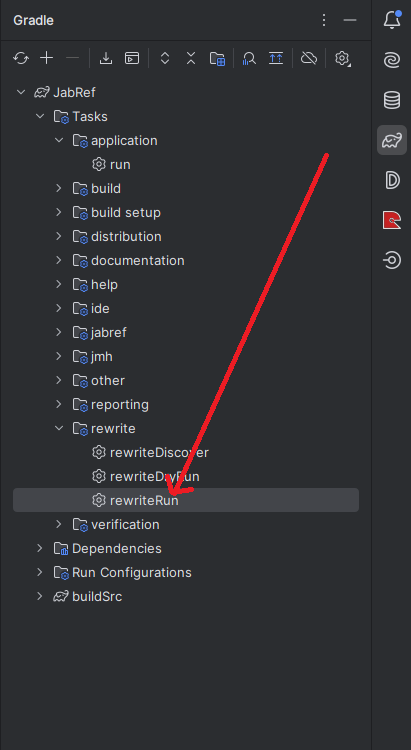
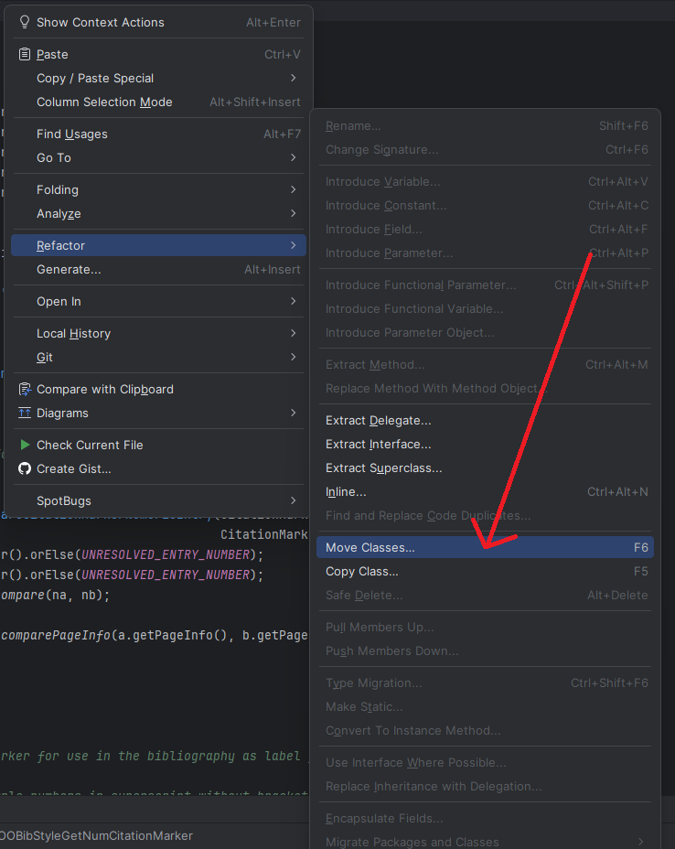
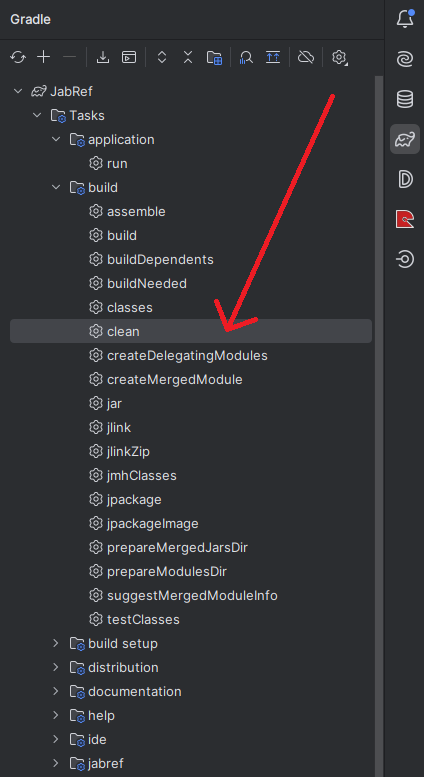
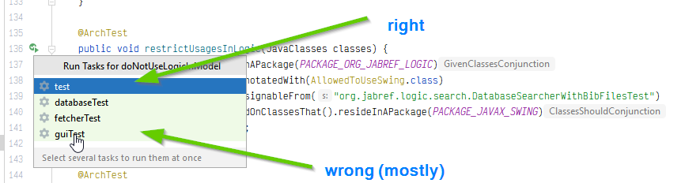
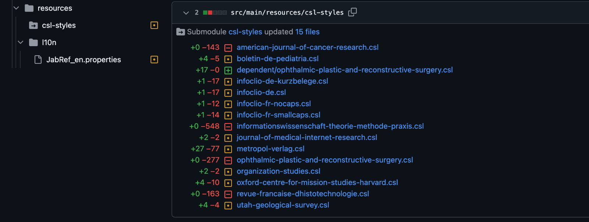
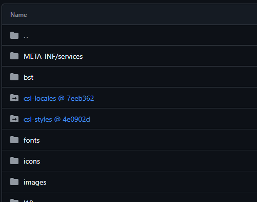

# Frequently Asked Questions (FAQ)

Following is a list of common errors encountered by developers which lead to failing tests, with their common solutions:

## git hints

* Sync your fork with the JabRef repository: [General howto by GitHub](https://help.github.com/articles/syncing-a-fork/)
* Branches and pull requests (🇩🇪): [https://github.com/unibas-marcelluethi/software-engineering/blob/master/docs/week2/exercises/practical-exercises.md](https://github.com/unibas-marcelluethi/software-engineering/blob/master/docs/week2/exercises/practical-exercises.md)

## Failing GitHub workflow "Sync fork with upstream"

To ease development, a GitHub workflow automatically updates your `main` branch daily.
However, it is not allowed to update your files if the GitHub workflows are updated by the JabRef team.
Therefore, GitHub notifies you now and then that "Sync fork with upstream failed for main branch".

To solve this issue, open your GitHub repository in your browser.
Then, click "Sync fork" to get your fork up-to-date and get the workflow passing again.


## Failing tests

### Failing <b>Checkstyle</b> tests

JabRef follows a pre-defined style of code for uniformity and maintainability that must be adhered to during development. To set up warnings and auto-fixes conforming to these style rules in your IDE, follow [Step 3](https://devdocs.jabref.org/getting-into-the-code/guidelines-for-setting-up-a-local-workspace/intellij-13-code-style.html) of the process to set up a local workspace in the documentation. Ideally, follow all the [set up rules](https://devdocs.jabref.org/getting-into-the-code/guidelines-for-setting-up-a-local-workspace/) in the documentation end-to-end to avoid typical set-up errors.<br> <b>Note</b>: The steps provided in the documentation are for IntelliJ, which is the preferred IDE for Java development. The `checkstyle.xml` is also available for VSCode, in the same directory as mentioned in the steps.

### Failing <b>OpenRewrite</b> tests

Execute the Gradle task `rewriteRun` from the `rewrite` group of the Gradle Tool window in IntelliJ to apply the automated refactoring and pass the test:<br>


Background: [OpenRewrite](https://docs.openrewrite.org/) is an automated refactoring ecosystem for source code.

### `org.jabref.logic.l10n.LocalizationConsistencyTest findMissingLocalizationKeys` <span style="color:red">FAILED</span>

You have probably used Strings that are visible on the UI (to the user) but not wrapped them using `Localization.lang(...)` and added them to the [localization properties file](https://github.com/JabRef/jabref/blob/main/src/main/resources/l10n/JabRef_en.properties).

Read more about the [background and format of localization](https://devdocs.jabref.org/code-howtos/localization.html) in JabRef.

### `org.jabref.logic.l10n.LocalizationConsistencyTest findObsoleteLocalizationKeys` <span style="color:red">FAILED</span>

Navigate to the unused key-value pairs in the file and remove them.
You can always click on the details of the failing test to pinpoint which keys are unused.

Background: There are localization keys in the [localization properties file](https://github.com/JabRef/jabref/blob/main/src/main/resources/l10n/JabRef_en.properties) that are not used in the code, probably due to the removal of existing code.
Read more about the [background and format of localization](https://devdocs.jabref.org/code-howtos/localization.html) in JabRef.

### `org.jabref.logic.citationstyle.CitationStyleCatalogGenerator generateCitationStyleCatalog` <span style="color:red">ERROR: Could not find any citation style. Tried with /ieee.csl.</span>

Check the directory `jablib/src/main/resources/csl-styles`.
If it is missing or empty, run `git submodule update`.
Now, check inside if `ieee.csl` exists.
If it does not, run `git reset --hard` **inside that directory**.

### `java.lang.IllegalArgumentException`: Unable to load locale en-US <span style="color:red">ERROR: Could not generate BibEntry citation. The CSL engine could not create a preview for your item.</span>

Check the directory `jablib/src/main/resources/csl-locales`.
If it is missing or empty, run `git submodule update`.
If still not fixed, run `git reset --hard` **inside that directory**.

### `org.jabref.support.CommonArchitectureTest restrictStandardStreams` <span style="color:red">FAILED</span>

Check if you've used `System.out.println(...)` (the standard output stream) to log anything into the console.
This is an architectural violation, as you should use the Logger instead for logging.
More details on [how to log](https://devdocs.jabref.org/code-howtos/logging.html).

### `org.jabref.support.CommonArchitectureTest doNotUseLogicInModel` <span style="color:red">FAILED</span>

One common case when this test fails is when you put any class purely containing business logic inside the `model` package (i.e., inside the directory `org/jabref/model/`).
To fix this, shift the class to a sub-package within the `logic` package (i.e., the directory`org/jabref/logic/`).
An efficient way to do this is to use IntelliJ's built-in refactoring capabilities - right-click on the file, go to "Refactor" and use "Move Class".
The import statement for all the classes using this class will be automatically adjusted according to the new location.<br>
<br>

More information on the architecture can be found at [../getting-into-the-code/high-level-documentation.md](High-level documentation).

### `Check external href links in the documentation / check-links (push)` <span style="color:red">FAILED</span>

This test is triggered when any kind of documentation is touched (be it the JabRef docs, or JavaDoc in code). If you changed something in the documentation, and particularly added/changed any links (to external files or websites), check if the links are correct and working. If you didn't change/add any link, or added correct links, the test is most probably failing due to any of the existing links being broken, and thus can be ignored (in the context of your contribution).

### Failing <b>Fetcher</b> tests

Fetcher tests are run when any file in the `.../fetcher` directory has been touched. If you have changed any fetcher logic, check if the changes are correct. You can look for more details on how to locally [run fetcher tests](https://devdocs.jabref.org/code-howtos/testing.html#fetchers-in-tests).
Otherwise, since these tests depend on remote services, their failure can also be caused by the network or an external server, and thus can be ignored in the context of your contribution. For more information, you can look at [commiting and pushing changes to fetcher tests](https://devdocs.jabref.org/code-howtos/fetchers.html#committing-and-pushing-changes-to-fetcher-files).

## Gradle outputs

### `ANTLR Tool version 4.12.0 used for code generation does not match the current runtime version 4.13.1`

Execute the Gradle task `clean` from the `build` group of the Gradle Tool Window in IntelliJ:<br>
<br>

### `BstVMVisitor.java:157: error: package BstParser does not exist`

Execute gradle task `clean` from the `build` group of the Gradle Tool Window in IntelliJ.

### `No test candidates found`

You probably chose the wrong gradle task:

<br>

## Submodules

### The problem

Sometimes, when contributing to JabRef, you may see `abbrv.jabref.org`, `csl-styles` or `csl-locales` among the changed files in your pull request. This means that you have accidentally committed your local submodules into the branch.



### Context

JabRef needs external submodules (such as CSL style files) for some of its respective features. These are cloned once when you set up a local development environment, using `--recurse-submodules` (you may have noticed). These submodules, in the main branch, are automatically periodically updated but not fetched into local again when you pull, as they are set to be ignored in `.gitmodules` (this is to avoid merge conflicts). So when remote has updated submodules, and your local has the old ones, when you stage all files, these changes are noticed.  
What's strange (mostly an IntelliJ bug): Regardless of CLI or GUI, These changes should ideally not be noticed on staging, as per the `.gitmodules` configuration. However, that is somehow overruled when using IntelliJ's CLI.
  
### Fix

For `csl-styles`, `csl-locales`, and `abbrev.jabref.org`:

```bash
git merge origin/main
git checkout main -- jablib/src/main/resources/csl-styles
git checkout main -- jablib/src/main/resources/csl-locales
git checkout main -- jablib/src/main/abbrv.jabref.org
git commit -m "Fix submodules"
git push
```

#### Alternative method (if the above doesn't work)

1. Edit `.gitmodules`: comment out `ignore = all` (for the respective submodules you are trying to reset)

    ```gitignore
    # ignore = all
    ```

2. `cd` into the changed submodules directory (lets say `csl-styles` was changed):

    ```bash
    cd jablib/src/main/resources/csl-styles
    ```

3. Find the latest submodule commit id from remote (github):

    

    Here, in the case of `csl-styles`, it is `4e0902d`.

4. Checkout the commit:

    ```bash
    git checkout 4e0902d
    ```

5. Now, IntelliJ's commit tab will notice that the submodules have been modified. This means we are on the right track.

6. Use IntelliJ's git manager (commit tab) or `git gui` to commit submodule changes only. Repeat steps 2-5 for other submodules that are shown as modified in the PR. Then, push these changes.

7. Revert the changes in `.gitmodules` (that you made in step 1).

### Prevention

To avoid this, avoid staging using `git add .` from CLI. Preferably use a GUI-based git manager, such as the one built in IntelliJ or open git gui from the command line. Even if you accidentally stage them, don't commit all files, selectively commit the files you touched using the GUI based tool, and push.

## Q: I get `java: package org.jabref.logic.journals does not exist`

A: You have to ignore `buildSrc/src/main` as source directory in IntelliJ as indicated in our [setup guide](https://devdocs.jabref.org/getting-into-the-code/guidelines-for-setting-up-a-local-workspace).

Also filed as IntelliJ issue [IDEA-240250](https://youtrack.jetbrains.com/issue/IDEA-240250).

<!-- markdownlint-disable-file MD033 -->
