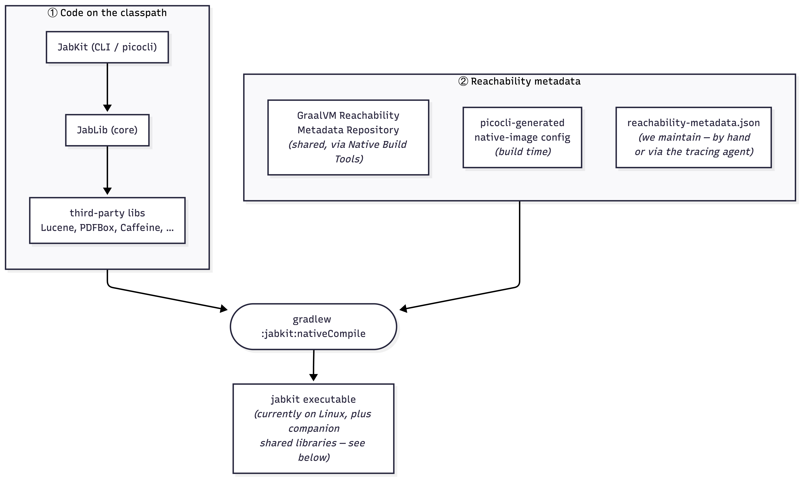

# Building JabKit as a GraalVM native image

JabKit is JabRef's command-line toolkit.

It is currently shipped through `jpackage` (installer and portable build, both bundling a JDK) and [JBang](https://github.com/JabRef/jabref/tree/main/.jbang#running-jabkit) (which downloads a JRE plus `jablib`). For a command-line tool, **JVM start-up is the bottleneck**.

[GraalVM Native Image](https://www.graalvm.org/latest/reference-manual/native-image/) turns JabKit into a self-contained executable that starts in milliseconds. JabKit is the first target because it is headless; the JabLS, JabSrv and JabGui come later.

The catch is the closed-world assumption: Native Image must know every class, method, and resource the program can use. Anything reached only through **reflection, resources, serialization, dynamic proxies, or JNI** must be declared as **reachability metadata**. Producing that metadata correctly, minimally, and with clear ownership is what most of this page is about.

## The big picture

Native Image compilation has two inputs: the **code** to compile (JabKit plus everything it pulls in) and the **reachability metadata**. Both meet in the `nativeCompile` task:



The metadata comes from three places:

| Source | Who maintains it | What it covers |
| --- | --- | --- |
| [GraalVM Reachability Metadata Repository](https://github.com/oracle/graalvm-reachability-metadata) | Upstream/community | Common third-party libraries |
| [picocli-generated native-image config](https://github.com/remkop/picocli/blob/main/picocli-codegen/README.adoc) | picocli annotation processor | JabKit's command model |
| `reachability-metadata.json` | JabRef | Gaps not covered by the first two sources |

## Building the binary

```shell
./gradlew :jabkit:nativeCompile
```

The executable is written to `jabkit/build/native/nativeCompile/jabkit`. The image name is configured in `jabkit/build.gradle.kts`, and the entry point is `org.jabref.toolkit.JabKitLauncher`.

On Linux, ship the whole `nativeCompile` directory, because the executable is accompanied by `.so` libraries.

### Toolchain

The build uses Liberica NIK Full because JabKit reaches `java.desktop`/AWT through PDFBox. See [Liberica NIK](#liberica-nik).

### Platform support

CI builds on Linux (`ubuntu-22.04`) and macOS (`macos-15`). The PDF attachment command currently works only on Linux because it uses an AWT path. See [Liberica NIK](#liberica-nik).

## Where the metadata lives

GraalVM auto-discovers metadata on the classpath under a per-artifact path: `META-INF/native-image/<group>/<artifact>/`. We keep each module's metadata under its own module, so JabLib's stays with JabLib:

```text
jabkit/src/main/resources/META-INF/native-image/org.jabref/jabkit/
    reachability-metadata.json      <- JabKit's own (CLI / picocli-facing)

jablib/src/main/resources/META-INF/native-image/org.jabref/jablib/
    reachability-metadata.json      <- JabLib's own (core library)
```

Both use GraalVM's unified [`reachability-metadata.json`](https://www.graalvm.org/latest/reference-manual/native-image/metadata/) schema, one file with `reflection`, `resources`, and `bundles` sections (JNI is expressed as a `jniAccessible` flag on reflection entries).

> [!NOTE]
> Ownership rule: metadata for a class belongs in that class's module. A reflection entry for a JabLib type goes in JabLib's file, even when only a JabKit command triggers it. This keeps JabLib self-describing for any future native consumer, such as JabSrv or JabLS.

## Adding metadata for a new command

picocli already generates metadata for `@Command` and `@Option` fields. Add only what the command reaches at runtime and static analysis cannot see: reflective library calls, JNI, and resource lookups.

The loop:

1. **Build** the binary: `./gradlew :jabkit:nativeCompile`.
2. **Run the command's real code path.** `--help` covers startup and is enough for baseline metadata; a new command's data path needs the real invocation with real arguments. Reachability gaps only show up on the code path that uses them.
3. **Read the failure.** Missing entries surface as `ClassNotFoundException`, `NoSuchMethodException`, a missing-resource error, or `UnsatisfiedLinkError`.
4. **Add the minimal entry** to the owning module's `reachability-metadata.json`.
5. **Rebuild and rerun** until the command works.
6. **Lock it in** with a clitest case.

### Two ways to find what is missing

- **Error-driven:** run the binary, read the exception, add one entry, repeat. This is precise and minimal, but slower.
- **Tracing agent:** run the command under the native-image agent and trim the generated metadata.

Native Build Tools can run the app under the agent for you:

```shell
./gradlew :jabkit:run -Pagent --args="check consistency path/to/library.bib"
```

The agent over-collects: it records everything touched during the run, which is more than your command usually needs. Trim the output to what the command actually requires.

To see why an entry was collected, run the installed binary with origin tracking enabled:

```shell
JAVA_TOOL_OPTIONS="-agentlib:native-image-agent=config-output-dir=<dir>,experimental-configuration-with-origins" \
  ./jabkit/build/install/jabkit/bin/jabkit --help
```

> [!NOTE]
> **Minimal wins.** Add the narrowest entry that fixes the failure — the
> constructor named by the error, the single missing resource glob, or the
> specific JNI access required. Small entries are reviewable and make it clear
> why each line exists. Use the existing entries in `reachability-metadata.json`
> as templates for the JSON shape.

See GraalVM's [Automatic Metadata Collection](https://www.graalvm.org/latest/reference-manual/native-image/metadata/AutomaticMetadataCollection/) documentation for the agent options.

## Liberica NIK

### Why not stock GraalVM

GraalVM CE and Oracle GraalVM do not support the `java.desktop` module (AWT) ([oracle/graal#4921](https://github.com/oracle/graal/issues/4921)); Red Hat's Mandrel excludes it too. This matters because PDFBox initializes AWT eagerly in `PDDocument`'s static initializer: even operations that render nothing, such as embedding a `.bib` into a PDF, trigger it, and the CE binary dies with `UnsatisfiedLinkError: Can't load library: awt`.

[BellSoft Liberica NIK](https://bell-sw.com/liberica-native-image-kit/) is a GraalVM downstream that ships AWT support, so it compiles that path. It is FOSS and tracks GraalVM; the cost is an extra vendor dependency.

### Setting it up

Use the **Full** variant, which bundles the AWT native libraries. The Standard package does not. To verify the installation, check that `<nik-home>/lib/libawt.so` exists.

The build has no toolchain pinning: the Native Build Tools plugin uses whichever `native-image` it finds through `GRAALVM_HOME`/`JAVA_HOME`.

- **Locally:** install the Liberica NIK Full package that matches the project's JDK version, and point `GRAALVM_HOME` and `JAVA_HOME` at it.
- **In CI** (`jabkit-native-smoke-test.yml`): use [`graalvm/setup-graalvm`](https://github.com/graalvm/setup-graalvm#supported-distributions) with `distribution: liberica` (NIK) and `java-package: jdk+fx` (the Full package).

### What the build produces on Linux

The build emits the `jabkit` binary plus companion `.so` files; native-image externalizes the JDK's AWT libraries. Check for `libfreetype.so` as part of that output: GraalVM CE emits `libawt.so` and `libfontmanager.so` too, but its AWT chain is incomplete, so it crashes at runtime. NIK Full completes the chain. Ship the whole `nativeCompile/` directory.

### macOS is a known limitation

Liberica NIK Full fixes the AWT path on **Linux**, verified end-to-end. On **macOS** it does not: the PDF-attachment command crashes loading `libawt_lwawt.dylib`, blocked by [oracle/graal#13272](https://github.com/oracle/graal/issues/13272) (runtime symptom: [oracle/graal#4124](https://github.com/oracle/graal/issues/4124)). The upstream fix landed in GraalVM `master` in May 2026 but is not in any released GraalVM/NIK yet; it should arrive in a future release. Until then, native PDF support on macOS is unavailable, which is why the [PDF smoke test](#smoke-testing) runs on Linux only.

## Smoke testing

A native binary can build and still crash on a code path with missing metadata, so every ported command gets a [clitest](https://github.com/aureliojargas/clitest) case. These tests protect metadata cleanup: after trimming entries, rerun them to catch broken commands.

clitest reads a Markdown file where `$` lines are run and the lines beneath them are the expected output:

```console
$ JABKIT=build/native/nativeCompile/jabkit
$ "$JABKIT" check consistency --porcelain --input=src/test/resources/testbib/origin.bib 2>/dev/null; echo $?
0
$ "$JABKIT" convert --porcelain --input=src/test/resources/testbib/origin.bib --output=build/tmp/convert.bib 2>/dev/null; echo $?
0
$ grep -c "@Book{" build/tmp/convert.bib
3
```

Run a file with:

```shell
cd jabkit
clitest src/test/nativeimage/jabkit-offline.md
```

### How to write assertions

- Assert data or exit code, not fragile status text. Check `$?`, or use `grep -c` on a known stable string in the output.
- Silence expected noise. Add `--porcelain` at the leaf command.
- If a command has no `--porcelain`, assert the exit code. Commands without `SharedOptions`, such as `preferences export`, cannot take the flag, so check `; echo $?`.

### Test files

| File | Scope | Runs |
| --- | --- | --- |
| `jabkit-offline.md` | Commands needing no network | Linux and macOS |
| `jabkit-offline-pdf.md` | The PDF/AWT path | Linux only; see [Liberica NIK](#liberica-nik) |
| `jabkit-online.md` | Commands hitting external APIs | Opt-in with `run-online-tests` |

All three files live in `jabkit/src/test/nativeimage/` and run from `jabkit-native-smoke-test.yml`.
