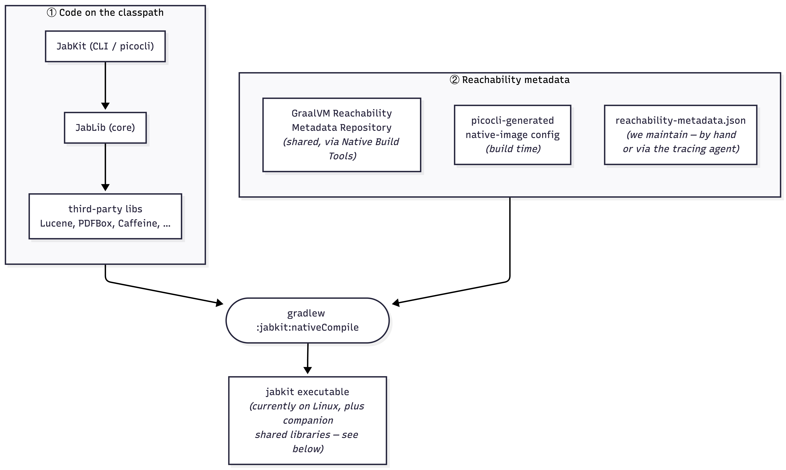

# Building JabKit as a GraalVM native image

JabKit is JabRef's command-line toolkit.

It is currently available as a `jpackage` installer or portable build, each bundling a Java runtime, and through [JBang](https://github.com/JabRef/jabref/tree/main/.jbang#running-jabkit).

[GraalVM Native Image](https://www.graalvm.org/latest/reference-manual/native-image/) builds JabKit ahead of time into a native executable with reduced startup time.

## Current setup

### The big picture

Native Image compilation has two inputs: the **code** to compile (JabKit plus everything it pulls in) and the **[reachability metadata](https://www.graalvm.org/latest/reference-manual/native-image/metadata/)**. Metadata covers dynamic behavior that static analysis cannot fully detect, such as reflective library calls, JNI access, and resource lookups. Both meet in the `nativeCompile` task:



The metadata comes from three places:

| Source | Who maintains it | What it covers |
| --- | --- | --- |
| [GraalVM Reachability Metadata Repository](https://github.com/oracle/graalvm-reachability-metadata) | Upstream/community | Common third-party libraries |
| [picocli-generated native-image config](https://github.com/remkop/picocli/blob/main/picocli-codegen/README.adoc) | picocli annotation processor | JabKit's command model |
| `reachability-metadata.json` | JabRef | Gaps not covered by the first two sources; one file per module |

The build uses [Liberica NIK Full](#liberica-nik).

### Where the metadata lives

GraalVM auto-discovers metadata on the classpath under a per-artifact path: `META-INF/native-image/<group>/<artifact>/`. Each module ships its own file:

```text
jabkit/src/main/resources/META-INF/native-image/org.jabref/jabkit/
    reachability-metadata.json      <- JabKit's own (CLI / picocli-facing)

jablib/src/main/resources/META-INF/native-image/org.jabref/jablib/
    reachability-metadata.json      <- JabLib's own (core library)
```

Both use GraalVM's unified [`reachability-metadata.json`](https://www.graalvm.org/latest/reference-manual/native-image/metadata/) schema, one file with `reflection`, `resources`, and `bundles` sections (JNI is expressed as a `jniAccessible` flag on reflection entries).

Metadata for a class belongs in that class's module. A reflection entry for a JabLib type goes in JabLib's file, even when only a JabKit command triggers it. This keeps JabLib self-describing for any future native consumer, such as JabSrv or JabLS.

### Smoke tests in CI

| File | Scope | Runs |
| --- | --- | --- |
| `jabkit-offline.md` | Commands needing no network | Linux and macOS |
| `jabkit-offline-pdf.md` | The PDF/AWT path | Linux only; see [Liberica NIK](#liberica-nik) |
| `jabkit-online.md` | Commands hitting external APIs | Opt-in with the `run-jabkit-online-tests` workflow input |

All three files live in `jabkit/src/test/nativeimage/` and run from `.github/workflows/binaries.yml`.

## How to build and extend it

### Building the binary

```shell
./gradlew :jabkit:nativeCompile
```

The executable is written to `jabkit/build/native/nativeCompile/jabkit`.

### Adding metadata for a new command

Adding or upgrading a dependency is covered in [Dependency management](dependency-management.md).

[picocli](https://github.com/remkop/picocli/blob/main/picocli-codegen/README.adoc) already generates metadata for `@Command` and `@Option` fields, so start with the command's runtime path instead of duplicating picocli-generated entries. GraalVM documents automatic metadata collection in [Collect Metadata with the Tracing Agent](https://www.graalvm.org/latest/reference-manual/native-image/metadata/AutomaticMetadataCollection/).

Use this loop for JabKit commands:

1. Run the command's real code path on the JVM with the tracing agent enabled. `--help` covers startup; a new command's data path needs the real invocation with real arguments.
2. Copy the relevant generated entries into the owning module's `reachability-metadata.json`; see [Where the metadata lives](#where-the-metadata-lives).
3. Trim entries that do not belong to the command's runtime path.
4. **Build** the binary: `./gradlew :jabkit:nativeCompile`.
5. Run the same command path with the native binary. If it still fails, use GraalVM's [runtime error troubleshooting guide](https://www.graalvm.org/dev/reference-manual/native-image/guides/troubleshoot-run-time-errors/) or rerun the tracing agent on the missing path, then add the next minimal entry.
6. **Lock it in** with a clitest case; see [Smoke testing](#smoke-testing).

Native Build Tools can run the app under the agent for you:

```shell
./gradlew :jabkit:run -Pagent --args="check consistency path/to/library.bib"
```

The agent over-collects: it records everything touched during the run, which is more than your command usually needs. Trim the output to what the command actually requires.

To see why an entry was collected, create the JVM installed distribution and run it with origin tracking enabled:

```shell
./gradlew :jabkit:installDist
```

```shell
JAVA_TOOL_OPTIONS="-agentlib:native-image-agent=config-output-dir=<dir>,experimental-configuration-with-origins" \
  ./jabkit/build/install/jabkit/bin/jabkit --help
```

See GraalVM's [Automatic Metadata Collection](https://www.graalvm.org/latest/reference-manual/native-image/metadata/AutomaticMetadataCollection/) documentation for the agent options.

### Smoke testing

A native binary can build and still crash on a code path with missing metadata, so every ported command gets a [clitest](https://github.com/aureliojargas/clitest) case. These tests protect metadata cleanup: after trimming entries, rerun them to catch broken commands.

clitest reads a Markdown file where `$` lines are run and the lines beneath them are the expected output. Use the files in `jabkit/src/test/nativeimage/` as examples.

Run a file with:

```shell
cd jabkit
clitest src/test/nativeimage/jabkit-offline.md
```

#### How to write assertions

- Pass `--porcelain` where supported to keep command output script-friendly.
- Assert exit codes, generated files, or stable machine-readable output.

## Known limitations

### Liberica NIK

[BellSoft Liberica NIK](https://bell-sw.com/liberica-native-image-kit/) is a GraalVM downstream that ships AWT support. JabKit uses the Full package because PDFBox reaches [`java.desktop`/AWT from `PDDocument`](https://lists.apache.org/thread/dkvct72z2ltjy1cm73z7x23jyfjrnkxj), while stock GraalVM/Mandrel toolchains do not support AWT in native images ([oracle/graal#4921](https://github.com/oracle/graal/issues/4921)).

### What the build produces on Linux

On Linux, the native build produces the `jabkit` executable and companion `.so` libraries in `jabkit/build/native/nativeCompile/`.
