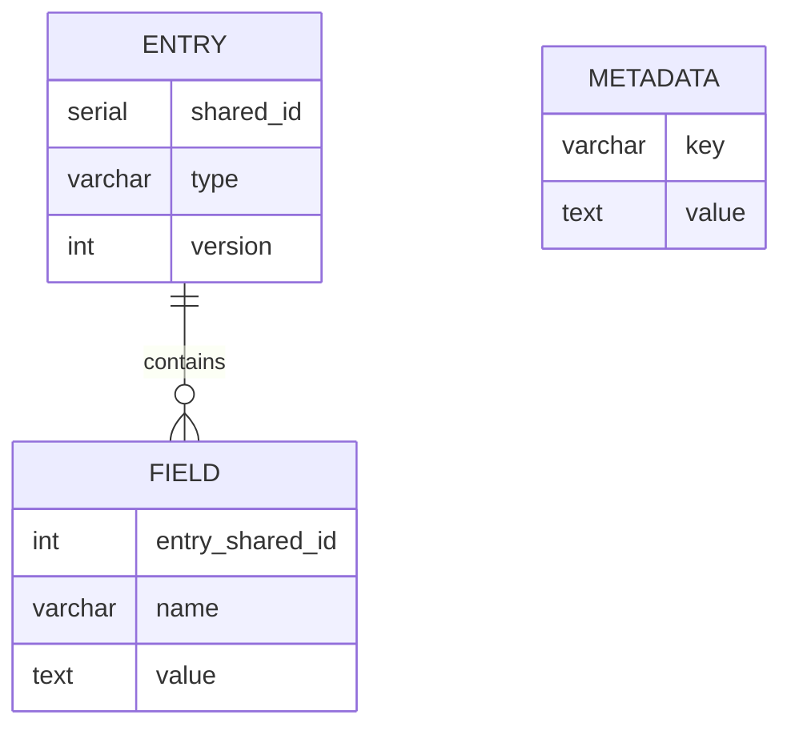

# Remote SQL Storage

For user documentation, see <https://docs.jabref.org/collaborative-work/sqldatabase>.

## Handling large shared databases

Synchronization times may get long when working with a large database containing several thousand entries. Therefore, synchronization only happens if several conditions are fulfilled:

* Edit to another field.
* Major changes have been made (pasting or deleting more than one character).

Class `org.jabref.logic.util.CoarseChangeFilter.java` checks both conditions.

Remaining changes that have not been synchronized yet are saved at closing the database rendering additional closing time. Saving is realized in `org.jabref.logic.shared.DBMSSynchronizer.java`. Following methods account for synchronization modes:

* `pullChanges` synchronizes the database unconditionally.
* `pullLastEntryChanges` synchronizes only if there are remaining entry changes. It is invoked when closing the shared database (`closeSharedDatabase`).

## Database structure

The following examples base on PostgreSQL.
Other databases work similar.

The database structure is created at [org.jabref.logic.shared.PostgreSQLProcessor#setUp](https://github.com/JabRef/jabref/blob/main/src/main/java/org/jabref/logic/shared/PostgreSQLProcessor.java#L37-L37).

The "secret sauce" is the `version` of an entry.
This version is used as version in the sense of an [Optimistic Offline Lock](https://martinfowler.com/eaaCatalog/optimisticOfflineLock.html), which in turn is a well-established technique to prevent conflicts in concurrent business transactions.
It assumes that the chance of conflict is low.
Implementation details are found at <https://www.baeldung.com/cs/offline-concurrency-control>.

The `shared_id` and `version` are handled in [`org.jabref.model.entry.SharedBibEntryData`](https://github.com/JabRef/jabref/blob/main/src/main/java/org/jabref/model/entry/SharedBibEntryData.java).

## Synchronization

PostgreSQL supports to register listeners on the database on changes.
(MySQL does not).
The listening is implemented at [`org.jabref.logic.shared.listener.PostgresSQLNotificationListener`](https://github.com/JabRef/jabref/blob/main/src/main/java/org/jabref/logic/shared/listener/PostgresSQLNotificationListener.java#L16).
It "just" fetches updates from the server when a change occurred there.
Thus, the changes are not actively pushed from the server, but still need to be fetched by the client.
