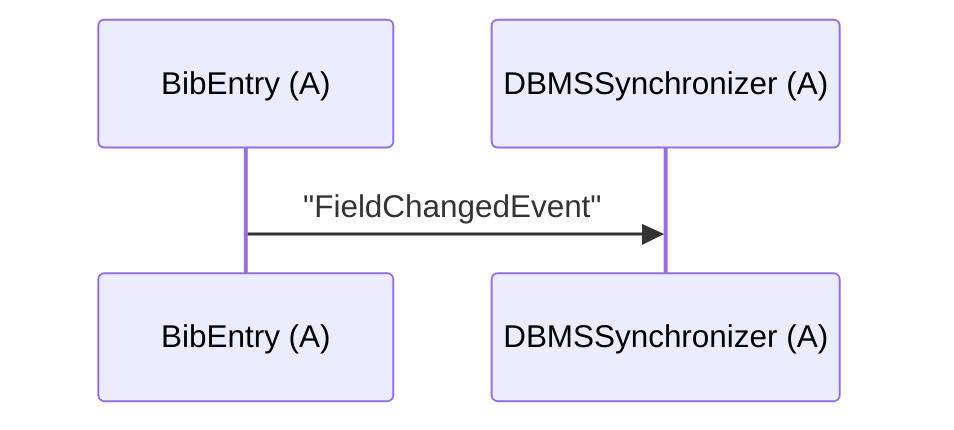
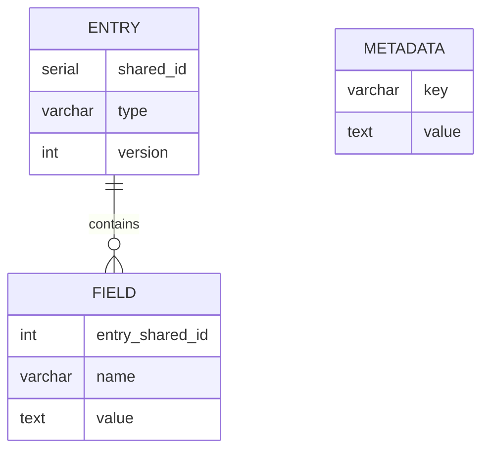

# Remote SQL Storage

For user documentation, see <https://docs.jabref.org/collaborative-work/sqldatabase>.

## Involved classes

* `org.jabref.logic.shared.notifications.NotificationListener`: handles and routes notifications from the PostgreSQL database to the `DBMSSynchronizer`.

## Flow of calls

The idea is to "publish" the change event with data both locally and remotely.
The change event should contain the new value, which can be directly applied remotely.
The change event should contain the old value to enable sanity checks while applying the change.

```mermaid
sequenceDiagram
  BibEntry (A)->>DBMSSynchronizer (A): "FieldChangedEvent"
```

## Handling large shared databases

Synchronization times may get long when working with a large database containing several thousand entries.
Therefore, we use PostgreSQL's `LISTEN` and `NOTIFY` commands to inform the client about changes in the database on an entry level.

Background reading: <https://www.baeldung.com/spring-postgresql-message-broker>.

## Handling synchronization of "micro-edits"

It causes too much load both on the server and at all subscribed clients to synchronize every single letter change.
Therefore, synchronization only happens if several conditions are fulfilled:

* Edit to another field.
* Major changes have been made (pasting or deleting more than one character).

Class `org.jabref.logic.util.CoarseChangeFilter.java` checks both conditions.

Remaining changes that have not been synchronized yet are saved at closing the database rendering additional closing time.
Saving is realized in `org.jabref.logic.shared.DBMSSynchronizer.java`.

Following methods account for synchronization modes:

* `pullChanges` synchronizes the database unconditionally.
* `pullLastEntryChanges` synchronizes only if there are remaining entry changes. It is invoked when closing the shared database (`closeSharedDatabase`).

## Database structure

The database structure is created at `org.jabref.logic.shared.DBMSProcessor#setUp`.

All tables live in the schema `jabref`. Since the table rework, two generations coexist in that schema:

| Tables | Structure version | Role |
| ------ | ----------------- | ---- |
| `entry`, `field`, `metadata` (lower case) | 2 | The live tables used by JabRef |
| `"ENTRY"`, `"FIELD"`, `"METADATA"` (quoted upper case) | 1 (JabRef ≤ 6.0-alpha) | Read once for migration, then left untouched |

On first connect, JabRef copies version-1 data into the version-2 tables (only while these are still empty).
The old tables are kept, so older JabRef versions can still work with them; they can be dropped manually once the migration is verified.
The structure version in use is recorded in the `metadata` table under the key `VersionDBStructure`.

### Entry identity

`entry.shared_id` is a database-assigned `SERIAL` (32-bit int, allocated per insert attempt) - a deliberate bridge, not the end state:

* The int range (~2.1 billion ids) is not a practical limitation for bibliographies, so widening to `BIGSERIAL` would be churn without benefit.
* The planned structure version 3 switches to client-generated [CUID2](https://github.com/paralleldrive/cuid2) strings (full length, not the short form used for processor ids). The motivation is not the id range but *who mints identity*: a client-generated id exists before any database round-trip, which makes inserts idempotent upserts, lets notifications reference brand-new entries, and enables offline-first synchronization (JabDrive). It is also safe in JSON/JavaScript, where 64-bit integers lose precision.
* `SharedBibEntryData` already models this future: `sharedIdAsString` is the leading representation, `sharedIdAsInt` the bridge for the current `SERIAL` implementation. Existing numeric ids migrate either as their decimal string or by minting fresh CUID2s.

```mermaid
erDiagram
    ENTRY ||--o{ FIELD : contains
    ENTRY {
        serial shared_id
        varchar type
        int version
    }
    FIELD {
        int entry_shared_id
        varchar name
        text value
    }
    METADATA {
        varchar key
        text value
    }
```

The "secret sauce" is the `version` of an entry.
This version is used as version in the sense of an [Optimistic Offline Lock](https://martinfowler.com/eaaCatalog/optimisticOfflineLock.html), which in turn is a well-established technique to prevent conflicts in concurrent business transactions.
It assumes that the chance of conflict is low.
Implementation details are found at <https://www.baeldung.com/cs/offline-concurrency-control>.

The `shared_id` and `version` are handled in [`org.jabref.model.entry.SharedBibEntryData`](https://github.com/JabRef/jabref/blob/main/jablib/src/main/java/org/jabref/model/entry/SharedBibEntryData.java).

## Synchronization

PostgreSQL supports to register listeners on the database on changes.
(MySQL does not).
The listening is implemented at `org.jabref.logic.shared.notifications.NotificationListener`.
It "just" fetches updates from the server when a change occurred there.
Thus, the changes are not actively pushed from the server, but still need to be fetched by the client.

## Reliability of change propagation

A change reaches other clients in one of two ways:

1. The `NOTIFY` payload carries the change itself (single field edits): applied directly, no extra round trip.
2. The payload only says "pull" (insertions, removals, bulk pastes, payloads over the 8000-byte `NOTIFY` limit): receivers run `pullChanges`, which diffs the full `shared_id`/`version` mapping against the local state. This diff is complete - it covers any number of changes at once, so a paste of thousands of entries arrives via one notification.

The same full diff runs when the notification listener reconnects after downtime, so notifications missed while disconnected are not lost.

A possible future refinement is a change-log table: writers append each change as a row (in the same transaction as the data change), the `NOTIFY` payload carries only the change-log id, and clients fetch all rows since the last id they applied. This gives per-change history (no size limit, exact catch-up instead of a full diff) and would become the PostgreSQL equivalent of the JabDrive changes feed. It only pays off once per-change semantics are needed (offline-first synchronization, tombstones, undo across clients) - the version-diff pull already guarantees losslessness.

## Tests

Tests are executed using [Zonky Embedded Postgres](https://github.com/zonkyio/embedded-postgres).
This installs and runs a PostgreSQL server and frees the developer from the need to install a PostgreSQL server on the local machine.
