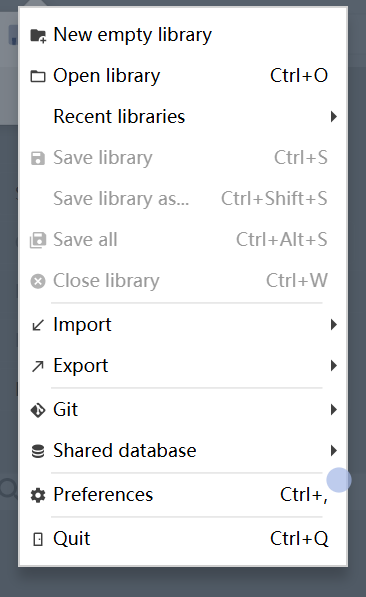
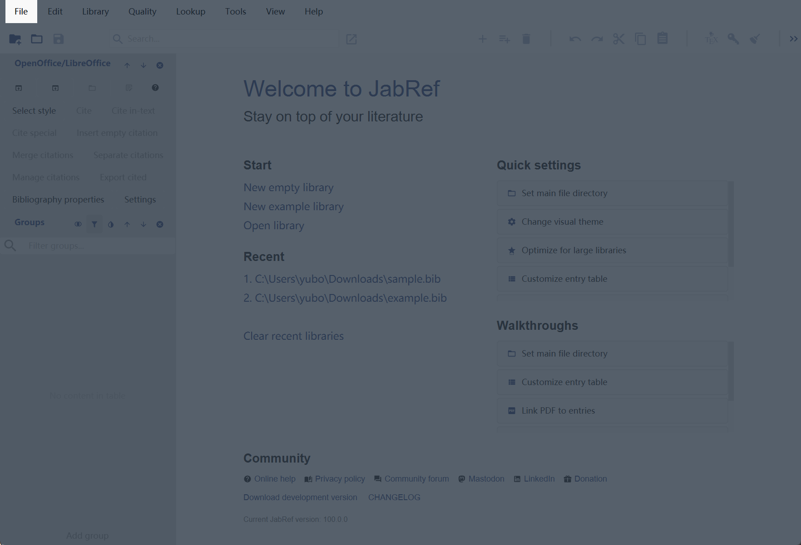
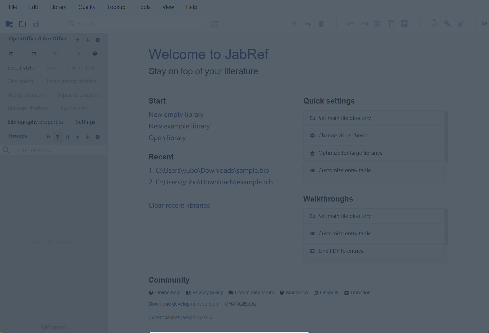
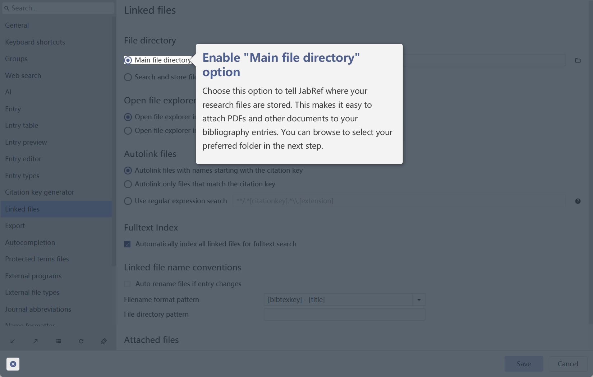
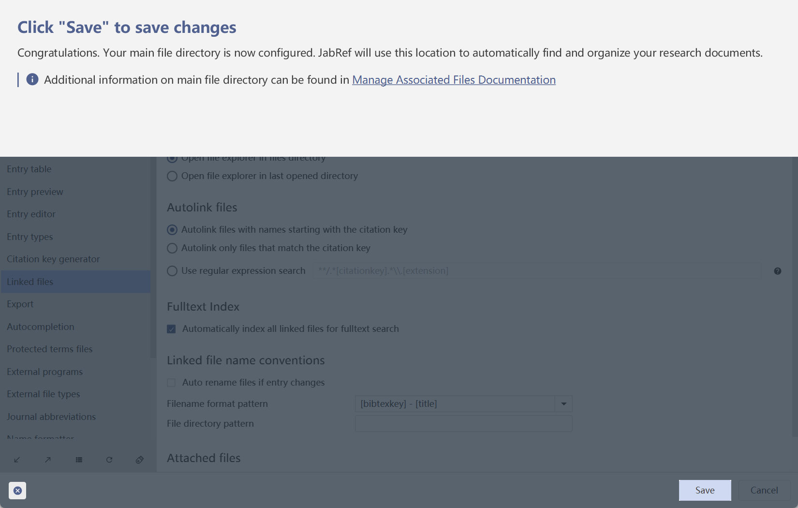
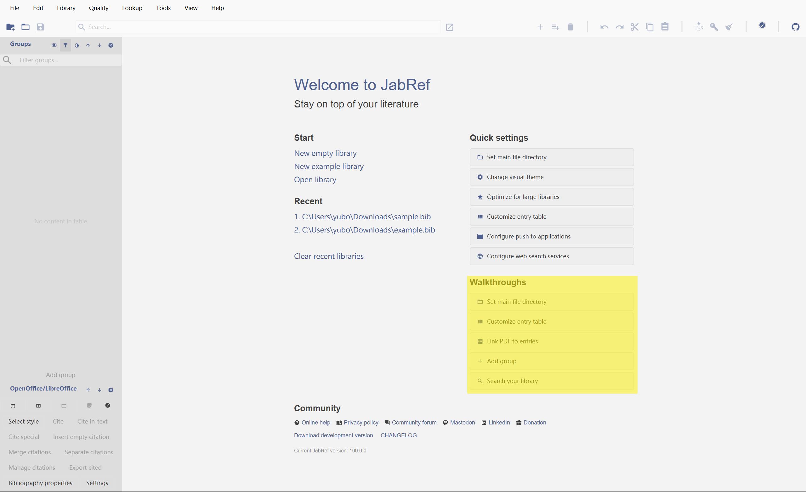
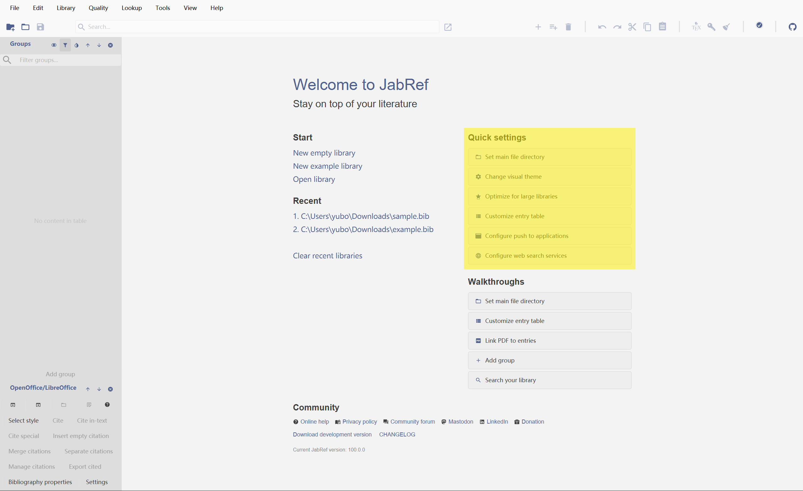

# Walkthrough

All walkthroughs are written using the internal declarative API (see `org.jabref.gui.walkthrough.declarative`) and are
defined in the `WalkthroughAction` class. Each walkthrough is a linear series of steps, where each step is either a UI
highlight (`VisibleComponent`) or an invisible side effect (`WalkthroughSideEffect`). The walkthroughs are built using a
builder API (`Walkthrough.Builder`). To launch a walkthrough, simply construct a new `WalkthroughAction` and pass the
name of the desired walkthrough.

The `WalkthroughOverlay` renderer takes the output of the declarative API (`Walkthrough`) and renders it for the user.
At a high level, a walkthrough primarily highlights GUI elements (nodes in the scene graph).

The following step types are supported:

## Highlights

1. `Ring`: Shows a small, accent-colored circle in the upper-right corner of the node to be highlighted.
   
2. `Spotlight`: Highlights the node of interest by darkening the rest of the window.
   
3. `FullScreenDarken`: Darkens the entire window, typically to display a panel in the center.
   

## Visual Steps

1. `TooltipStep`: Shows a tooltip next to a specified node. This step must be associated with a node to display
   correctly.
   
2. `PanelStep`: Shows a panel with rich text and info boxes on the top, left, bottom, or right of the screen.
   

## Side Effects

1. `OpenLibrarySideEffect`: Opens a specified example library.
2. `EnsureSearchSettingsSideEffect`: Forces a search preference into a desired state.

All walkthroughs are currently launched from the `Walkthroughs` component, which is located exclusively on the
`WelcomeTab`.

## Quick Settings

Since walkthroughs are only supposed to highlight UI components and guide the user through JabRef, quick settings are
create so as to provide a convenient entry point for the user to edit the common settings like theme, online services,
and main file directory. All the quick settings items are present in the `org.jabref.gui.welcome.components.QuickSettings`
component, which is visible in the `WelcomeTab`.

