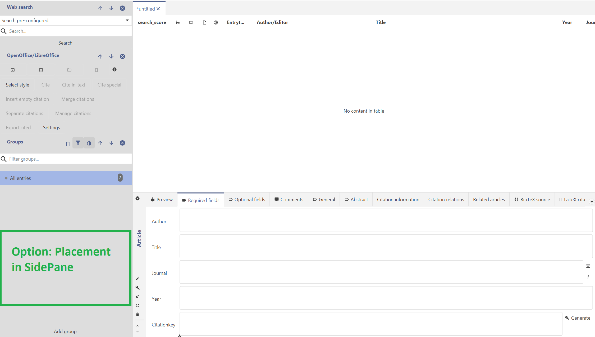
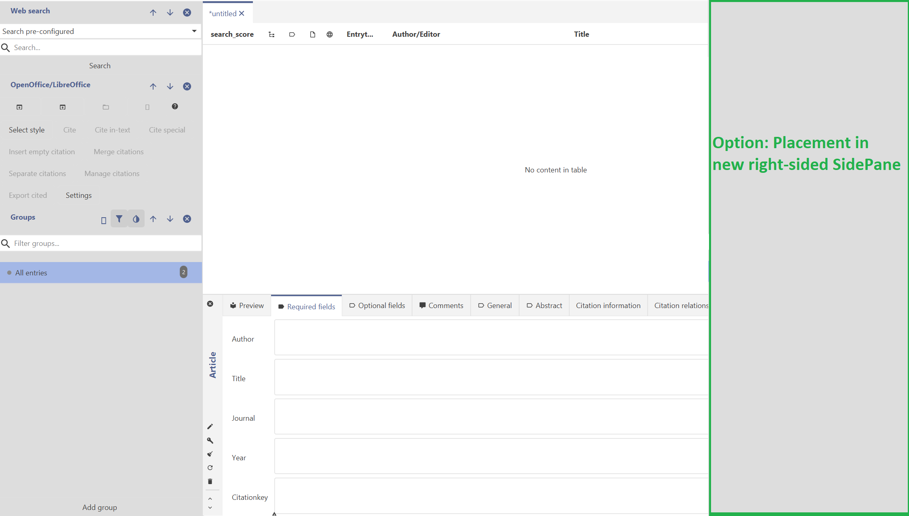
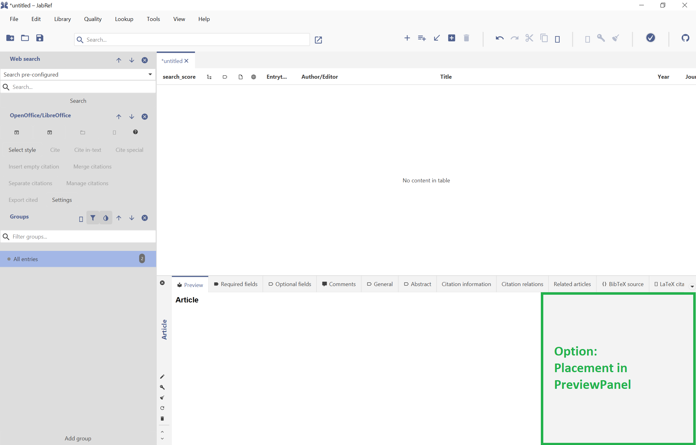
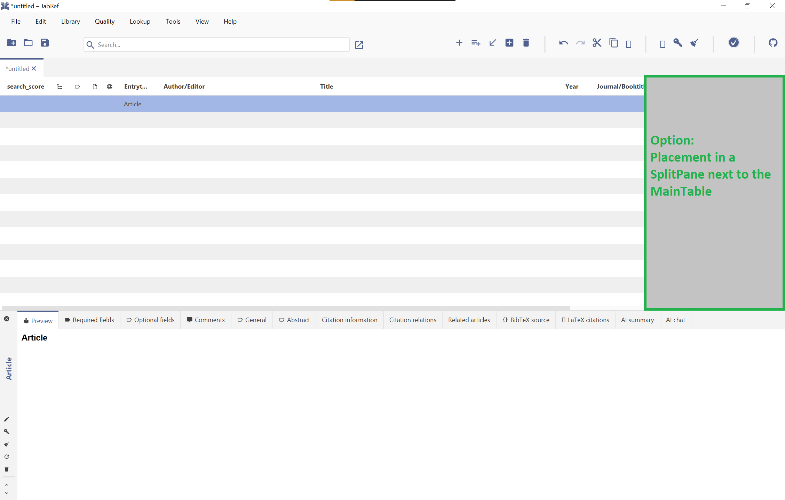

# Display front cover for book citations in the Preview tab

## Context and Problem Statement

* Users have requested that the front covers of book citations are displayed in JabRef.
* This is discussed on the [JabRef forum](https://discourse.jabref.org/t/display-cover-images-for-books/3647) and raised as a [feature request](https://github.com/JabRef/jabref/issues/10120).
* We need to decide where the book cover should be placed.

## Decision Drivers

* It should not be obtrusive or distracting since the main use of JabRef is for articles not books.
* It should not obstruct the view of existing GUI components, specifically the MainTable or the information in the EntryEditor's tabs.

## Considered Options

Place the book cover in:

1. The existing SidePane
2. A new SidePane
3. The Preview panel of the EntryEditor
4. A SplitPane next to the MainTable

## Decision Outcome

Chosen option: "The PreviewPanel of the EntryEditor".

## Pros and Cons of the Options

### Existing SidePane

* Good, because it would be unobtrusive
* Bad, because it would crowd other panels in the SidePane
* Bad, because changing the size of the SidePane would affect both the MainTable and the EntryEditor.

### New right-sided SidePane

* Good, if integrated together with entry preview because it would make it easier to view a citation's preview.
* Bad, because an extra SidePane would make the interface overly complex.

### The PreviewPanel of the EntryEditor

* Good, because it would not be obtrusive or distracting.
* Bad, if the Entry Editor is closed, users will have to open the Entry Editor and navigate to the "Preview" or "Required fields" tab to see the cover.

### SplitPane next to the MainTable

* Good, because changing the size of this SplitPane would [only affect the MainTable](https://github.com/user-attachments/assets/4e458099-ca5c-41bc-a33b-ce4240d7df82).
* Bad, because it would obstruct some columns in the MainTable.
