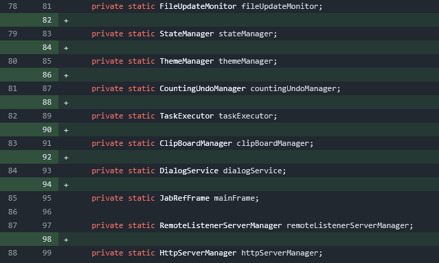
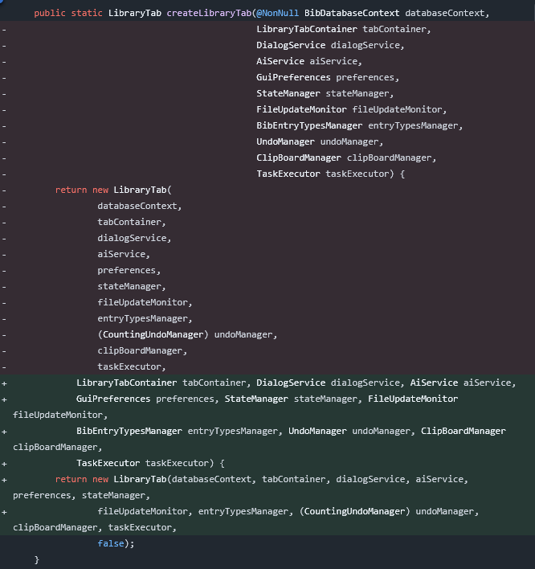

# Use custom code style

## Context and Problem Statement

Code should be formatted consistently.
Which code style and auto formatter to be used?

## Decision Drivers

* Consistency to the Java world (to lower the cognitive load)
* Maintained tooling to reduce risk of non-working tooling in the future

## Considered Options

* Use custom code style
* Use prettier-java
* Use palantir-java-format
* Use google-java-format
* Use spring-javaformat
* Use eclipse formatter

## Decision Outcome

Chosen option: "Use custom code style", because comes out best (see below).

### Consequences

* Good, because the style closely follows the maintainer's expectations on code formatting
* Good, because the IntelliJ tooling works reasonably well
* Bad, because users need to setup IntelliJ to use the code style
* Bad, because JBang scripts cannot be formatted automatically

## Pros and Cons of the Options

<!-- markdownlint-disable-next-line MD024 -->
### Use custom code style

IntelliJ offers to customize the code style and export it into an XML file.

* Good, because the style closely follows the maintainer's expectations on code formatting
* Good, because the IntelliJ tooling works reasonably well
* Bad, because users need to setup IntelliJ to use the code style
* Bad, because depends on IntelliJ's capabilities (and is not tool-independent)
* Bad, because the statement after `->` is [always on the next line](https://youtrack.jetbrains.com/issue/IDEA-330487/Disable-line-breaks-after-switch-cases-on-simple-on-liner-case-blocks-in-switch-expression).
* Bad, because JBang scripts cannot be formatted automatically.
* Bad, because not supported by the formatter tool [jbang-fmt](https://github.com/jbangdev/jbang-fmt).

### Use prettier-java

[prettier-java](https://github.com/jhipster/prettier-java) is a prettier plugin for Java.

It uses around [80 characters as soft width limit](https://prettier.io/docs/options#print-width):

> For readability we recommend against using more than 80 characters:
>
> In code styleguides, maximum line length rules are often set to 100 or 120. However, when humans write code, they don’t strive to reach the maximum number of columns on every line. Developers often use whitespace to break up long lines for readability. In practice, the average line length often ends up well below the maximum.
>
> Prettier’s `printWidth` option does not work the same way. It is not the hard upper allowed line length limit. It is a way to say to Prettier roughly how long you’d like lines to be. Prettier will make both shorter and longer lines, but generally strive to meet the specified `printWidth`.

We tried out at <https://github.com/JabRef/jabref-koppor/pull/717>.

Example:

```java
        action
            .getKeyBinding()
            .ifPresent(keyBinding ->
                keyBindingRepository
                    .getKeyCombination(keyBinding)
                    .ifPresent(combination -> setAccelerator(combination))
            );
```

* Good, because `prettier-java` is updated regularly.
* Good, because the subject is "always" in the first thing in the line.
* Good, because it also formats the imports
* Neutral, because optimized for code review (because of the 80 characters width):
  Favors short lines (80 characters); the reading is more top-to-buttom; screens are typically wider.
* Bad, because [prettier-action cannot be used](https://github.com/creyD/prettier_action/issues/149)
* Bad, because [has line breaks at single variables](https://github.com/jhipster/prettier-java/issues/777)
* Bad, because not supported by the formatter tool [jbang-fmt](https://github.com/jbangdev/jbang-fmt).

## Use palantir-java-format

Example:

```java
        action.getKeyBinding().ifPresent(keyBinding -> keyBindingRepository
                .getKeyCombination(keyBinding)
                .ifPresent(combination -> setAccelerator(combination)));
```

* Good, because [optimized for code review](https://github.com/palantir/palantir-java-format#optimised-for-code-review)
* Bad, because [not compatible with JDK21](https://github.com/palantir/palantir-java-format/issues/934). Especially, [does not support `_`](https://github.com/palantir/palantir-java-format/issues/1236)
* Bad, because not supported by the formatter tool [jbang-fmt](https://github.com/jbangdev/jbang-fmt).

## Use JBang style

* Good, because supported by the formatter tool [jbang-fmt](https://github.com/jbangdev/jbang-fmt).

## Use google-java-format

* Good, because supported by the formatter tool [jbang-fmt](https://github.com/jbangdev/jbang-fmt).
* Bad, because [Markdown JavaDoc cannot be used](https://github.com/google/google-java-format/issues/1193)
* Bad, because [does not support `format:off` comments](https://github.com/google/google-java-format/issues/137).
* Bad, because not actively maintained; there are [139 opened issues](https://github.com/google/google-java-format/issues?q=sort%3Aupdated-desc%20is%3Aissue%20is%3Aopen&page=1).

## Use spring-javaformat

[spring-javaformat](https://github.com/spring-io/spring-javaformat) is a code style of Spring.
The plugin is automatically activated in IntelliJ. For the code style, see <https://github.com/spring-projects/spring-framework/wiki/Code-Style>.

We tried out at <https://github.com/JabRef/jabref-koppor/pull/716>.

* Good, because supported by the formatter tool [jbang-fmt](https://github.com/jbangdev/jbang-fmt).
* Neutral, because each class field is separated by an empty line:\

   

* Bad, because merges lines together where it should not:

   

* Bad, because `import` statements are not handled.
* Bad, because we need to accept that `else` starts on the "first" column. ("Kernighan and Ritchie style") -> <https://github.com/spring-projects/spring-framework/wiki/Code-Style#block-like-constructs-kr-style>
* Bad, because it provides bad wrapping:

    ```diff
        /**
    -     * Add X11 clipboard support to a text input control. It is necessary to call this method in every input where you
    -     * want to use it: {@code ClipBoardManager.addX11Support(TextInputControl input);}.
    -     *
    -     * @param input the TextInputControl (e.g., TextField, TextArea, and children) where adding this functionality.
    -     * @see <a href="https://www.uninformativ.de/blog/postings/2017-04-02/0/POSTING-en.html">Short summary for X11
    -     * clipboards</a>
    -     * @see <a href="https://unix.stackexchange.com/questions/139191/whats-the-difference-between-primary-selection-and-clipboard-buffer/139193#139193">Longer
    +     * Add X11 clipboard support to a text input control. It is necessary to call this
    +     * method in every input where you want to use it:
    +     * {@code ClipBoardManager.addX11Support(TextInputControl input);}.
    +     * @param input the TextInputControl (e.g., TextField, TextArea, and children) where
    +     * adding this functionality.
    +     * @see <a href=
    +     * "https://www.uninformativ.de/blog/postings/2017-04-02/0/POSTING-en.html">Short
    +     * summary for X11 clipboards</a>
    +     * @see <a href=
    +     * "https://unix.stackexchange.com/questions/139191/whats-the-difference-between-primary-selection-and-clipboard-buffer/139193#139193">Longer
        * text over
    ```

    ```diff
    -    public ArgumentProcessor(String[] args,
    -                             Mode startupMode,
    -                             PreferencesService preferencesService,
    -                             FileUpdateMonitor fileUpdateMonitor,
    -                             BibEntryTypesManager entryTypesManager) throws org.apache.commons.cli.ParseException {
    +    public ArgumentProcessor(String[] args, Mode startupMode, PreferencesService preferencesService,
    +            FileUpdateMonitor fileUpdateMonitor, BibEntryTypesManager entryTypesManager)
    +            throws org.apache.commons.cli.ParseException {
    ```

## Use eclipse formatter

* Good, because it [can be used in IntelliJ](https://github.com/krasa/EclipseCodeFormatter).
* Good, because supported by the formatter tool [jbang-fmt](https://github.com/jbangdev/jbang-fmt).
* Good, because JabRef has an initial Eclipse formatting configuration.
* Bad, because the IntelliJ plugin not actively maintained.
* Bad, because there is NOT "the" Eclipse style, the style still needs to be configured.
