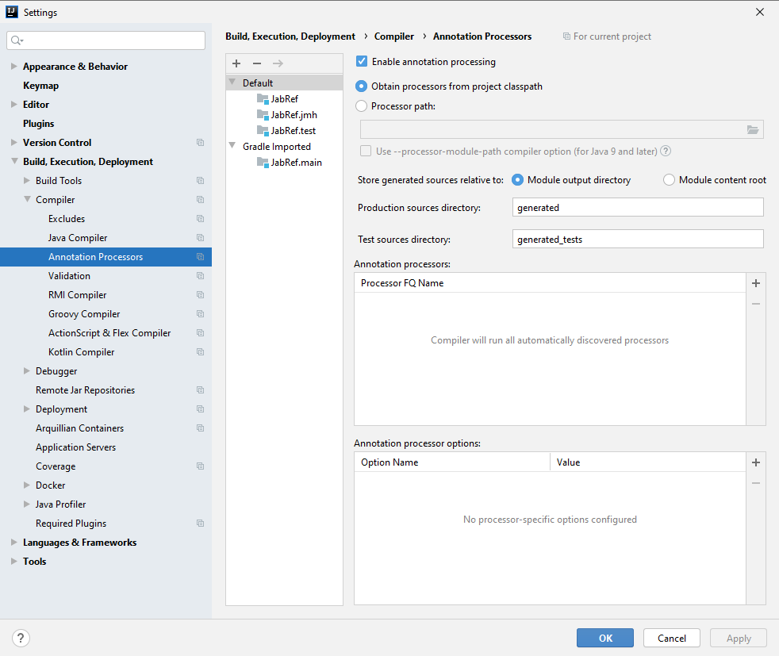
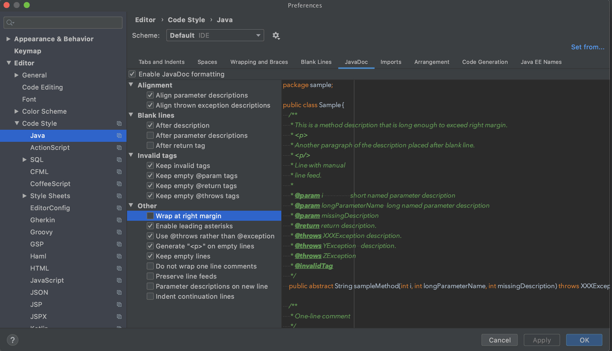
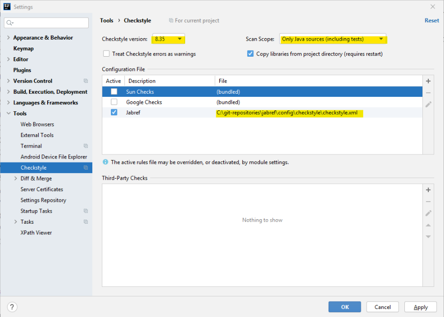

# Set up a local workspace

This guide explains how to set up your environment for development of JabRef. It includes information about prerequisites, configuring your IDE, and running JabRef locally to verify your setup.

```text
The most important step is to configure your IDE.
In case you know how to install JDK14 with JavaFX support and to fork JabRef's code,
        please scroll down to the IDE setup.
```

For a complete step-by-step guide for Linux using IntellJ IDEA as the IDE, have a look at the following video instructions:

[](https://youtu.be/JkFVJ6p0urw)

## Prerequisites

This section list the prerequisites you need to get started to develop JabRef. After this section, you are ready to get the code.

### Java Development Kit 14

A working Java \(Develoment Kit\) 14 installation with Java FX support is required. In the command line \(terminal in Linux, cmd in Windows\) run `javac -version` and make sure that the reported version is Java 14 \(e.g `javac 14`\). If `javac` is not found or a wrong version is reported, check your PATH environment variable, your `JAVA_HOME` environment variable or install the most recent JDK.

[JavaFX is not part of the default JDK any more](https://www.reddit.com/r/java/comments/82qm9x/javafx_will_be_removed_from_the_java_jdk_in_jdk_11/), it needs to be installed separately if not using a special JDK. We recommend to setup the full Liberica JDK including JavaFX. You can get it from [https://bell-sw.com/pages/downloads/?version=java-14&package=jdk-full](https://bell-sw.com/pages/downloads/?version=java-14&package=jdk-full). On Windows, you can execute `choco install libericajdkfull` \(requires [installation of chocolatey - a package manager for Windows](https://chocolatey.org/install)\).

Alternatively, you can download and install the JDK from [https://jdk.java.net/](https://jdk.java.net/). Afterwards, download download the "jmods" JavaFX 14 zip archive from [https://gluonhq.com/products/javafx/](https://gluonhq.com/products/javafx/) and put the `.jmod` files into `C:\Program Files\OpenJDK\jdk-14.0.1\jmods`.

### GitHub Account

If you do not yet have a GitHub account, please [create one](https://github.com/join).

Proposals for account names:

* Login similar to your university account. Example: `koppor`
* Use your last name prefixed by the first letter of your first name. Example: `okopp`
* Use `firstname.lastname`. Example: `oliver.kopp`

You can hide your email adress by following the recommendations at [https://saraford.net/2017/02/19/how-to-hide-your-email-address-in-your-git-commits-but-still-get-contributions-to-show-up-on-your-github-profile-050/](https://saraford.net/2017/02/19/how-to-hide-your-email-address-in-your-git-commits-but-still-get-contributions-to-show-up-on-your-github-profile-050/).

Most developers, though, do not hide their email adress. They use one mich may get public. Mostly, they create a new email account for development only. That account then be used for develoment mailing lists, mail exchange with other developers, etc.

Examples:

* Same login as in GitHub \(see above\). Example: `koppor@gmail.com`
* "`it`" in the name. Example:  `kopp.it@gmail.com`
* Use the university login. Example: `st342435@stud.uni-stuttgart.de`

### git

It is strongly recommend that you have git installed.

* In Debian-based distros: `sudo apt-get install git`
* In Windows: [Download the installer](http://git-scm.com/download/win) and install it. Using chocolatey, you can run `choco install git.install -y --params "/GitAndUnixToolsOnPath /WindowsTerminal` to a\) install git and b\) have linux commands such as `grep` available in your `PATH`.
* [official installation instructions](https://git-scm.com/book/en/v2/Getting-Started-Installing-Git)

### IDE

We suggest [IntelliJ IDEA](https://www.jetbrains.com/idea/) or [Eclipse \(for advanced users\)](https://eclipse.org/) \(`2020-03` or newer\).

On Ubuntu Linux, you can follow the [documentation from the Ubuntu Community](https://help.ubuntu.com/community/EclipseIDE#Download_Eclipse) or the [step-by-step guideline from Krizna](https://www.krizna.com/ubuntu/install-eclipse-in-ubuntu-12-04/) to install Eclipse. Under Windows, download it from [www.eclipse.org](http://www.eclipse.org/downloads/) and run the installer.

### Other Tooling

See our [tool recommendations](../readings-on-coding/tools.md).

## Get the code

This section explains how you get the JabRef code onto your machine in a form allowing you to make contributions.

### Fork JabRef into your GitHub account

1. Log into your GitHub account
2. Go to [https://github.com/JabRef/jabref](https://github.com/JabRef/jabref)
3. Create a fork by clicking at fork button on the right top corner
4. A fork repository will be created under your account `https://github.com/YOUR\_USERNAME/jabref`.

### Clone your forked repository on your local machine

* In a command line, navigate to the folder where you want to place the source code \(parent folder of `jabref/`\). To prevent issues along the way, it is strongly recommend to choose a path that does not contain any special \(non-ASCII or whitespace\) characters.
* Run `git clone --depth=10 https://github.com/YOUR_USERNAME/jabref.git`. The `--depth--10` is used to limit the download to ~20 MB instead of downloading the complete history \(~800 MB\). If you want to dig in our commit history, feel free to download everything.
* Go to the newly created jabref folder: `cd jabref`
* Generate additional source code: `./gradlew assemble`
* Start JabRef: `./gradlew run`
  * The JabRef's GUI should now start up.

## Configure your IDE

These steps are very important. They allow you to focus on the content and ensure that the code formatting always goes well. Did you know that [IntelliJ allows for reformatting selected code](https://www.jetbrains.com/help/idea/reformat-and-rearrange-code.html#reformat_code) if you press Ctrl+Alt+L?

### Setup for IntelliJ IDEA

We recommend to install IntelliJ IDEA using [JetBrains Toolbox App](https://www.jetbrains.com/toolbox-app/), because IDE updates are automatically installed.

IntelliJ IDEA fully supports Gradle as a build tool, but also has an internal build system which is usually faster. For JabRef, Gradle is required to make a full build but once set up, IntelliJ IDEA's internal system can be used for sub-sequent builds.

To configure IntelliJ IDEA for developing JabRef, you should first ensure that you have enabled both bundled plugins _Gradle_ and _Gradle Extension_:

* Navigate to **File \| Settings \| Plugins \| Installed** and check that you have the _Gradle_ and _Gradle Extension_ enabled.

After that, you can open `jabref/build.gradle` as a project. It is crucial that Java 14 is used consistently for the JabRef project which includes ensuring the right settings for your project structure, Gradle build, and run configurations.

Ensure you have a Java 14 SDK configured by navigating to **File \| Project Structure \| Platform Settings \| SDKs**. If you don't have one, add a new Java JDK and point it to the location of a JDK 14:

* Navigate to **File \| Project Structure \| Project** and ensure that the projects' SDK is Java 14
* Navigate to **File \| Settings \| Build, Execution, Deployment \| Build Tools \| Gradle** and select the Java 14 SDK as the Gradle JVM at the bottom.

To prepare IntelliJ's build system two additional steps are required:

* Navigate to **File \| Settings \| Build, Execution, Deployment \| Compiler \| Java Compiler**, and under "Override compiler parameters per-module" add \(\[+\]\) the following compiler arguments for the `JabRef.main` module:

  ```text
   --add-exports=javafx.controls/com.sun.javafx.scene.control=org.jabref
   --add-exports=org.controlsfx.controls/impl.org.controlsfx.skin=org.jabref
  ```

* Enable annotation processors by navigating to **File \| Settings \| Build, Execution, Deployment \| Compiler \| Annotation processors** and check "Enable annotation processing"

  

To have autoformat working properly in the context of line wrapping, "Wrap at right margin" has to be disabled as shown below. Details are found in [IntelliJ issue 240517](https://youtrack.jetbrains.com/issue/IDEA-240517).



#### Using Gradle from within IntelliJ IDEA

Ensuring JabRef builds with Gradle should always the first step because, e.g. it generates additional sources that are required for compiling the code. After adjusting all settings mentioned earlier, your first step should be to

* Open the Gradle Tool Window with the small button that can usually be found on the right side of IDEA or navigate to **View \| Tool Windows \| Gradle**.
* In the Gradle Tool Window, press the "Reimport All Gradle Projects" button to ensure that all settings are up-to-date

  with the setting changes.

After that, you can use the Gradle Tool Window to build all parts JabRef and run it. To do so, expand the JabRef project in the Gradle Tool Window and navigate to Tasks. From there, you can

* Build and run JabRef by double-clicking **JabRef \| Tasks \| application \| run**.

After that a new entry called "jabref \[run\]" will appear in the run configurations. Now you can also select "jabref \[run\]" and either run or debug the application from within IntelliJ. You can run any other development task in a similar way. Equivalently, this can also be executed from the terminal by running `./gradlew run`.

#### Using IntelliJ's internal build system

**Note that these steps do not work on IntelliJ 2020.x.**. You have to keep using gradle for executing tasks. See [IDEA-249391](https://youtrack.jetbrains.com/issue/IDEA-249391) for details.

You should use IntelliJ IDEA's internal build system for compiling and running JabRef during development, because it is usually more responsive. Thereby, **it's important** that you understand that JabRef relies on generated sources which are only build through Gradle. Therefore, to build or update these dependencies you need to run the `assemble` Gradle task at least once.

To use IntelliJ IDEA's internal build system when you build JabRef through **Build \| Build Project** or use the provided "JabRef Main" run configuration, ensure that

* In **File \| Settings \| Build, Execution, Deployment \| Build Tools \| Gradle** the setting "Build and run using" and "Test using" is set to "IntelliJ IDEA".
* Ignore the Gradle project "buildSrc" by clicking the button **Select Project Data To Import** in the Gradle Tool Window and unchecking the folder "buildSrc".

    

* Delete `org.jabref.gui.logging.plugins.Log4jPlugins` \(location: `generated\org\jabref\gui\logging\plugins\Log4jPlugins.java`\). Otherwise, you will see folowing error:

  ```text
  Error:java: Unable to create Plugin Service Class org.jabref.gui.logging.plugins.Log4jPlugins
  ```

  or following error:

  ```text
  Error:(16, 25) java: package org.jabref.search does not exist
  ```

Essentially, you now have the best of both worlds: You can run Gradle tasks using the Gradle Tool Window and unless you haven't made changes to input files that generate sources, you can compile and run with IntelliJ's faster internal build system.

In case all steps are followed, and there are still issues with `SearchBaseVisitor` \(e.g., `Error:(16, 25) java: package org.jabref.search does not exist`\), you have to delete `generated\org\jabref\gui\logging\plugins\Log4jPlugins.java`. This is independet of having enabled or disabled Annotation Processing \(see above at "Enable Annotation Processing"\).

#### Using JabRef's code style

Contributions to JabRef's source code need to have a code formatting that is consistent with existing source code. For that purpose, JabRef provides code-style and check-style definitions.

* Install the [CheckStyle-IDEA plugin](http://plugins.jetbrains.com/plugin/1065?pr=idea), it can be found via the plug-in repository:
  1. Navigate to **File \| Settings \| Plugins \| Marketplace** and search for "Checkstyle" and choose "CheckStyle-IDEA"
  2. Close the settings afterwards and restart IntelliJ
* Go to **File \| Settings \| Editor \| Code Style**
* Click on the settings wheel \(next to the scheme chooser\), then click "Import Scheme"
* Select the IntelliJ configuration file `config/IntelliJ Code Style.xml`
* Go to **File \| Settings \| Tools \| Checkstyle \| Configuration File** 1. Import the CheckStyle configuration file by clicking the \[+\] button 2. For the description provide "JabRef" 3. Click "Browse" and choose `config/checkstyle/checkstyle.xml` 4. Click "Next" and "Finish" 5. Activate the CheckStyle configuration file by ticking it in the list 6. Ensure that the [latest CheckStyle version](https://checkstyle.org/releasenotes.html) is selected \(8.36 or higher\). 8.36 is required for Java 14. 7. Set the "Scan Scope" to "Only Java sources \(including tests\) 8. Save settings by clicking "OK" 9. Your configuration should now look like this:

  ```text
  
  ```

### Setup for Eclipse

Make sure your Eclipse installation us up to date, Eclipse JEE 2020-03 or newer is required. For Eclipse 2020-03 you need to install [jdk14 support](https://marketplace.eclipse.org/content/java-14-support-eclipse-2020-03-415)

1. Run `./gradlew run` to generate all resources and to check if JabRef runs.
   * The JabRef GUI should finally appear.
   * This step is only required once.
2. Run `./gradlew eclipse`
   * **This must always be executed, when there are new upstream changes.**
3. Open or import the existing project in Eclipse as Java project.
   * Remark: Importing it as gradle project will not work correctly.
   * Refresh the project in Eclipse
4. Create a run/debug configuration for the main class `org.jabref.gui.JabRefLauncher` and/or for `org.jabref.gui.JabRefMain` \(both can be used equivalently\)
   * Remark: The run/debug configuration needs to be added by right clicking the class \(e.g. JabRefLauncher or JabRefMain\) otherwise it will not work.

     

   * In the tab "Arguments" of the run/debug configuration, enter the following runtime VM arguments:

     ```text
        --patch-module test=fastparse_2.12-1.0.0.jar
        --patch-module test2=fastparse-utils_2.12-1.0.0.jar
        --patch-module test3=sourcecode_2.12-0.1.4.jar
        --add-exports javafx.controls/com.sun.javafx.scene.control=org.jabref
        --add-exports org.controlsfx.controls/impl.org.controlsfx.skin=org.jabref
        --add-exports javafx.graphics/com.sun.javafx.scene=org.controlsfx.controls
        --add-exports javafx.graphics/com.sun.javafx.scene.traversal=org.controlsfx.controls
        --add-exports javafx.graphics/com.sun.javafx.css=org.controlsfx.controls
        --add-exports javafx.controls/com.sun.javafx.scene.control.behavior=org.controlsfx.controls
        --add-exports javafx.controls/com.sun.javafx.scene.control=org.controlsfx.controls
        --add-exports javafx.controls/com.sun.javafx.scene.control.inputmap=org.controlsfx.controls
        --add-exports javafx.base/com.sun.javafx.event=org.controlsfx.controls
        --add-exports javafx.base/com.sun.javafx.collections=org.controlsfx.controls
        --add-exports javafx.base/com.sun.javafx.runtime=org.controlsfx.controls
        --add-exports javafx.web/com.sun.webkit=org.controlsfx.controls
        --add-exports javafx.graphics/com.sun.javafx.css=org.controlsfx.controls
        --add-exports javafx.controls/com.sun.javafx.scene.control.behavior=com.jfoenix
        --add-exports javafx.graphics/com.sun.javafx.stage=com.jfoenix
        --add-exports com.oracle.truffle.regex/com.oracle.truffle.regex=org.graalvm.truffle
        --patch-module org.jabref=build/resources/main
     ```

   * In the tab "Dependencies" of the run/debug configuration tick the checkbox "Exclude test code"
5. Optional: Install the [e\(fx\)clipse plugin](http://www.eclipse.org/efxclipse/index.html) from the Eclipse marketplace: 1. Help -&gt; Eclipse Marketplace... -&gt; Search tab 2. Enter "e\(fx\)clipse" in the search dialogue 3. Click "Go" 4. Click "Install" button next to the plugin 5. Click "Finish"
6. Now you can build and run/debug the application by either using "JabRefLauncher" or "JabRefMain". This is the recommended way, since the application starts quite fast.

## Final comments

Got it running? GREAT! You are ready to lurk the code and contribute to JabRef. Please make sure to also read our [contribution guide](https://github.com/JabRef/jabref/blob/master/CONTRIBUTING.md).

## Common issues

### Java installation

An indication that `JAVA_HOME` is not correctly set or no JDK 14 is installed is following error message:

```text
compileJava FAILED

FAILURE: Build failed with an exception.

* What went wrong:
Execution failed for task ':compileJava'.
> java.lang.ExceptionInInitializerError (no error message)
```

Another indication is following output

```text
java.lang.UnsupportedClassVersionError: org/javamodularity/moduleplugin/ModuleSystemPlugin has been compiled by a more recent version of the Java Runtime (class file version 55.0), this version of the Java Runtime only recognizes class file versions up to 52.0
```

### Problems with generated source files

In rare cases you might encounter problems due to out-dated automatically generated source files. Running `./gradlew clean` deletes these old copies. Do not forget to run at least `./gradlew eclipse` or `./gradlew build` afterwards to regenerate the source files.

