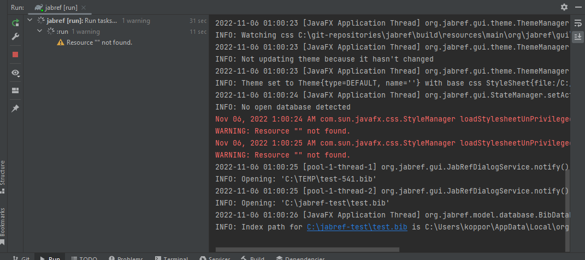
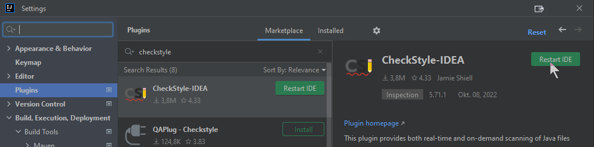
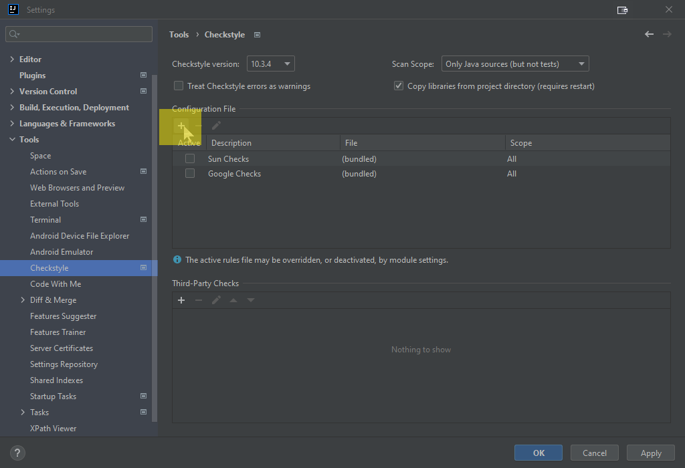
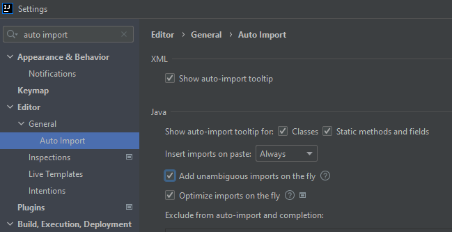
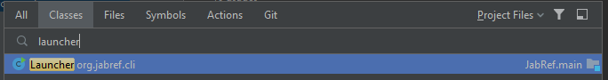

# Set up a local workspace

This guide explains how to set up your environment for development of JabRef. It includes information about prerequisites, configuring your IDE, and running JabRef locally to verify your setup.

{: .highlight }
The most important step is to configure your IDE.
If you know how to fork and check out JabRef's code,
already have an IDE installed, then
please scroll down to the [IDE setup](#configure-your-ide).
Otherwise, please keep on reading.

## Prerequisites

This section list the prerequisites you need to get started to develop JabRef. After this section, you are ready to get the code.

### GitHub Account

If you do not yet have a GitHub account, please [create one](https://github.com/join).

Proposals for account names:

* Login similar to your university account. Example: `koppor`
* Use your last name prefixed by the first letter of your first name. Example: `okopp`
* Use `firstname.lastname`. Example: `oliver.kopp`

You can hide your email address by following the recommendations at [https://saraford.net/2017/02/19/how-to-hide-your-email-address-in-your-git-commits-but-still-get-contributions-to-show-up-on-your-github-profile-050/](https://saraford.net/2017/02/19/how-to-hide-your-email-address-in-your-git-commits-but-still-get-contributions-to-show-up-on-your-github-profile-050/).

Most developers, though, do not hide their email address. They use one which may get public. Mostly, they create a new email account for development only. That account then be used for development mailing lists, mail exchange with other developers, etc.

Examples:

* Same login as in GitHub (see above). Example: `koppor@gmail.com`
* "`it`" in the name. Example: `kopp.it@gmail.com`
* Use the university login. Example: `st342435@stud.uni-stuttgart.de`

### git

It is strongly recommended that you have git installed.

* On Debian-based distros: `sudo apt-get install git`
* On Windows: [Download the installer](http://git-scm.com/download/win) and install it. Using [chocolatey](https://chocolatey.org/), you can run `choco install git.install -y --params "/GitAndUnixToolsOnPath /WindowsTerminal` to a) install git and b) have Linux commands such as `grep` available in your `PATH`.
* [Official installation instructions](https://git-scm.com/book/en/v2/Getting-Started-Installing-Git)

### Installed IDE

We suggest [IntelliJ IDEA](https://www.jetbrains.com/idea/?from=jabref).
The Community Edition works well.
Most contributors use the Ultimate Edition, because they are students getting that edition for free.

For advanced users, [Eclipse](https://eclipse.org) (`2022-03` or newer) is also possible.
On Ubuntu Linux, you can follow the [documentation from the Ubuntu Community](https://help.ubuntu.com/community/EclipseIDE#Download\_Eclipse) or the [step-by-step guideline from Krizna](https://www.krizna.com/ubuntu/install-eclipse-in-ubuntu-12-04/) to install Eclipse.
On Windows, download it from [www.eclipse.org](http://www.eclipse.org/downloads/) and run the installer.

### Java Development Kit 18

For Eclipse, a working Java (Development Kit) 18 installation is required.
In the case of IntelliJ, this will be downloaded inside the IDE (if you follow the steps below).

In the command line (terminal in Linux, cmd in Windows) run `javac -version` and make sure that the reported version is Java 18 (e.g., `javac 18`).
If `javac` is not found or a wrong version is reported, check your `PATH` environment variable, your `JAVA_HOME` environment variable or install the most recent JDK.
Please head to <https://adoptium.net/de/temurin/releases> to download JDK 18.
Note that JDK 19 does not work.

## Get the code

This section explains how you get the JabRef code onto your machine in a form allowing you to make contributions.

### Fork JabRef into your GitHub account

1. Log into your GitHub account
2. Go to [https://github.com/JabRef/jabref](https://github.com/JabRef/jabref)
3. Create a fork by clicking at fork button on the right top corner
4. A fork repository will be created under your account `https://github.com/YOUR\_USERNAME/jabref`.

### Clone your forked repository on your local machine

In a command line, navigate to the folder where you want to place the source code (parent folder of `jabref`).
To prevent issues along the way, it is strongly recommend choosing a path that does not contain any special (non-ASCII or whitespace) characters.
In the following, we will use `c:\git-repositories` as base folder:

```cmd
cd \
mkdir git-repositories
cd git-reposiroties
```

Note that using `c:\` and thus placing the folder `jabref` directly in the disk root directory may cause an error.

Run the respective `git clone` command:

```cmd
git clone --depth=10 https://github.com/YOUR_USERNAME/jabref.git
```

The `--depth--10` is used to limit the download to \~20 MB instead of downloading the complete history (\~800 MB).
If you want to dig in our commit history, feel free to download everything.

Go to the newly created JabRef folder: `cd jabref`.

Add JabRef's upstream code base as upstream:

```
git remote add upstream https://github.com/JabRef/jabref.git
```

Now, you have two remote repositories, where `origin` is yours and `upstream` is the one of the JabRef organization.

You can see it with `git remote -v`:

```cmd
c:\git-repositories\jabref> git remote -v
origin     https://github.com/YOURUSERNAME/jabref.git (fetch)
origin     https://github.com/YOURUSERNAME/jabref.git (push)
upstream     https://github.com/jabref/jabref.git (fetch)
upstream     https://github.com/jabref/jabref.git (push)
```

### Create generate source code

{: .note }
This is required for Eclipse only.
In IntelliJ, this will be done in the IDE.

Generate additional source code: `gradlew assemble` (on Linux/Mac: `./gradlew assemble`).

The directory `src-gen` is now filled.

## Get the code into your IDE

Start IntelliJ.

IntelliJ shows the following window:





Click on "Open"

Choose `build.gradle` in the root of the jabref source folder:





After pressing "OK", IntelliJ asks how that file should be opened.
Answer: "Open as Project"





Then, trust the project:





## Configuration of IntelliJ IDEA

These steps are very important. They allow you to focus on the content and ensure that the code formatting always goes well. Did you know that [IntelliJ allows for reformatting selected code](https://www.jetbrains.com/help/idea/reformat-and-rearrange-code.html#reformat\_code) if you press <kbd>Ctrl</kbd> + <kbd>Alt</kbd> + <kbd>L</kbd>?

IntelliJ IDEA fully supports Gradle as a build tool, but also has an internal build system which is usually faster. For JabRef, Gradle is required to make a full build.
Once set up, IntelliJ IDEA's internal system can be used for subsequent builds.

In case IntelliJ's internal build system does not work, just stick with using Gradle.

### Ensure that JDK 18 is available to IntelliJ

Ensure you have a Java 18 SDK configured by navigating to **File > Project Structure... > Platform Settings > SDKs**.





If there is another JDK than JDK 18 selected, click on the plus button and choose "Download JDK..."





Select JDK version 18 and then Eclipse Temurin.





After clicking "Download", IntelliJ installs Eclipse Temurin:





Navigate to **Project Settings > Project** and ensure that the projects' SDK is Java 18





Click "OK" to store the changes.

### Configure the Build System

Navigate to **File > Settings... > Build, Execution, Deployment > Build Tools > Gradle** and select the "Project SDK" as the Gradle JVM at the bottom. If that does not exist, just select a JDK 18.





To prepare IntelliJ's build system additional steps are required:

Navigate to **Build, Execution, Deployment > Compiler > Java Compiler**, and under "Override compiler parameters per-module", click add (\[+]) and choose `JabRef.main`:





Then double click inside the cell "Compilation options" and enter following parameters:

```text
--add-exports=javafx.controls/com.sun.javafx.scene.control=org.jabref
--add-exports=org.controlsfx.controls/impl.org.controlsfx.skin=org.jabref
```

Press <kbd>Enter</kbd> to have the value really stored.
Otherwise, it seems like the setting is stored, but it is not there if you re-open this preference dialog.
Then click on "Apply" to store the setting.





If this step is omited, you will get: `java: package com.sun.javafx.scene.control is not visible (package com.sun.javafx.scene.control is declared in module javafx.controls, which does not export it to module org.jabref)`.

Enable annotation processors by navigating to **Build, Execution, Deployment > Compiler > Annotation processors** and check "Enable annotation processing"





### Using Gradle from within IntelliJ IDEA

Ensuring JabRef builds with Gradle should always the first step because, e.g. it generates additional sources that are required for compiling the code.

Open the Gradle Tool Window with the small button that can usually be found on the right side of IDEA or navigate to **View > Tool Windows > Gradle**.
In the Gradle Tool Window, press the "Reload All Gradle Projects" button to ensure that all settings are up-to-date with the setting changes.





After that, you can use the Gradle Tool Window to build all parts JabRef and run it.
To do so, expand the JabRef project in the Gradle Tool Window and navigate to Tasks.
From there, you can build and run JabRef by double-clicking **JabRef > Tasks > application > run**.





The Gradle run window opens, shows compilation and then the output of JabRef.
The spinner will run as long as JabRef is opened.





You can close JabRef again.

After that a new entry called "jabref \[run]" appears in the run configurations.
Now you can also select "jabref \[run]" and either run or debug the application from within IntelliJ.

You can run any other development task in a similar way.
Equivalently, this can also be executed from the terminal by running `./gradlew run`.

### Using IntelliJ's internal build system for tests

You should use IntelliJ IDEA's internal build system for compiling and running JabRef tests during development, because it is usually more responsive.

{: .important}
When using IntelliJ's build system, **it is important** that you understand that JabRef relies on generated sources which are only built through Gradle.
Therefore, to build or update these dependencies you need to run the `run` (or `assemble`) Gradle task at least once.
When you followed this guide, you should have done it in the Gradle setup.

{: .note}
Running JabRef itself through IntellIJ's build system is **not** possible as we encounter difficulties when reading resources though `.class.getResource(...)`.
Although solutions are discussed in length [on stackoverflow](https://stackoverflow.com/q/26328040/873282), there is no "good" solution for us.

In **File > Settings... > Build, Execution, Deployment > Build Tools > Gradle** the setting "Run tests using:" is set to "IntelliJ IDEA".





**In case there are difficulties later, this is the place to switch back to gradle.**

Click "OK" to close the preference dialog.

In the menubar, select **Build > Rebuild project**.

IntelliJ now compiles JabRef.
This should happen without any error.

Now you can use IntelliJ IDEA's internal build system by using **Build > Build Project**.

To run an example test from IntelliJ, we let IntelliJ create a launch configuration:

Locate the class `BibEntryTest`:
Press </kbd>Ctrl</kbd>+<kbd>N</kbd>.
Then, the "Search for classes dialog" pops up.
Enter `bibenrytest`.
Now, `BibEntryTest` should appear first:





Press <kbd>Enter</kbd> to jump to that class.

Hover on the green play button on `testDefaultConstructor`:





Then, click on it.
A popup menu opens.
Choose the first entry "Run testDefaultConstructor" and click on it.





Then, the single test starts.

You also have an entry in the Launch configurations to directly launch the test.
You can also click on the debug symbol next to it to enable stopping at breakpoints.





The tests are green after the run.
You can also use the play button there to re-execute the tests.
A right-click on "BibEntryTests" enables to start the debugger.





{: .note }
Essentially, you now have the best of both worlds:
You can run Gradle tasks using the Gradle Tool Window.
You can compile and run tests with IntelliJ's faster internal build system
(unless you haven't made changes to input files that generate sources).

### Using JabRef's code style

Contributions to JabRef's source code need to have a code formatting that is consistent with existing source code. For that purpose, JabRef provides code-style and check-style definitions.

Install the [CheckStyle-IDEA plugin](http://plugins.jetbrains.com/plugin/1065?pr=idea), it can be found via the plug-in repository:
Navigate to **File > Settings... > Plugins".
On the top, click on "Marketplace".
Then, search for "Checkstyle".
Click on "Install" choose "CheckStyle-IDEA".





After clicking, IntelliJ asks for confirmation:





If you agree, click on "Agree" and you can continue.

Afterwards, use the "Restart IDE" button to restart IntelliJ.





Click on "Restart" to finally restart.

Wait for IntelliJ coming up again.

Go to **File > Settings... > Editor > Code Style**

Click on the settings wheel (next to the scheme chooser),
then click "Import Scheme >",
then click "IntelliJ IDEA code style XML"





You have to browse for the directory `config` in JabRef's code.
There is an `IntelliJ Code Style.xml`.





Click "OK".

At following dialog is "Import Scheme".
Click there "OK", too.





Click on "Apply" to store the preferences.

### Put JabRef's checkstyle configuration in place

Now, put the checkstyle configuration file is in place:

Go to **File > Settings... > Tools > Checkstyle > Configuration File**

Trigger the import dialog of a CheckStyle style by clicking the \[+] button:





Then:

* Put "JabRef" as description.
* Browse for `config/checkstyle/checkstyle.xml`
* Tick "Store relative to project location"
* Click "Next"





Click on "Finish"

Activate the CheckStyle configuration file by ticking it in the list





Ensure that the [latest CheckStyle version](https://checkstyle.org/releasenotes.html) is selected (10.3.4 or higher).
Also, set the "Scan Scope" to "Only Java sources (including tests)".





Save settings by clicking "Apply" and then "OK"

In the lower part of IntelliJ's window, click on "Checkstyle".
In "Rules", change to "JabRef".
Then, you can run a check on all modified files.





### Have auto format working properly in JavaDoc

To have auto format working properly in the context of JavaDoc and line wrapping, "Wrap at right margin" has to be disabled. Details are found in [IntelliJ issue 240517](https://youtrack.jetbrains.com/issue/IDEA-240517).

Go to **File > Settings... > Editor > Code Style > Java > JavaDoc**.

At "Other", disable "Wrap at right margin"





### Enable proper import cleanup

To enable "magic" creation and auto cleanup of imports, go to **File > Settings... > Editor > General > Auto Import**.
There, enable both "Add unambiguous imports on the fly" and "Optimize imports on the fly"
(Source: [JetBrains help](https://www.jetbrains.com/help/idea/creating-and-optimizing-imports.html#automatically-add-import-statements)).





Press "OK".

### Disable too advanced code folding

Go to **File > Settings... > Editor > General > Code Folding**.
At "Java", disable "General > File header", "General > Imports", and "Java > One-line methods".





Press "OK".

{: .highlight }
> Now you have configured IntelliJ completely.
> You can run the main application using Gradle and the test cases using IntelliJ.
> The code formatting rules are imported - and the most common styling issue at imports is automatically resolved by IntelliJ.
> Finally, you have Checkstyle running locally so that you can check for styling errors before submitting the pull request.
>
> We wish you a successful contribution!

### Key hints for IntelliJ

* <kbd>Shift</kbd>+<kbd>Shift</kbd> (AKA double-shift): Open the search dialog.
* <kbd>Ctrl</kbd>+<kbd>N</kbd>: Open the search dialog and select search for a class.
* <kbd>Ctrl</kbd>+<kbd>Shift</kbd>+<kbd>F</kbd>: Search everywhere in the code base.
* <kbd>Alt</kbd>+<kbd>F1</kbd> and then <kbd>Enter</kbd>: Locate the file in the search bar on the left side.
* <kbd>Ctrl</kbd>+<kbd>Shift</kbd>+<kbd>T</kbd>: Navigate from a class to the test class.

## Setup for Eclipse

Make sure your Eclipse installation us up to date.

1. Run `./gradlew run` to generate all resources and to check if JabRef runs.
   * The JabRef GUI should finally appear.
   * This step is only required once.
2. Run `./gradlew eclipse`
   * **This must always be executed, when there are new upstream changes.**
3. Open or import the existing project in Eclipse as Java project.
   * Remark: Importing it as gradle project will not work correctly.
   * Refresh the project in Eclipse
4. Create a run/debug configuration for the main class `org.jabref.cli.Launcher` and/or for `org.jabref.gui.JabRefMain` (both can be used equivalently)
   * Remark: The run/debug configuration needs to be added by right clicking the class (e.g. `Launcher` or JabRefMain) otherwise it will not work.

       
   * In the tab "Arguments" of the run/debug configuration, enter the following runtime VM arguments:

       ```text
          --add-exports javafx.controls/com.sun.javafx.scene.control=org.jabref
          --add-exports org.controlsfx.controls/impl.org.controlsfx.skin=org.jabref
          --add-exports javafx.graphics/com.sun.javafx.scene=org.controlsfx.controls
          --add-exports javafx.graphics/com.sun.javafx.scene.traversal=org.controlsfx.controls
          --add-exports javafx.graphics/com.sun.javafx.css=org.controlsfx.controls
          --add-exports javafx.controls/com.sun.javafx.scene.control.behavior=org.controlsfx.controls
          --add-exports javafx.controls/com.sun.javafx.scene.control=org.controlsfx.controls
          --add-exports javafx.controls/com.sun.javafx.scene.control.inputmap=org.controlsfx.controls
          --add-exports javafx.base/com.sun.javafx.event=org.controlsfx.controls
          --add-exports javafx.base/com.sun.javafx.collections=org.controlsfx.controls
          --add-exports javafx.base/com.sun.javafx.runtime=org.controlsfx.controls
          --add-exports javafx.web/com.sun.webkit=org.controlsfx.controls
          --add-exports javafx.graphics/com.sun.javafx.css=org.controlsfx.controls
          --add-exports javafx.controls/com.sun.javafx.scene.control.behavior=com.jfoenix
          --add-exports javafx.graphics/com.sun.javafx.stage=com.jfoenix
          --add-exports com.oracle.truffle.regex/com.oracle.truffle.regex=org.graalvm.truffle
          --patch-module org.jabref=build/resources/main
       ```

   * In the tab "Dependencies" of the run/debug configuration tick the checkbox "Exclude test code"
5. Optional: Install the [e(fx)clipse plugin](http://www.eclipse.org/efxclipse/index.html) from the Eclipse marketplace: 1. Help -> Eclipse Marketplace... -> Search tab 2. Enter "e(fx)clipse" in the search dialogue 3. Click "Go" 4. Click "Install" button next to the plugin 5. Click "Finish"
6. Now you can build and run/debug the application by either using `Launcher` or `JabRefMain`. This is the recommended way, since the application starts quite fast.

### Localization Test Configuration (Eclipse)

To run the `LocalizationConsistencyTest` you need to add some extra module information: Right-click on the file -> "Run/Debug as JUnit test". Go to the Run/debug configuration created for that file and in the arguments tab under VM-configurations add:

```text
--add-exports javafx.graphics/com.sun.javafx.application=ALL-UNNAMED
--add-exports javafx.graphics/com.sun.javafx.stage=ALL-UNNAMED
--add-exports javafx.graphics/com.sun.javafx.stage=com.jfoenix
```

## Final comments

Got it running? GREAT! You are ready to lurk the code and contribute to JabRef. Please make sure to also read our [contribution guide](https://github.com/JabRef/jabref/blob/main/CONTRIBUTING.md).

### Other tooling

We collected some other tooling recommendations.
We invite you to read on at our [tool recommendations](../code-howtos/tools.md).

## Common issues

### Java installation

An indication that `JAVA_HOME` is not correctly set or no JDK 18 is installed is following error message:

```text
compileJava FAILED

FAILURE: Build failed with an exception.

* What went wrong:
Execution failed for task ':compileJava'.
> java.lang.ExceptionInInitializerError (no error message)
```

Another indication is following output

```text
java.lang.UnsupportedClassVersionError: org/javamodularity/moduleplugin/ModuleSystemPlugin has been compiled by a more recent version of the Java Runtime (class file version 55.0), this version of the Java Runtime only recognizes class file versions up to 52.0
```

### Issues with generated source files

In rare cases you might encounter problems due to out-dated automatically generated source files. Running `./gradlew clean` deletes these old copies. Do not forget to run at least `./gradlew eclipse` or `./gradlew build` afterwards to regenerate the source files.

### Issues with `buildSrc`

1. Open the context menu of `buildSrc`.
2. Select "Load/Unload modules".
3. Unload `jabRef.buildSrc`.

### Issue with "Module org.jsoup" not found, required by org.jabref

Following error message appears:

```text
Error occurred during initialization of boot layer
java.lang.module.FindException: Module org.jsoup not found, required by org.jabref
```

This can include different modules.

1. Go to File -> Invalidate caches...
2. Check "Clear file system cache and Local History".
3. Check "Clear VCS Log caches and indexes".
4. Uncheck the others.
5. Click on "Invalidate and Restart".
6. After IntelliJ restarted, you have to do the "buildSrc", "Log4JAppender", and "src-gen" steps again.

### Issues with OpenJFX libraries in local maven repository

There might be problems with building if you have OpenJFX libraries in local maven repository, resulting in errors like this:

```text
 > Could not find javafx-fxml-18-mac.jar (org.openjfx:javafx-fxml:18).
     Searched in the following locations:
         file:<your local maven repository path>/repository/org/openjfx/javafx-fxml/18/javafx-fxml-18-mac.jar
```

As a workaround, you can remove all local OpenJFX artifacts by deleting the whole OpenJFX folder from specified location.

### Issues with `JournalAbbreviationLoader`

In case of a NPE at `Files.copy` at `org.jabref.logic.journals.JournalAbbreviationLoader.loadRepository(JournalAbbreviationLoader.java:30) ~[classes/:?]`, invalidate caches and restart IntelliJ. Then, Build -> Rebuild Project.

If that does not help:

1. Save/Commit all your work
2. Close IntelliJ
3. Delete all non-versioned items: `git clean -xdf`. This really destroys data
4. Execute `./gradlew run`
5. Start IntelliJ and try again.

### Hints for IntelliJ 2021

In older IntelliJ setups, more things were necessary:

Ignore the Gradle project "buildSrc" by clicking the button **Select Project Data To Import** in the Gradle Tool Window and unchecking the folder "buildSrc".


Add `src-gen` as root:

1. Right click on the project "jabref".
2. Select "Open Module Settings"
3. Expand "JabRef"
4. Select "main"
5. Select tab "Sources"
6. Click "+ Add Content Root"
7. Select the `src-gen` directory
8. Click "OK". When expanding "main", "java" should have been selected as source
9. Click "OK" to save the changes

In case the above step does not work, run with gradle, import gradle project again, and try again.

~~Note that the above steps might not work on IntelliJ 2020.x.\*\*. You have to keep using gradle for executing tasks. See~~ [~~IDEA-249391~~](https://youtrack.jetbrains.com/issue/IDEA-249391) ~~for details.~~

In case all steps are followed, and there are still issues with `SearchBaseVisitor` (e.g., `Error:(16, 25) java: package org.jabref.search does not exist`), you have to delete `src\main\generated\org\jabref\gui\logging\plugins\Log4jPlugins.java`. This is independent of having enabled or disabled Annotation Processing (see above at "Enable Annotation Processing").

---

In **File > Settings... > Build, Execution, Deployment > Build Tools > Gradle** the setting "Build and run using" and "Test using" is set to "IntelliJ IDEA".





**In case there are difficulties later, this is the place to switch back to gradle.**

Click "OK" to close the preference dialog.

In the menubar, select **Build > Rebuild project**.

IntelliJ now compiles JabRef.
This should happen without any error.

Now you can use IntelliJ IDEA's internal build system by using **Build > Build Project**.

To run JabRef from IntelliJ, we let IntelliJ create a launch configuration:

Locate the class `Launcher`:
Press <kbd>Ctrl</kbd>+<kbd>N</kbd>.
Then, the "Search for classes dialog" pops up.
Enter `Launcher`.
Now, only one class should have been found:





Press <kbd>Enter</kbd> to jump to that class.

Hover on the green play button.





Then, click on it.
A popup menu opens.
Choose the first entry and click on it.





Then, JabRef starts.

You also have an entry in the Launch configurations to directly launch the JabRef GUI:





You can also click on the debug symbol next to it to enable stopping at breakpoints.
