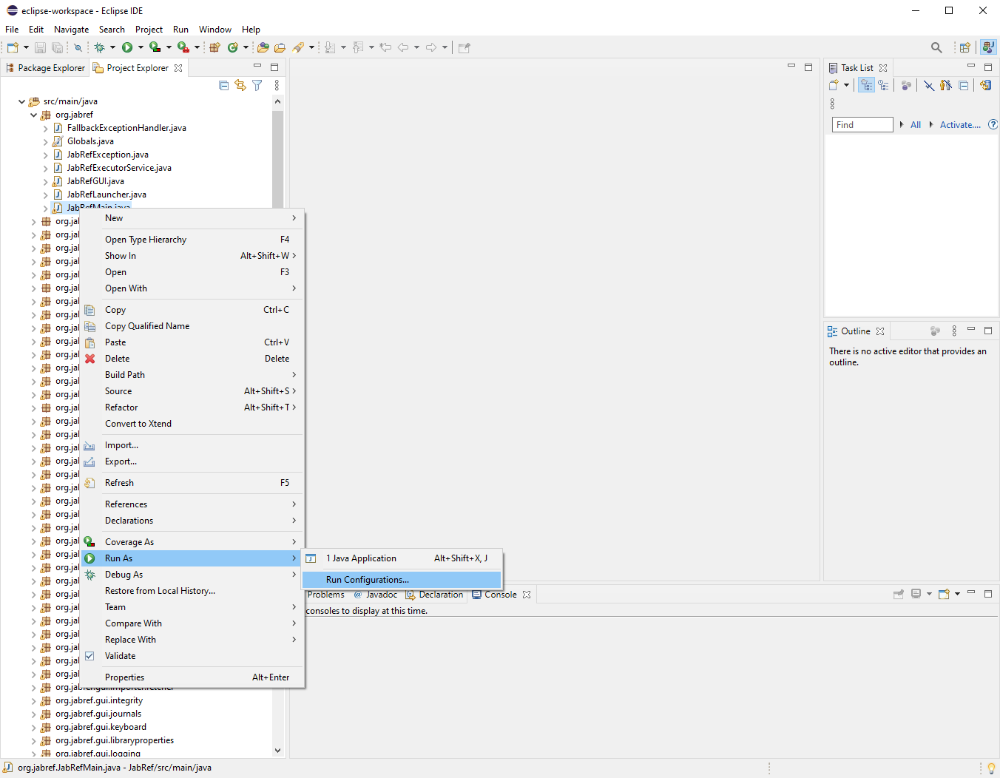

# Advanced: Eclipse as IDE

For advanced users, [Eclipse](https://eclipse.org) (`2023-03` or newer) is also possible.
For JDK20 you need to install the additional [support for jdk20 as extension](https://marketplace.eclipse.org/content/java-20-support-eclipse-2023-03-427)).
On Ubuntu Linux, you can follow the [documentation from the Ubuntu Community](https://help.ubuntu.com/community/EclipseIDE#Download\_Eclipse) or the [step-by-step guideline from Krizna](https://www.krizna.com/ubuntu/install-eclipse-in-ubuntu-12-04/) to install Eclipse.
On Windows, download it from [www.eclipse.org](http://www.eclipse.org/downloads/) and run the installer.

For Eclipse, a working Java (Development Kit) 20 installation is required.
In the case of IntelliJ, this will be downloaded inside the IDE (if you follow the steps below).

In the command line (terminal in Linux, cmd in Windows) run `javac -version` and make sure that the reported version is Java 20 (e.g., `javac 20`).
If `javac` is not found or a wrong version is reported, check your `PATH` environment variable, your `JAVA_HOME` environment variable or install the most recent JDK.
Please head to <https://adoptium.net/de/temurin/releases> to download JDK 20.

Always make sure your Eclipse installation us up to date.

1. Run `./gradlew run` to generate all resources and to check if JabRef runs.
   * The JabRef GUI should finally appear.
   * This step is only required once.
   * The directory `src-gen` is now filled.
2. Run `./gradlew eclipse`
   * **This must always be executed, when there are new upstream changes.**
3. Open or import the existing project in Eclipse as Java project.
   * Remark: Importing it as gradle project will not work correctly.
   * Refresh the project in Eclipse
4. Create a run/debug configuration for the main class `org.jabref.cli.Launcher` and/or for `org.jabref.gui.JabRefMain` (both can be used equivalently)
   * Remark: The run/debug configuration needs to be added by right-clicking the class (e.g. `Launcher` or JabRefMain) otherwise it will not work.

       
   * In the tab "Arguments" of the run/debug configuration, enter the following runtime VM arguments:

       ```text
          --add-exports javafx.controls/com.sun.javafx.scene.control=org.jabref
          --add-exports org.controlsfx.controls/impl.org.controlsfx.skin=org.jabref
          --add-exports javafx.graphics/com.sun.javafx.scene=org.controlsfx.controls
          --add-opens javafx.graphics/javafx.scene=org.controlsfx.controls
          --add-exports javafx.graphics/com.sun.javafx.scene.traversal=org.controlsfx.controls
          --add-exports javafx.graphics/com.sun.javafx.css=org.controlsfx.controls
          --add-exports javafx.controls/com.sun.javafx.scene.control.behavior=org.controlsfx.controls
          --add-exports javafx.controls/com.sun.javafx.scene.control=org.controlsfx.controls
          --add-exports javafx.controls/com.sun.javafx.scene.control.inputmap=org.controlsfx.controls
          --add-exports javafx.base/com.sun.javafx.event=org.controlsfx.controls
          --add-exports javafx.base/com.sun.javafx.collections=org.controlsfx.controls
          --add-exports javafx.base/com.sun.javafx.runtime=org.controlsfx.controls
          --add-exports javafx.web/com.sun.webkit=org.controlsfx.controls
          --add-exports javafx.graphics/com.sun.javafx.css=org.controlsfx.controls
          --patch-module org.jabref=build/resources/main
       ```

   * In the tab "Dependencies" of the run/debug configuration tick the checkbox "Exclude test code"
5. Optional: Install the [e(fx)clipse plugin](http://www.eclipse.org/efxclipse/index.html) from the Eclipse marketplace: 1. Help -> Eclipse Marketplace... -> Search tab 2. Enter "e(fx)clipse" in the search dialogue 3. Click "Go" 4. Click "Install" button next to the plugin 5. Click "Finish"
6. Now you can build and run/debug the application by either using `Launcher` or `JabRefMain`. This is the recommended way, since the application starts quite fast.

## Localization Test Configuration (Eclipse)

To run the `LocalizationConsistencyTest` you need to add some extra module information: Right-click on the file -> "Run/Debug as JUnit test". Go to the Run/debug configuration created for that file and in the arguments tab under VM-configurations add:

```text
--add-exports javafx.graphics/com.sun.javafx.application=ALL-UNNAMED
--add-exports javafx.graphics/com.sun.javafx.stage=ALL-UNNAMED
--add-exports javafx.graphics/com.sun.javafx.stage=com.jfoenix
```
