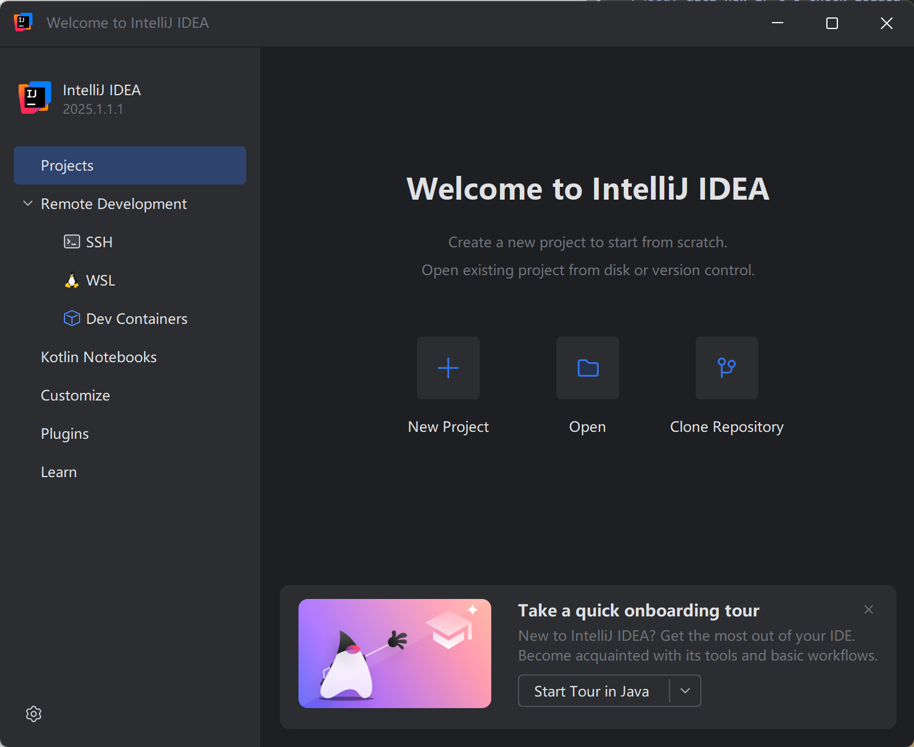
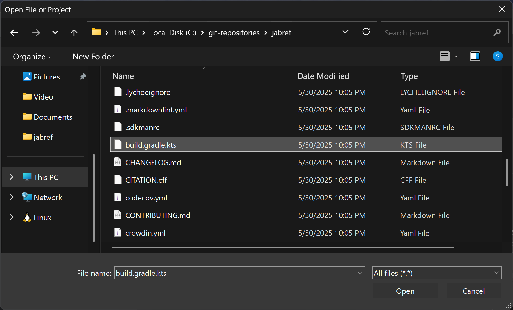
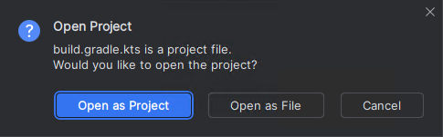
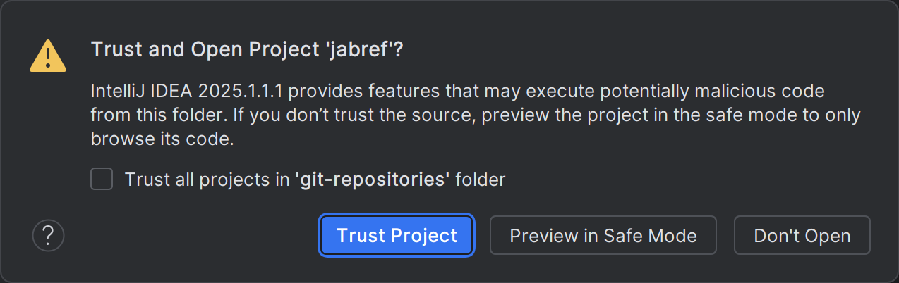
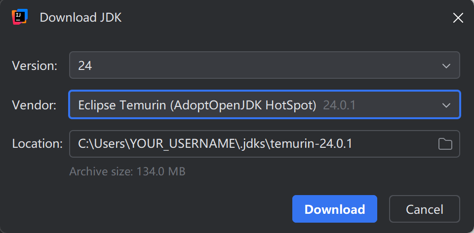
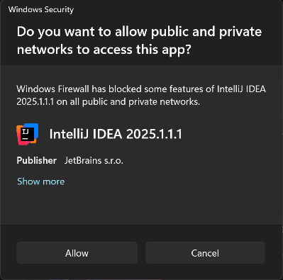
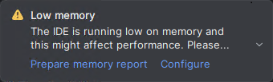

# Step 1: Get the code into IntelliJ

## Pre-condition: Gradle caches filled

On Linux, with IntelliJ IDEA 2025.2.4 (Ultimate Edition), there are issues with importing.
The workaround is to run JabRef once from the command line.

- Linux: Execute `./gradlew :jabgui:run`
- Windows (Powershell): Execute `.\gradlew :jabgui:run`

In case Gradle does not find a JDK, use [`gg.cmd`](https://github.com/eirikb/gg) as follows:

1. Download <https://github.com/eirikb/gg/releases/latest/download/gg.cmd>
2. Move the file to your JabRef project directory
3. Run the GUI

   - Windows: `.\gg.cmd gradle:java@24 jabgui:compileJava`
   - Linux: `sh -x ./gg.cmd gradle:java@24 jabgui:compileJava`

4. Wait until the command execution completes.
   On an Intel(R) Core(TM) i5-1350 (16 GB RAM), it takes more than 15 minutes.

The command line may appear to hang at `:jablib:processResources`, you still need to keep waiting.
However, in parallel, you can continue setting up IntelliJ below, because the initial Gradle setup succeeded.

{: .note }
> Background
>
> The above is a workaround for following error:
>
> ```text
> Could not apply requested plugin [id: 'org.jabref.gradle.module'] as it does not provide a plugin with id 'org.jabref.gradle.module'. This is caused by an incorrect plugin implementation. Please contact the plugin author(s).
> > Plugin with id 'org.jabref.gradle.module' not found.
> ```

## IntelliJ Startup

Start IntelliJ IDEA.

IntelliJ shows the following window:





## Open the project

Click on "Open"

Choose `build.gradle.kts` in the root of the `jabref` source folder:





After clicking "Open," IntelliJ asks how that file should be opened.
Answer: "Open as Project"





Then, trust the project:





## Confirm JDK Downloading

IntelliJ asks for JDK downloading.
Keep the suggested Java version and choose "Eclipse Temurin" as Vendor.
Click "Download".





## Allow JDK to access the internet

Allow also access for both cases and click "Allow access".





## Wait for IntelliJ IDEA to import the gradle project

IntelliJ shows "Importing 'jabref' Gradle Project" in the lower right corner.
This will take several minutes.
Wait until this disappears.





## Respond to notifications

You can disregard notifications

- offering to reopen the project in a container
- announcing the project JDK
- suggesting that you install the plugin WireMock

## IntelliJ IDEA may report low memory





1. Click on "Configure".
2. Set "2500" MB (instead of 1262) and click on "Save and Restart".
3. Wait until IntelliJ is up and running again.

<!-- markdownlint-disable-file MD033 -->
