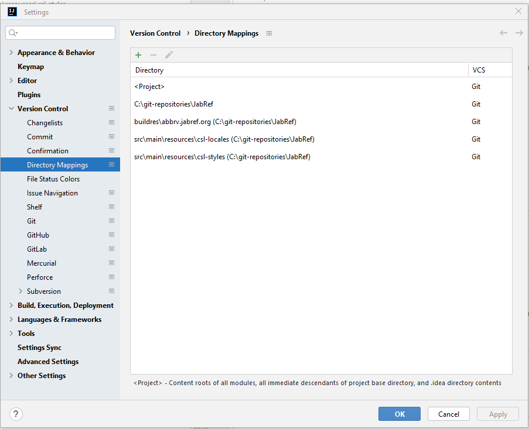
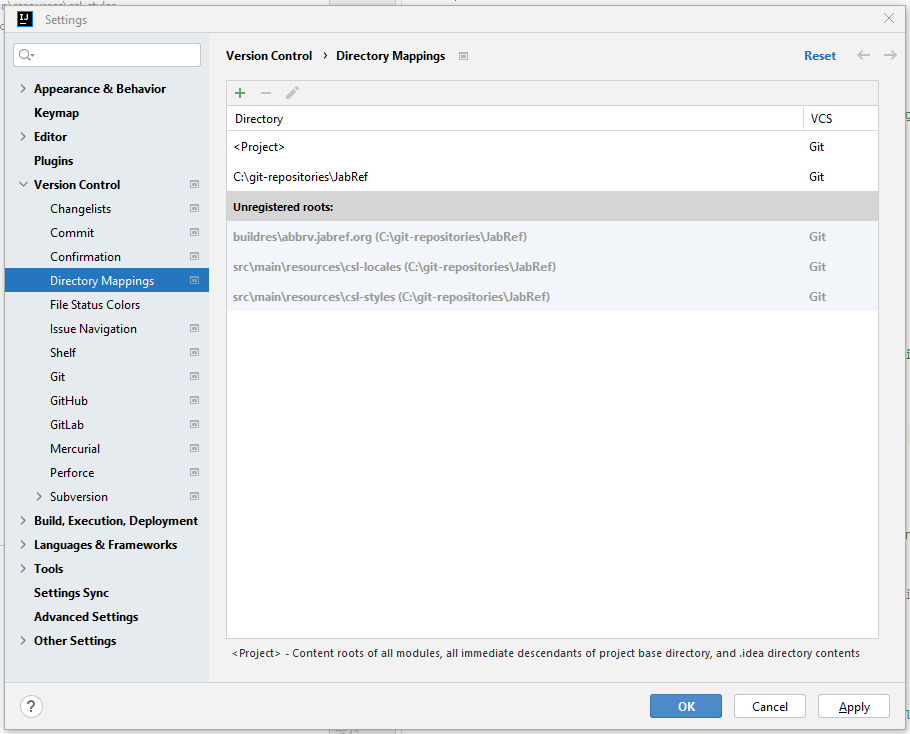

# Step 1: Get the code into IntelliJ

Start IntelliJ.

IntelliJ shows the following window:





Click on "Open"

Choose `build.gradle` in the root of the jabref source folder:





After pressing "OK", IntelliJ asks how that file should be opened.
Answer: "Open as Project"





Then, trust the project:





## Ensure that committing via IntelliJ works

IntelliJ offers committing using the UI.
Press <kbd>Alt</kbd>+<kbd>0</kbd> to open the commit dialog.

Unfortunately, IntelliJ has no support for ignored sub modules [[IDEA-285237](https://youtrack.jetbrains.com/issue/IDEA-285237/ignored-changes-in-submodules-are-still-visible-in-the-commit-window)].
Fortunately, there is a workaround:

Go to **File > Settings... > Version Control > Directory Mappings**.<br>
**Note:** In some MacBooks, `Settings` can be found at the "IntelliJ" button of the app menu instead of at "File".

Currently, it looks as follows:





You need to tell IntelliJ to ignore the submodules `buildres\abbrv.jabref.org`, `src\main\resources\csl-locales`, and `src\main\resources\csl-styles`.
Select all three (holding the <kbd>Ctrl</kbd> key).
Then press the red minus button on top.

This will make these directories "Unregistered roots:", which is fine.





## Ensure that committing with other tools work

Open a "git bash".
On Windows, navigate to `C:\git-repositories\JabRef`.
Open the context menu of the file explorer (using the right mouse button), choose "Open Git Bash here".

Execute following command:

```shell
git update-index --assume-unchanged buildres/abbrv.jabref.org src/main/resources/csl-styles src/main/resources/csl-locales
```

{: .tip }
If you do not see the context menu, re-install git following the steps given at [StackOverflow](https://stackoverflow.com/a/50667280/873282).

<!-- markdownlint-disable-file MD033 -->
