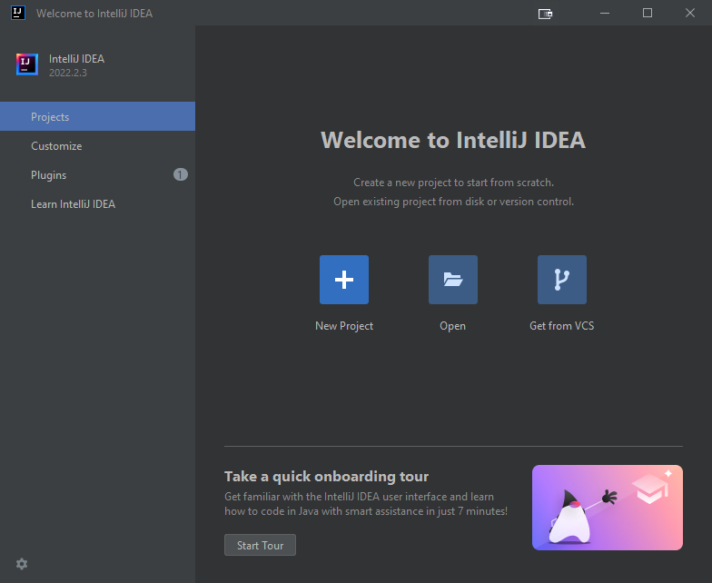
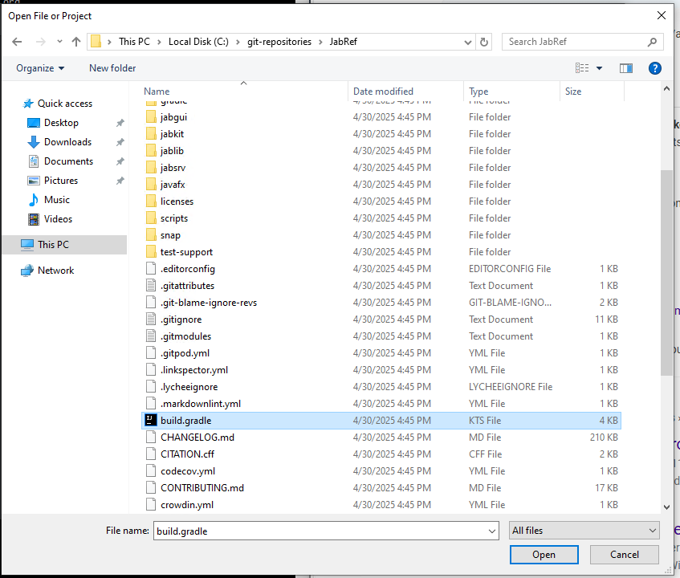
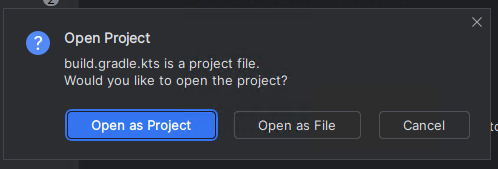
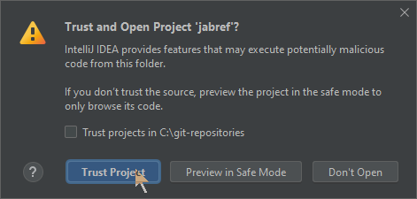

# Step 1: Get the code into IntelliJ

Start IntelliJ.

IntelliJ shows the following window:





Click on "Open"

Choose `build.gradle` in the root of the jabref source folder:





After pressing "OK", IntelliJ asks how that file should be opened.
Answer: "Open as Project"





Then, trust the project:




