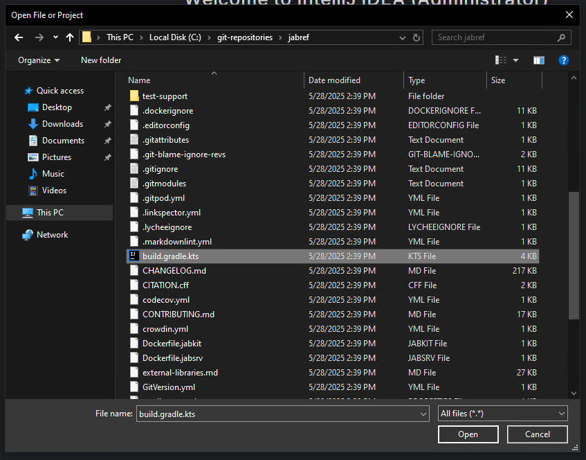
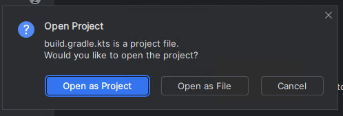
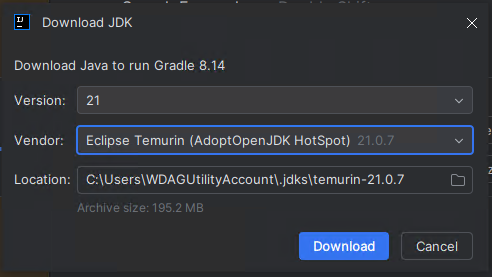
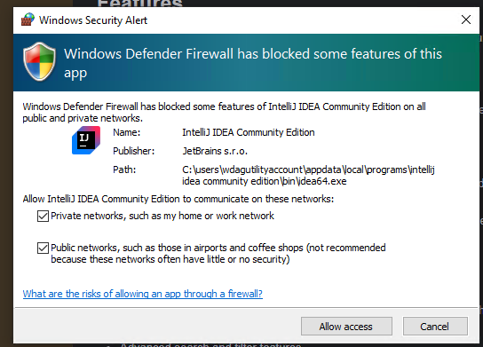
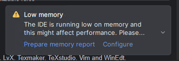
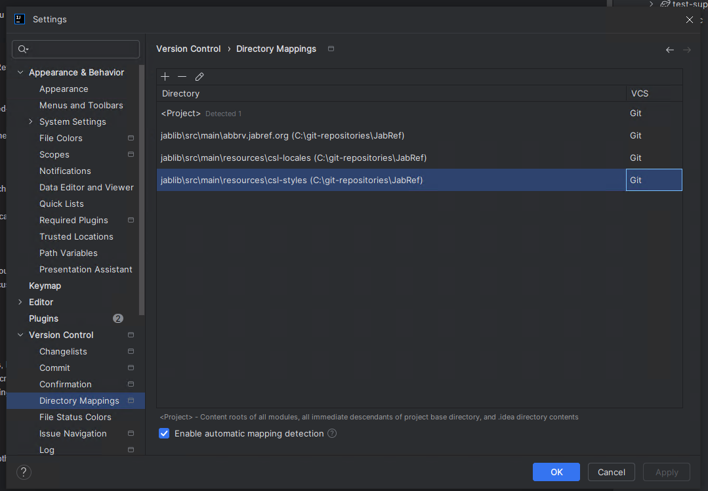
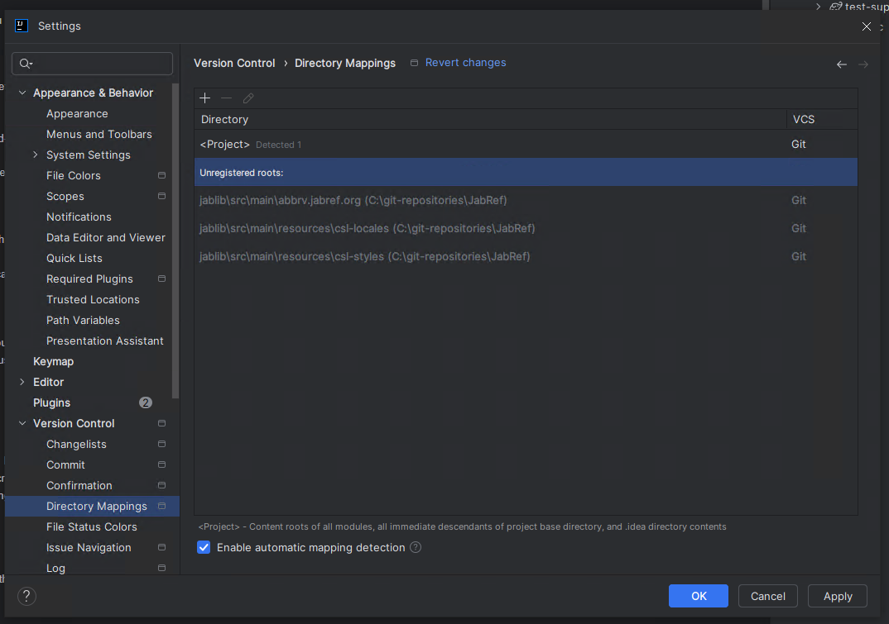

# Step 1: Get the code into IntelliJ

## IntelliJ Startup

Start IntelliJ IDEA.

IntelliJ shows the following window:





## Open the project

Click on "Open"

Choose `build.gradle.kts` in the root of the `jabref` source folder:





After clicking "Open," IntelliJ asks how that file should be opened.
Answer: "Open as Project"





Then, trust the project:





## Confirm JDK Downloading

IntelliJ asks for JDK downloading.
Keep the suggested Java version and choose "Eclipse Temurin" as Vendor.
Click "Download".





## Allow JDK to access the internet

Allow also access for both cases and click "Allow access".





## Wait for IntelliJ IDEA to import the gradle project

IntelliJ shows "Importing 'jabref' Gradle Project" at the lower right corner.
This will take several minutes.
Wait until this disappears.





## IntelliJ IDEA will report low memory





1. Click on "Configure".
2. Set "2500" MB (instead of 1262) and click on "Save and Restart".
3. Wait until IntelliJ is up and running again.

## Ensure that committing via IntelliJ works

Unfortunately, IntelliJ has no support for ignored sub modules [[IDEA-285237](https://youtrack.jetbrains.com/issue/IDEA-285237/ignored-changes-in-submodules-are-still-visible-in-the-commit-window)].
Fortunately, there is a workaround:

Go to **File > Settings... > Version Control > Directory Mappings**. 
**Note:** In some MacBooks, `Settings` can be found at the "IntelliJ" button of the app menu instead of at "File".

Currently, it looks as follows:





You need to tell IntelliJ to ignore the submodules `jablib\src\main\abbrv.jabref.org`, `jablib\src\main\resources\csl-locales`, and `jablib\src\main\resources\csl-styles`.
Select all three (holding the <kbd>Ctrl</kbd> key).
Then press the minus button on top.

This will make these directories "Unregistered roots:", which is fine.





Click "OK"

<!-- markdownlint-disable-file MD033 -->
