# Step 2: Setup the build system: JDK and Gradle

## Ensure that JDK 21 is available to IntelliJ

Ensure you have a Java 21 SDK configured by navigating to **File > Project Structure... > Platform Settings > SDKs**.


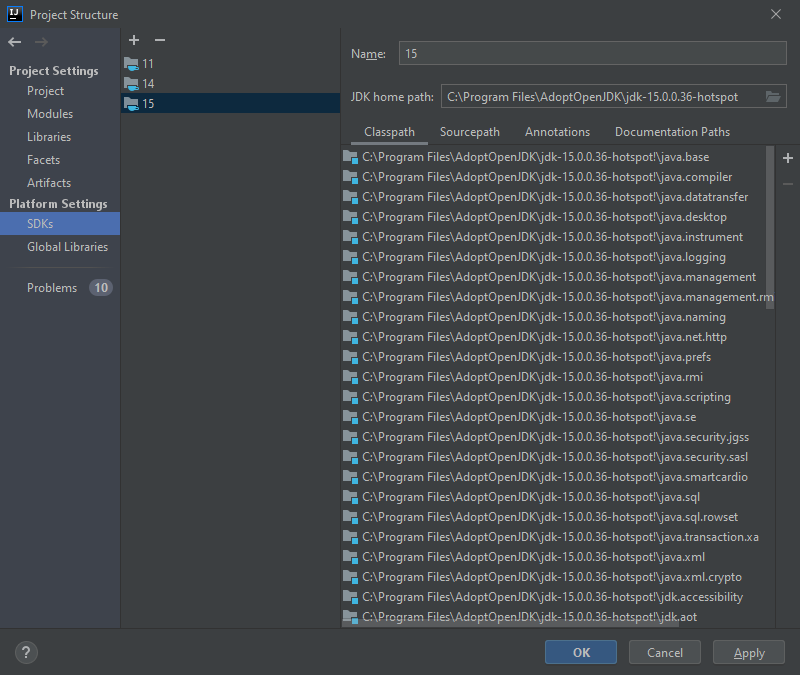


If there is another JDK than JDK 21 selected, click on the plus button and choose "Download JDK..."


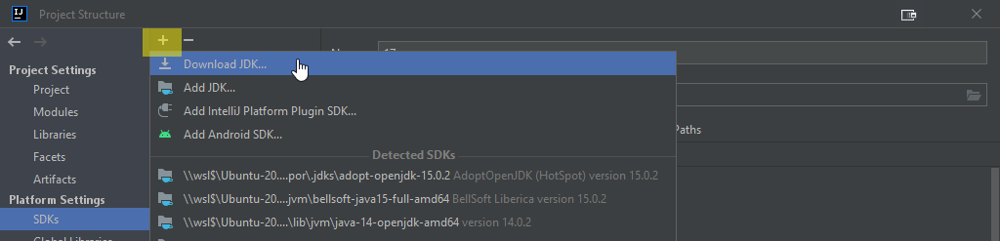


Select JDK version 21 and then Eclipse Temurin.


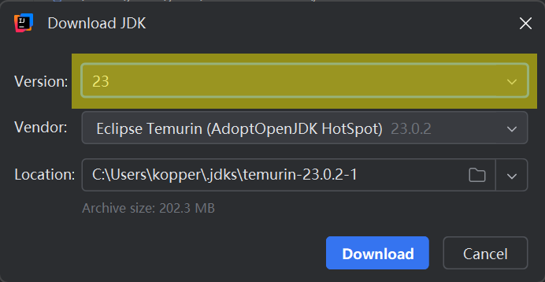


After clicking "Download", IntelliJ installs Eclipse Temurin:


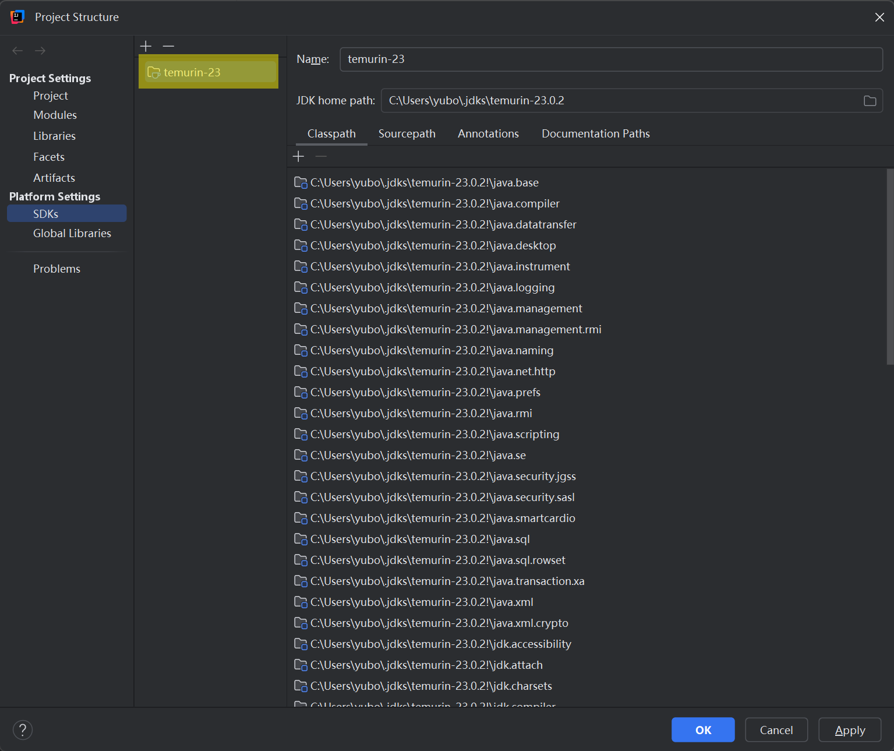


Open the module settings: Right click on "JabRef" and select "Open Module Settings":


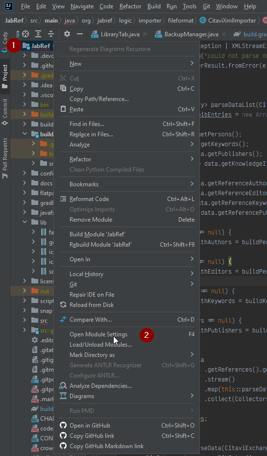


Navigate to **Project Settings > Project** and ensure that the projects' SDK is Java 21.


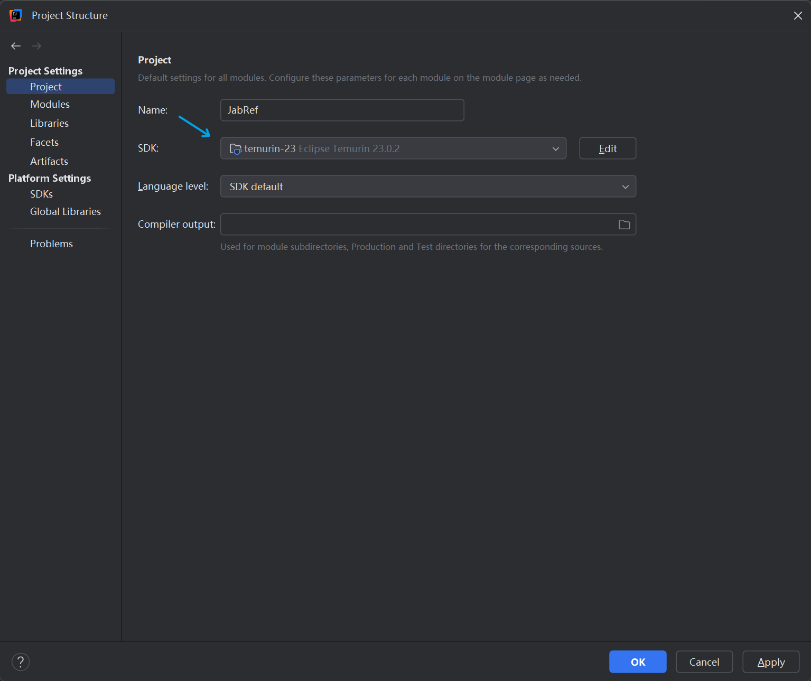


Click "OK" to store the changes.

## Configure the Build System

Navigate to **File > Settings... > Build, Execution, Deployment > Build Tools > Gradle** and select the "Project SDK" as the Gradle JVM at the bottom. If that does not exist, just select a JDK 21.


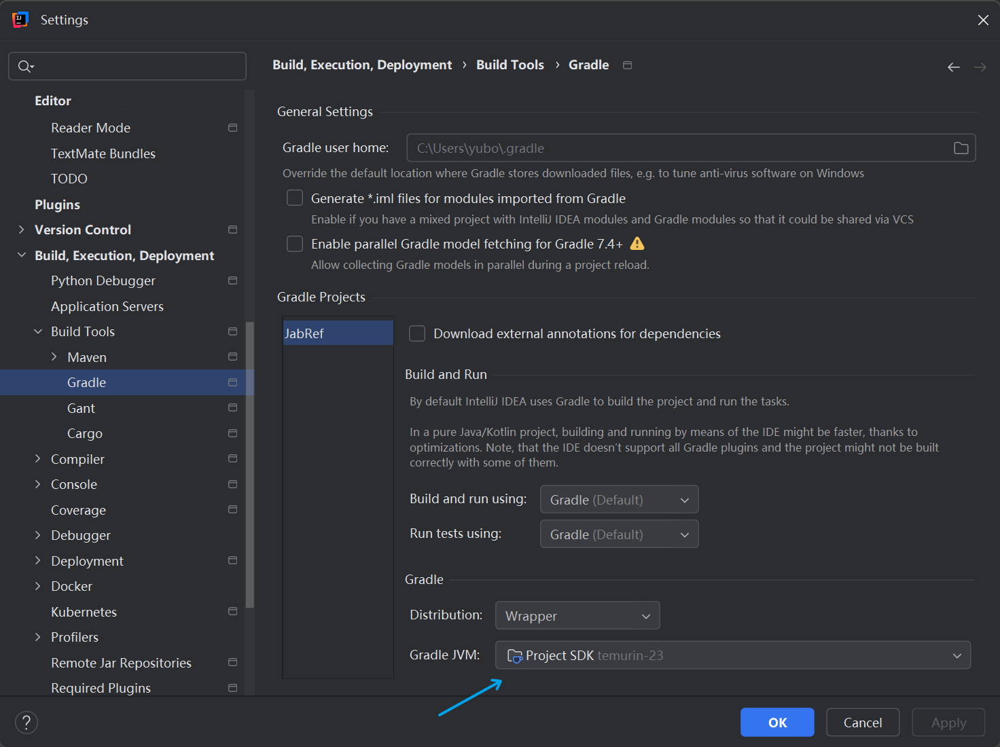


To prepare IntelliJ's build system additional steps are required:

Navigate to **Build, Execution, Deployment > Compiler > Java Compiler**, and under "Override compiler parameters per-module", click add (\[+]) and choose `JabRef.main`:


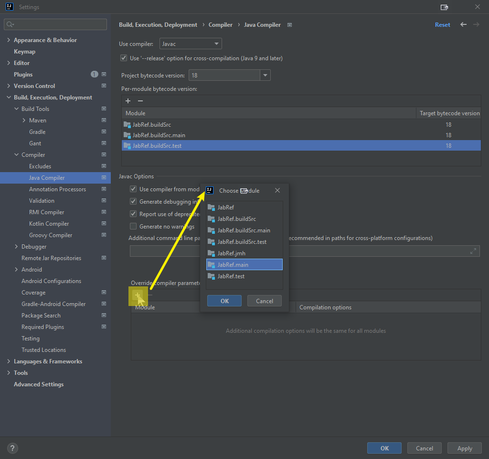


Then double click inside the cell "Compilation options" and enter following parameters:

```text
--add-exports=javafx.controls/com.sun.javafx.scene.control=org.jabref
--add-exports=org.controlsfx.controls/impl.org.controlsfx.skin=org.jabref
--add-reads org.jabref=org.fxmisc.flowless
--add-reads org.jabref=org.apache.commons.csv
```

Press <kbd>Enter</kbd> to have the value really stored.
Otherwise, it seems like the setting is stored, but it is not there if you re-open this preference dialog.
Then click on "Apply" to store the setting.


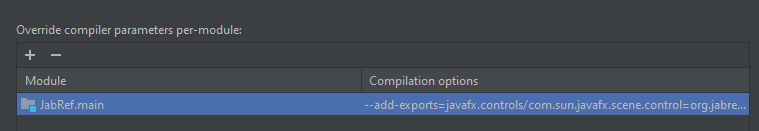


If this step is omited, you will get: `java: package com.sun.javafx.scene.control is not visible (package com.sun.javafx.scene.control is declared in module javafx.controls, which does not export it to module org.jabref)`.

Enable annotation processors by navigating to **Build, Execution, Deployment > Compiler > Annotation processors** and check "Enable annotation processing"


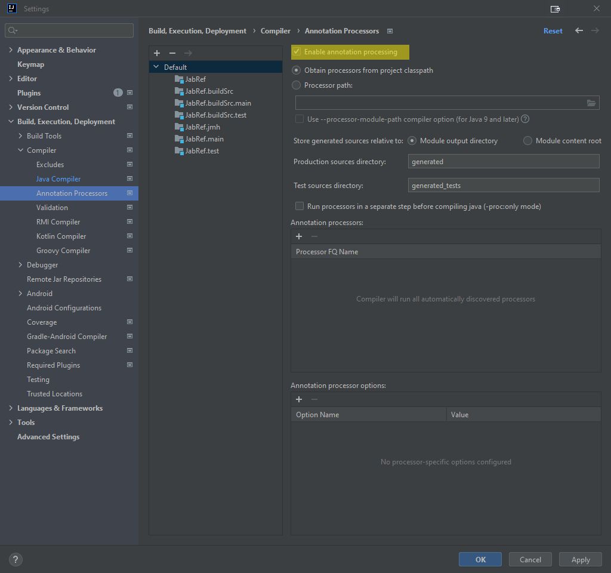


## Using Gradle from within IntelliJ IDEA

{: .note }
Ensuring JabRef builds with Gradle should always the first step because, e.g. it generates additional sources that are required for compiling the code.

Open the Gradle Tool Window with the small button that can usually be found on the right side of IDEA or navigate to **View > Tool Windows > Gradle**.
In the Gradle Tool Window, press the "Reload All Gradle Projects" button to ensure that all settings are up-to-date with the setting changes.


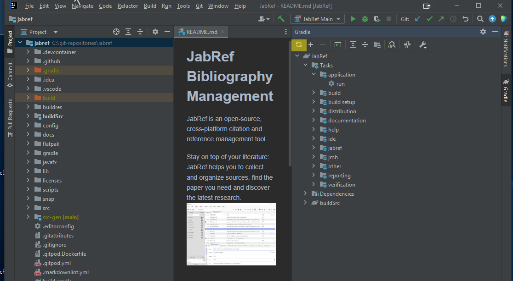


After that, you can use the Gradle Tool Window to build all parts JabRef and run it.
To do so, expand the JabRef project in the Gradle Tool Window and navigate to Tasks.
From there, you can build and run JabRef by double-clicking **JabRef > Tasks > application > run**.


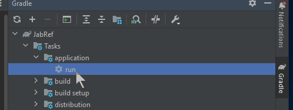


The Gradle run window opens, shows compilation and then the output of JabRef.
The spinner will run as long as JabRef is opened.


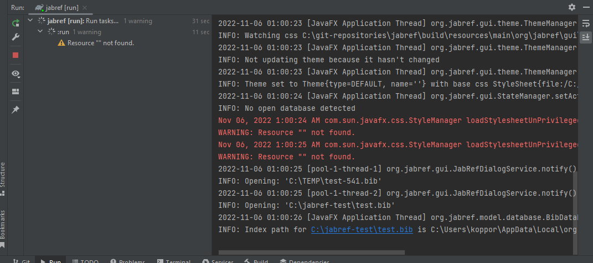


You can close JabRef again.

After that a new entry called "jabref \[run]" appears in the run configurations.
Now you can also select "jabref \[run]" and either run or debug the application from within IntelliJ.

{: .note }
You can run any other development task in a similar way.

## Using IntelliJ's internal build system for tests

In **File > Settings... > Build, Execution, Deployment > Build Tools > Gradle** the setting "Run tests using:" is set to "IntelliJ IDEA".


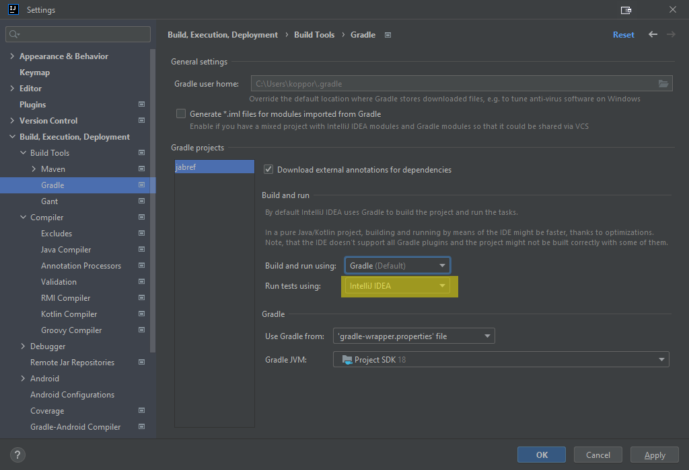


{: .note }
In case there are difficulties later, this is the place to switch back to gradle.

Click "OK" to close the preference dialog.

In the menubar, select **Build > Rebuild project**.

IntelliJ now compiles JabRef.
This should happen without any error.

Now you can use IntelliJ IDEA's internal build system by using **Build > Build Project**.

## Final build system checks (optional)

To run an example test from IntelliJ, we let IntelliJ create a launch configuration:

Locate the class `BibEntryTest`:
Press <kbd>Ctrl</kbd>+<kbd>N</kbd>.
Then, the "Search for classes dialog" pops up.
Enter `bibenrytest`.
Now, `BibEntryTest` should appear first:


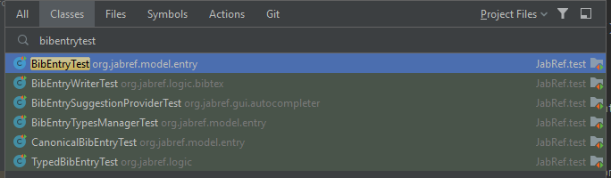


Press <kbd>Enter</kbd> to jump to that class.

Hover on the green play button on `testDefaultConstructor`:


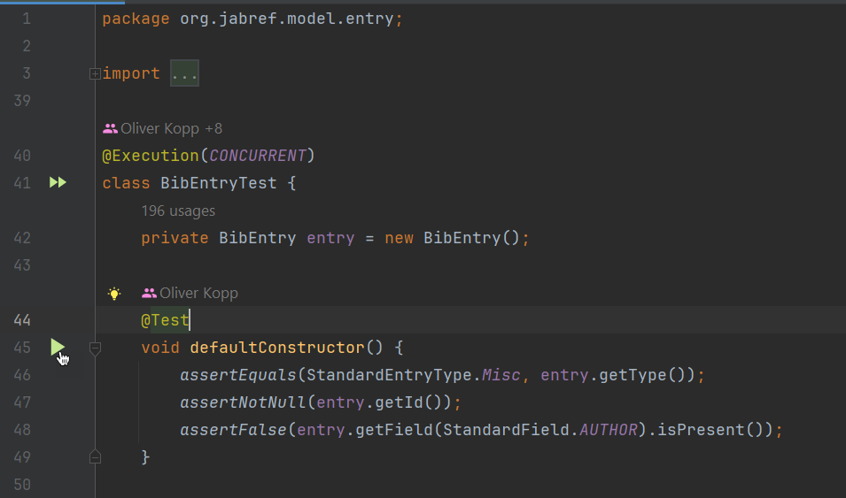


Then, click on it.
A popup menu opens.
Choose the first entry "Run testDefaultConstructor" and click on it.


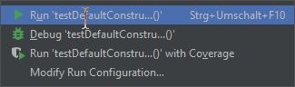


Then, the single test starts.

You also have an entry in the Launch configurations to directly launch the test.
You can also click on the debug symbol next to it to enable stopping at breakpoints.





The tests are green after the run.
You can also use the play button there to re-execute the tests.
A right-click on "BibEntryTests" enables to start the debugger.


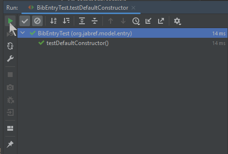

