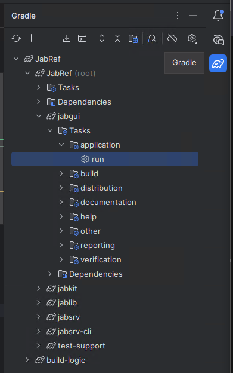
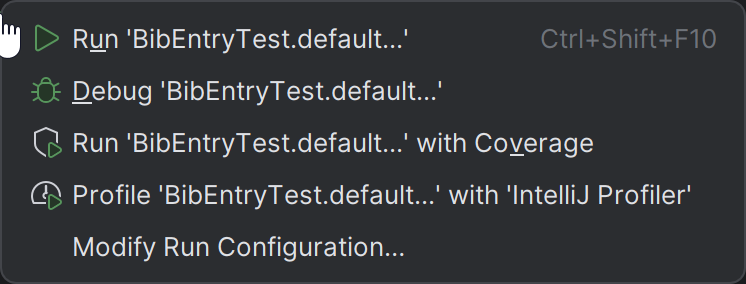
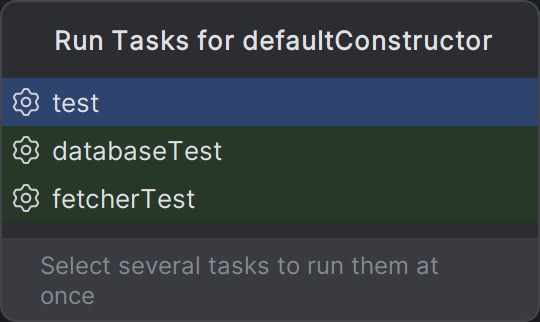
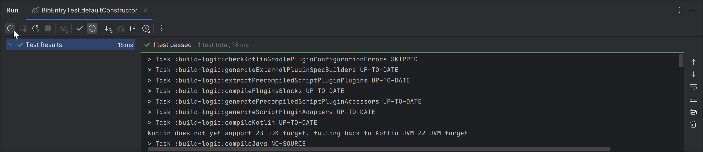

# Step 2: Set up the build system: JDK and Gradle

## Ensure that the project is synchronized

Press the synchronization button in the gradle menu.

1. Locate the gradle icon on the right side and click on it.
2. Click on the arrows on the left side of this pane.





Press <kbd>Alt</kbd>+<kbd>1</kbd> to show the project view

Then, on the left side the project folder is there:





## Switch JDK to the latest one

Go to "File > Project Structure" or press <kbd>Ctrl</kbd>+<kbd>Shift</kbd>+<kbd>Alt</kbd>+<kbd>S</kbd>.





Click on "Project" on the left side. Then, select **temurin-25** as the project SDK (continue reading if this option is not available).





If you do not have the access to this JDK, download it by clicking on "Download JDK..." In the dialog that opens, select version 25, vendor "Eclipse Temurin (AdoptOpenJDK HotSpot)", and click "Download".









Finally enable the JDK:

1. Click "OK" to close the dialog "Project Structure".
2. Wait for IntelliJ to index the new JDK.
3. If IntelliJ crashes, restart it. At "Help > Memory Settings", increase the "Maximum Heap Size".

## Enable annotation processors

Enable annotation processors by navigating to **File > Settings > Build, Execution, Deployment > Compiler > Annotation processors** and check "Enable annotation processing"





## Using Gradle from within IntelliJ IDEA

{: .note }
Ensuring JabRef builds with Gradle should always be the first step since this is the commonly supported way to build JabRef.

Use the Gradle Tool Window to build all parts of JabRef and run it.
To do so, expand the JabRef project in the Gradle Tool Window, navigate to "jabgui", expand it, navigate to "application", expand it, and double click "run".





The Gradle run window opens, shows compilation and then the output of JabRef.
The spinner will run as long as JabRef is open.

You might get an out-of-memory-exception as follows:

```text
OpenJDK 64-Bit Server VM warning: INFO: os::commit_memory(0x00000000cb600000, 177209344, 0) failed; error='The paging file is too small for this operation to complete' (DOS error/errno=1455)
```

You can close JabRef again.

After that a new entry called "jabref \[run]" appears in the run configurations.
Now you can also select "jabref \[run]" and either run or debug the application from within IntelliJ.

{: .note }
You can run any other development task similarly.

## Enable compilation by IntelliJ

This is currently not possible due to [IDEA-3733059](https://youtrack.jetbrains.com/issue/IDEA-373305).

<!--

To prepare IntelliJ's build system additional steps are required:

Navigate to **File > Settings > Build, Execution, Deployment > Compiler > Java Compiler**, and under "Override compiler parameters per-module", click add (\[+]) and choose `JabRef`.

Copy following text into your clipboard:

```text
--add-exports=javafx.controls/com.sun.javafx.scene.control=org.jabref
--add-exports=org.controlsfx.controls/impl.org.controlsfx.skin=org.jabref
```

Then double click inside the cell "Compilation options".
Press <kbd>Ctrl</kbd>+<kbd>V</kbd> to paste all text.
Press <kbd>Enter</kbd> to have the value really stored.
Otherwise, it seems like the setting is stored, but it is not there if you reopen this preference dialog.

Note: If you use the expand arrow, you need to press <kbd>Shift</kbd>+<kbd>Enter</kbd> to close the expansion and then <kbd>Enter</kbd> to commit the value.

Then click on "Apply" to store the setting.

Note: If this step is omitted, you will get: `java: package com.sun.javafx.scene.control is not visible (package com.sun.javafx.scene.control is declared in module javafx.controls, which does not export it to module org.jabref)`.

IntelliJ prompts with "Back Up Your Settings".
You can choose "Skip" here.

-->

## Using IntelliJ's internal build system for tests

This is currently not possible due to [IDEA-3733059](https://youtrack.jetbrains.com/issue/IDEA-373305).

<!--

In **File > Settings... > Build, Execution, Deployment > Build Tools > Gradle** the setting "Run tests using:" is set to "IntelliJ IDEA".





{: .note }
In case there are difficulties later, this is the place to switch back to gradle.

Click "OK" to close the preference dialog.

In the menu bar, select **Build > Rebuild project**.

IntelliJ now compiles JabRef.
This should happen without any error.

Now you can use IntelliJ IDEA's internal build system by using **Build > Build Project**.

-->

## Final build system checks

To run an example test from IntelliJ, we let IntelliJ create a launch configuration:

Locate the class `BibEntryTest`:
Press <kbd>Ctrl</kbd>+<kbd>N</kbd>.
Then, the "Search for classes dialog" pops up.
Enter `bibentrytest`.
Now, `BibEntryTest` should appear first:





Press <kbd>Enter</kbd> to jump to that class.

Hover on the green play button on `defaultConstructor`:





Then, click on it.
A popup menu opens.
Choose the first entry "Run BibEntryTest.testDefaultConstructor" and click on it.





Then, another popup menu opens. Choose "test" as the run task for the test.





Then, the single test starts.

You also have an entry in the Launch configurations to directly launch the test.
You can also click on the debug symbol next to it to enable stopping at breakpoints.





The tests are green after the run.
You can also use the play button there to re-execute the tests.
A right-click on "BibEntryTests" enables the debugger to start.





<!-- markdownlint-disable-file MD033 -->
