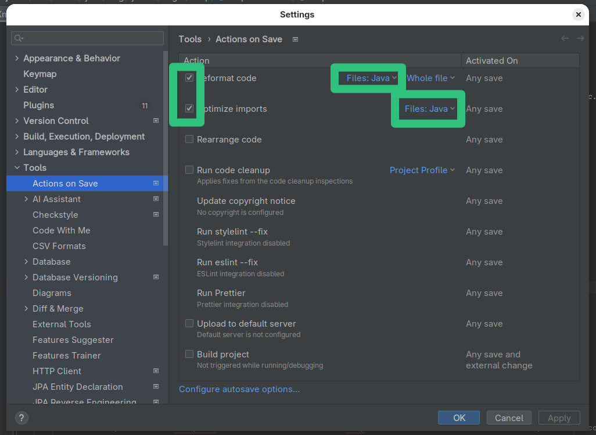

# Step 3: Set up JabRef's code style

Contributions to JabRef's source code need to have a code formatting that is consistent with existing source code. For that purpose, JabRef provides code-style and check-style definitions.

Install the [CheckStyle-IDEA plugin](http://plugins.jetbrains.com/plugin/1065?pr=idea), it can be found via the plug-in repository:
Navigate to **File > Settings... > Plugins"**.
On the top, click on "Marketplace".
Then, search for "Checkstyle".
Click on "Install" choose "CheckStyle-IDEA". 
**Note:** In some MacBooks, `Settings` can be found at the "IntelliJ" button of the app menu instead of at "File".





After clicking, IntelliJ asks for confirmation:





If you agree, click on "Agree" and you can continue.

Afterward, use the "Restart IDE" button to restart IntelliJ.





Click on "Restart" to finally restart.

Wait for IntelliJ coming up again.

## Have auto format working properly in JavaDoc

To have auto format working properly in the context of JavaDoc and line wrapping, "Wrap at right margin" has to be disabled. Details are found in [IntelliJ issue 240517](https://youtrack.jetbrains.com/issue/IDEA-240517).

Go to **File > Settings... > Editor > Code Style > Java > JavaDoc**.

At "Other", disable "Wrap at right margin"





## Enable auto formatting of your code

IntelliJ can automatically reformat your code on save.
Please make use of this functionality.

Go to **File > Settings... > Tools > Actions on Save**.

1. Check "Reformat code"
2. Click on "All file types" (on the right)
3. Uncheck "All file types"
4. Check "Java"
5. Check "Optimize imports"
6. Click on "All file types" (on the right)
7. Uncheck "All file types" to disable it
8. Check "Java"





## Enable proper import cleanup

To enable "magic" creation and auto cleanup of imports, go to **File > Settings... > Editor > General > Auto Import**.
There, enable both "Add unambiguous imports on the fly" and "Optimize imports on the fly"
(Source: [JetBrains help](https://www.jetbrains.com/help/idea/creating-and-optimizing-imports.html#automatically-add-import-statements)).





Press "OK".

## Disable too advanced code folding

Go to **File > Settings... > Editor > General > Code Folding**.
At section "General", disable "File header" and "Imports".
At section "Java", disable "One-line methods".





Press "OK".

## Run checkstyle

In the lower part of IntelliJ's window, click on "Checkstyle".
In "Rules", change to "JabRef".
Then, you can run a check on all modified files.





## Final comments

{: .highlight }
> Now you have configured IntelliJ completely.
> You can run the main application using Gradle and the test cases using IntelliJ.
> The code formatting rules are imported - and the most common styling issue at imports is automatically resolved by IntelliJ.
> Finally, you have Checkstyle running locally so that you can check for styling errors before submitting the pull request.

Got it running? GREAT! You are ready to lurk the code and contribute to JabRef. Please make sure to also read our [contribution guide](https://devdocs.jabref.org/contributing#contribute-code).

<!-- markdownlint-disable-file MD033 -->
