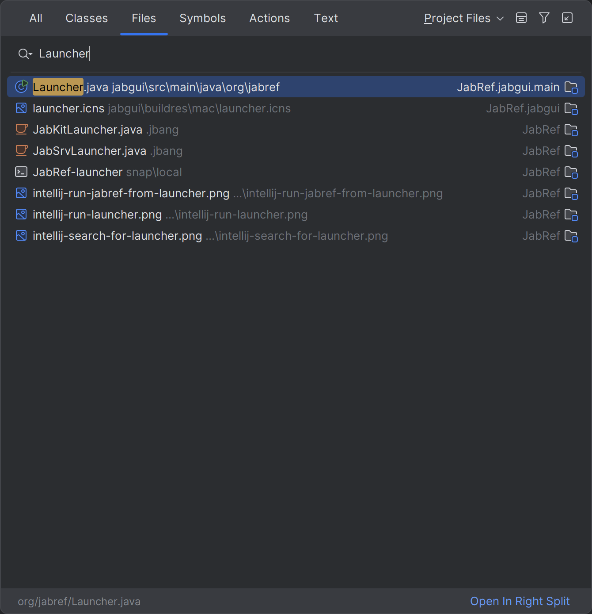
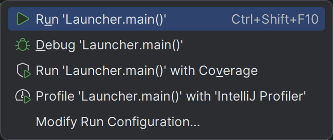
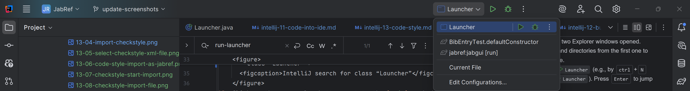
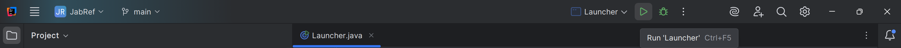

# Advanced: Build and run using IntelliJ IDEA

{: .important }
> Following is currently not possible due to [IDEA-3733059](https://youtrack.jetbrains.com/issue/IDEA-373305).
>
> We keep this page as basis for future work.

In "Step 2: Setup the build system: JDK and Gradle", IntelliJ was configured to use Gradle as tool for launching JabRef.
It is also possible to use IntelliJ's internal build and run system to launch JabRef.
Due to [IDEA-119280](https://youtrack.jetbrains.com/issue/IDEA-119280), it is a bit more work.

1. Navigate to **File > Settings... > Build, Execution, Deployment > Build Tools > Gradle**.
2. Change the setting "Build and run using:" to "IntelliJ IDEA".
3. Navigate to **File > Settings... > Build, Execution, Deployment > Compiler**.
4. Uncheck `Clear output directory on rebuild`.
5. Navigate to **File > Settings... > Build, Execution, Deployment > Compiler > Java Compiler**.
6. Uncheck `--Use 'release' option for cross-compilation`.
7. Click "OK" to store the preferences and close the dialog.
8. **Build > Build Project** (<kbd>Ctrl</kbd>+<kbd>F9</kbd>)
9. Open the project view (<kbd>Alt</kbd>+<kbd>1</kbd>, on macOS <kbd>cmd</kbd>+<kbd>1</kbd>)
10. Copy all build resources to the folder of the build classes
    1. Navigate to the folder `build/resources/main`
    1. Right click -> "Open In" -> "Explorer (Finder on macOS)"
    1. Navigate into directory "main"
    1. Select the folder `out/production/classes`
    1. Right click -> "Open In" -> "Explorer (Finder on macOS)"
    1. Navigate into directory "classes"
    1. Now you have two Explorer windows opened. Copy all files and directories from the first one to the second one.
11. Locate the class `Launcher` (e.g., by <kbd>ctrl</kbd>+<kbd>N</kbd> and then typing `Launcher`). Press <kbd>Enter</kbd> to jump to that class.
    <figure>
      
      <figcaption>IntelliJ search for class “Launcher”</figcaption>
    </figure>
12. Click on the green play button next to the `main` method to create a Launch configuration. IntelliJ will fail in launching.
    <figure>
      
      <figcaption>However on green play</figcaption>
    </figure>
    <figure>
      
      <figcaption>Run JabRef via launcher drop down</figcaption>
    </figure>
13. On the top right of the IntelliJ window, next to the newly created launch configuration, click on the drop down
14. Click on "Edit Configurations..."
15. On the right, click on "Modify options"
16. Ensure that "Use classpath of module" is checked
17. Select "Add VM options"
18. In the newly appearing field for VM options, insert:
   ```text
   --add-exports=javafx.controls/com.sun.javafx.scene.control=org.jabref
   --add-opens=org.controlsfx.controls/org.controlsfx.control.textfield=org.jabref
   --add-exports=org.controlsfx.controls/impl.org.controlsfx.skin=org.jabref
   --add-exports javafx.controls/com.sun.javafx.scene.control=org.jabref
   --add-exports org.controlsfx.controls/impl.org.controlsfx.skin=org.jabref
   --add-exports javafx.graphics/com.sun.javafx.scene=org.controlsfx.controls
   --add-opens javafx.graphics/javafx.scene=org.controlsfx.controls
   --add-exports javafx.graphics/com.sun.javafx.scene.traversal=org.controlsfx.controls
   --add-exports javafx.graphics/com.sun.javafx.css=org.controlsfx.controls
   --add-exports javafx.controls/com.sun.javafx.scene.control.behavior=org.controlsfx.controls
   --add-exports javafx.controls/com.sun.javafx.scene.control=org.controlsfx.controls
   --add-opens=javafx.controls/javafx.scene.control.skin=org.controlsfx.controls
   --add-exports javafx.controls/com.sun.javafx.scene.control.inputmap=org.controlsfx.controls
   --add-exports javafx.base/com.sun.javafx.event=org.controlsfx.controls
   --add-exports javafx.base/com.sun.javafx.collections=org.controlsfx.controls
   --add-exports javafx.base/com.sun.javafx.runtime=org.controlsfx.controls
   --add-exports javafx.web/com.sun.webkit=org.controlsfx.controls
   --add-exports javafx.graphics/com.sun.javafx.css=org.controlsfx.controls
   --add-reads org.jabref=org.fxmisc.flowless
   --add-reads org.jabref=org.apache.commons.csv
   ```
19. Click "Apply"
20. Click "Run". You can also click on the debug symbol next to it to enable stopping at breakpoints.
     <figure>
       
       <figcaption>Launch menu contains “Launcher”</figcaption>
     </figure>

<!-- MD031 is disabled, because otherwise the numbering does not work properly. MD029 and M032 are disabled as a consequence. -->
<!-- markdownlint-disable-file MD029 MD031 MD032 MD033 -->
