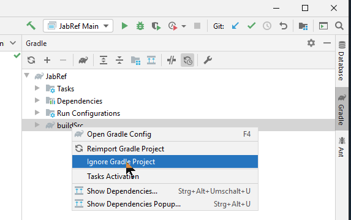

# Trouble shooting

## Issues with `buildSrc`

1. Open the context menu of `buildSrc`.
2. Select "Load/Unload modules".
3. Unload `jabRef.buildSrc`.

## Issues with generated source files

In rare cases you might encounter problems due to out-dated automatically generated source files. Running gradle task "clean" (Command line: `./gradlew clean`) deletes these old copies. Do not forget to run at least `./gradlew assemble` or `./gradlew eclipse` afterwards to regenerate the source files.

## Issue with "Module org.jsoup" not found, required by org.jabref

Following error message appears:

```text
Error occurred during initialization of boot layer
java.lang.module.FindException: Module org.jsoup not found, required by org.jabref
```

This can include different modules.

1. Go to File -> Invalidate caches...
2. Check "Clear file system cache and Local History".
3. Check "Clear VCS Log caches and indexes".
4. Uncheck the others.
5. Click on "Invalidate and Restart".
6. After IntelliJ restarted, you have to do the "buildSrc", "Log4JAppender", and "src-gen" steps again.

## Issues with OpenJFX libraries in local maven repository

There might be problems with building if you have OpenJFX libraries in local maven repository, resulting in errors like this:

```text
 > Could not find javafx-fxml-20-mac.jar (org.openjfx:javafx-fxml:20).
     Searched in the following locations:
         file:<your local maven repository path>/repository/org/openjfx/javafx-fxml/20/javafx-fxml-20-mac.jar
```

As a workaround, you can remove all local OpenJFX artifacts by deleting the whole OpenJFX folder from specified location.

## Issues with `JournalAbbreviationLoader`

In case of a NPE at `Files.copy` at `org.jabref.logic.journals.JournalAbbreviationLoader.loadRepository(JournalAbbreviationLoader.java:30) ~[classes/:?]`, invalidate caches and restart IntelliJ. Then, Build -> Rebuild Project.

If that does not help:

1. Save/Commit all your work
2. Close IntelliJ
3. Delete all non-versioned items: `git clean -xdf`. This really destroys data
4. Execute `./gradlew run`
5. Start IntelliJ and try again.

## Hints for IntelliJ 2021

In older IntelliJ setups, more things were necessary:

Ignore the Gradle project "buildSrc" by clicking the button **Select Project Data To Import** in the Gradle Tool Window and unchecking the folder "buildSrc".



Add `src-gen` as root:

1. Right click on the project "jabref".
2. Select "Open Module Settings"
3. Expand "JabRef"
4. Select "main"
5. Select tab "Sources"
6. Click "+ Add Content Root"
7. Select the `src-gen` directory
8. Click "OK". When expanding "main", "java" should have been selected as source
9. Click "OK" to save the changes

In case the above step does not work, run with gradle, import gradle project again, and try again.

~~Note that the above steps might not work on IntelliJ 2020.x.\*\*. You have to keep using gradle for executing tasks. See~~ [~~IDEA-249391~~](https://youtrack.jetbrains.com/issue/IDEA-249391) ~~for details.~~

In case all steps are followed, and there are still issues with `SearchBaseVisitor` (e.g., `Error:(16, 25) java: package org.jabref.search does not exist`), you have to delete `src\main\generated\org\jabref\gui\logging\plugins\Log4jPlugins.java`. This is independent of having enabled or disabled Annotation Processing (see above at "Enable Annotation Processing").

## Java installation

An indication that `JAVA_HOME` is not correctly set or no JDK 20 is installed in the IDE is following error message:

```text
compileJava FAILED

FAILURE: Build failed with an exception.

* What went wrong:
Execution failed for task ':compileJava'.
> java.lang.ExceptionInInitializerError (no error message)
```

Another indication is following output

```text
java.lang.UnsupportedClassVersionError: org/javamodularity/moduleplugin/ModuleSystemPlugin has been compiled by a more recent version of the Java Runtime (class file version 55.0), this version of the Java Runtime only recognizes class file versions up to 52.0
```
