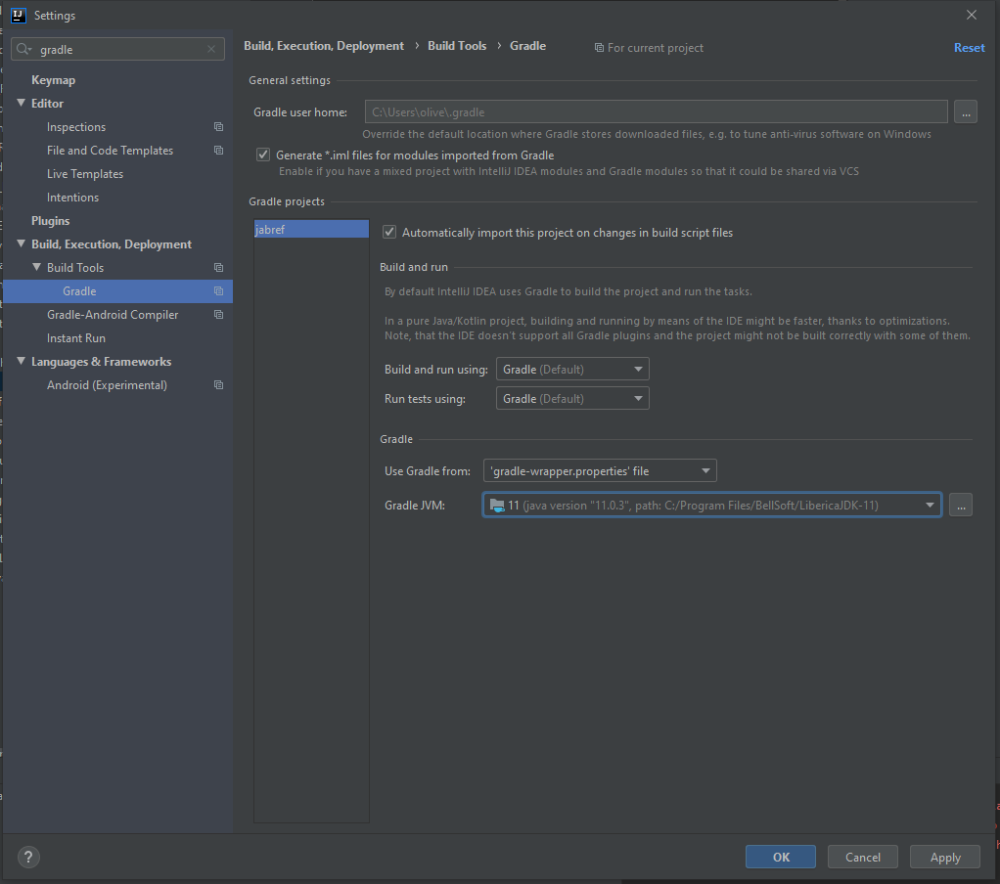

## Prerequisites

> Java Development Kit 11 with JavaFX development.

We recommend Liberica JDK 11 LTS at <https://bell-sw.com/pages/java-11.0.3/>, because it includes JavaFX.
There is a long way to go regarding good Java 11 code.
See https://github.com/JabRef/jabref/issues/5226 for current issues.

An indication that `JAVA_HOME` is not correctly set or no JDK is installed is following error message:

```
compileJava FAILED

FAILURE: Build failed with an exception.

* What went wrong:
Execution failed for task ':compileJava'.
> java.lang.ExceptionInInitializerError (no error message)
```

Another indication is following output

    java.lang.UnsupportedClassVersionError: org/javamodularity/moduleplugin/ModuleSystemPlugin has been compiled by a more recent version of the Java Runtime (class file version 55.0), this version of the Java Runtime only recognizes class file versions up to 52.0

### Ensure you have a Java SDK installed

* In the command line (terminal in Linux, cmd in Windows) run `javac -version`
* If `javac` is not found, check your PATH environment variable, your JAVA_HOME environment variable or install the most recent SDK

### GitHub account

If you do not have a GitHub account, create it at https://github.com.

### Get an IDE in place

We suggest [Eclipse](https://eclipse.org/) or [IntelliJ](https://www.jetbrains.com/idea/).

#### IntelliJ

The community edition should be enough.
If not, a developer key for the JabRef project for the full version is available upon request.

You can find a IntelliJ Codestyle configuration file in the folder `config`

In case there are errors at the Gradle sync (and that there is no play button at the tests), fix the reference JDK.

##### JabRef 5.x

Please use a JDK with JavaFX support.
We recommend the LibericaJDK as it works out of the box.
See <https://bell-sw.com/>.

##### JabRef 4.x

The current JDK is most probably JDK 8 (and not JDK 11).
Hints are given at <https://stackoverflow.com/a/54507226/873282>.

#### Eclipse

Please install [EclEmma](http://eclemma.org/) for code coverage.

In Ubuntu Linux, you can follow one of these guidelines to Install Eclipse:

* [Documentation from Ubuntu Community](https://help.ubuntu.com/community/EclipseIDE#Download_Eclipse)
* [Step-by-step from Krizna](www.krizna.com/ubuntu/install-eclipse-in-ubuntu-12-04/)

In Windows download it from [www.eclipse.org](http://www.eclipse.org/downloads/) and run the installer.

### Get git in place

* In Debian-based distros: `sudo apt-get install git`
* In Windows: Go to http://git-scm.com/download/win download and install it. For more advanced tooling, you may use [Git Extensions](http://gitextensions.github.io/) or [SourceTree](https://www.sourcetreeapp.com/).

## Get the code

### Fork JabRef into your GitHub account

1. Log into your GitHub account
2. Go to https://github.com/JabRef/jabref 
3. Create a fork by clicking at fork button on the right top corner
4. A fork repository will be created under your account (https://github.com/YOUR_USERNAME/jabref)

### Clone your forked repository on your local machine.

* In command line go to a folder you want to place the source code locally (parent folder of `jabref/`). To prevent issues along the way, it is strongly recommend to choose a path that does not contain any special (non-ASCII or whitespace) characters.
* Run `git clone --depth=10 https://github.com/YOUR_USERNAME/jabref.git`. The `--depth--10` is used to limit the download to ~20 MB instead of downloading the complete history (~800 MB). If you want to dig in our commit history, feel free to download everything.
* Update submodules: `git submodule update --init`

### Generating additional source codes and getting dependencies using Gradle

(not required for IntelliJ)

1. Go to the jabref folder (the repo you just cloned, if you are following this tutorial, just execute `cd jabref`)
2. Execute the following steps from the git-bash:

    * Run `./gradlew assemble`
    * If you use Eclipse: Additionally run `./gradlew eclipse`
    * If you use IntelliJ: No further setup is required

3. In rare cases you might encounter problems due to out-dated automatically generated source files. Running `./gradlew clean` deletes these old copies. Do not forget to run at least `./gradlew eclipse` or `./gradlew build` afterwards to regenerate the source files.
4. `./gradlew tasks` shows many other runnable tasks.  

### Set-up Eclipse

* Open Eclipse
* To Import your JabRef project go to menu File --> Import

1. Choose General --> Existing projects in the workspace and "next"
2. For "select root directory", browse until the root folder of your jabref just cloned from your repo (e.g., `/home/user/<YOU>/jabref`)
3. Click on "Finish" and voilá!
4. In Eclipse, right click on the project and choose Refresh workspace and then choose Run as --> Java application (Forget about the existing errors)
5. Choose JabRefMain as the main class to be executed

### Set-up your IDE (IntelliJ)

#### JabRef 5.x

In IntelliJ, execute following steps:

1. Open `build.gradle` as project
2. Do not enable automatic sync if asked
3. Ensure that Projekt SDK is Java 11

    1. Right click on project -> Module Settings 
    2. Platform Settings -> SDK

3. Ensure that each module has Java 11

  1. File | Settings | Build, Execution, Deployment | Compiler | Java Compiler 
  2.  All Modules have to have "Target bytecode version" as 11.

3. Ensure that <s>IntelliJ</s>Gradle is used as execution service

  1. File | Settings | Build, Execution, Deployment | Build Tools | Gradle
  1. Build and run using: <s>IntelliJ IDEA</s>Gradle
  1. Run tests using: <s>IntelliJ IDEA</s>Gradle

4. **Stop here**
4. Open Module Settings (right click on the project root)
5. Select Project Settings --> Libraries
6. Add all *.jars from lib/ directory **one by one**: Make it available to all projects (multiselection is possible)
<!--
- afterburner.fx.jar -> no replacement required
- customjfx.jar -> no replacement required
-->
8. Remove all starting with `com.lihaoyi` <!-- fastparse+fastparse-utils+sourcecode -->
<!-- libreoffice.jar -> Remove all libeoffice (if exists) -->
9. Remove all com.google.errorprone
9. Remove all org.checkerframework
9. Remove all jsr305 <!-- com.google.code.findbugs:jsr305 -->
9. Enable impl.org.controlsfx.skin being visible:

    1. See <https://intellij-support.jetbrains.com/hc/en-us/community/posts/360001797820/comments/360000274319>
    2. Add `--add-exports org.controlsfx.controls/impl.org.controlsfx.skin=org.jabref --add-exports javafx.controls/javafx.scene.control=org.jabref --add-exports javafx.controls/com.sun.javafx.scene.control=org.controlsfx.controls --add-exports javafx.controls/com.sun.javafx.scene.control=org.jabref` as option to JabRef.main
    3. Ensure that you click the "Apply" button. You have to select the black area below the input field to enable the Apply button.

9. Execute Build/Rebuild Project
9. Start the UI

  1. Run org.jabref.JabRefMain:main
  1. Ensure that "Use classpath of module JabRef.main" is selected

9. Currently does not start. We are working on it.
9. Apply workaround to have Gradle as execution environment

#### JabRef 4.x

See <https://youtu.be/FeQpygT0314>. This ensures that `src/main/gen` is present.

After that steps, please follow these:

1. Install the [CheckStyle-IDEA plugin](http://plugins.jetbrains.com/plugin/1065?pr=idea), it can be found via plug-in repository (File > Settings > Plugins > Browse repositories).
2. Go to File > Settings > Editor > Code Style, choose a code style (or create a new one) 
3. Click on the settings wheel (next to the scheme chooser), then Import scheme and choose "CheckStyle Configuration". Select the CheckStyle configuration file `config\checkstyle\checkstyle.xml`. Click OK and restart IntelliJ.
4. Go to File > Settings > Checkstyle and import the above CheckStyle configuration file. Activate it.

In case IntelliJ cannot compile the sources, tell IntelliJ to use Gradle for compiling and testing:



## Final comments

Got it running? GREAT! You are ready to lurk the code and contribute to JabRef :books: . In the latter case, please read [CONTRIBUTING.md](https://github.com/JabRef/jabref/blob/master/CONTRIBUTING.md).
