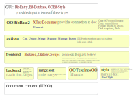

# Code reorganization

Why

- Separate backend
- Separate GUI code (dialogs) and logic
- Data is now organized around `Citation`, `CitationGroup` instead of arrays for citation group
  fields, and arrays of arrays for citation fields.  
  Also take `citationKey` as the central data unit, this is what we start with: unresolved `citationKeys`
  do not stop processing. Although we cannot sort them by author and year, we can still emit a marker
  that acts as a placeholder and shows the user the problematic key.

## Result

### Layers

### By directories

- `model`
  - `util` : general utilities
    - (`OOPair`, `OOTuple3`) collect two or three objects without creating a new class
    - `OOResult` : while an Optional.empty can comunicate failure, it cannot provide details.  
      `OOResult` allows an arbitrary error object to be provided in case of failure.  
    - `OOVoidResult` : for functions returning no result on success, only diagnostics on failure.
    - `OOListUtil`: some utilities working on List
  - `uno` : helpers for various tasks via UNO.  
    These are conceptually independent of JabRef code and logic.
  - `ootext` : to separate decisions on the format of references and citation marks from
    the actual insertion into the document, the earlier method
    [OOUtil.insertOOFormattedTextAtCurrentLocation](https://github.com/JabRef/jabref/blob/475b2989ffa8ec61c3327c62ed8f694149f83220/src/main/java/org/jabref/logic/openoffice/OOUtil.java#L112)
    was extended to handle new tags that describe actions earlier done in code.
    - This became [OOTextIntoOO.write](https://github.com/antalk2/jabref/blob/122d5133fa6c7b44245c5ba5600d398775718664/src/main/java/org/jabref/model/openoffice/ootext/OOTextIntoOO.java#L149)
      - `(change)` Now all output to the document goes through this, not only those from Layout. This allows the citation markers and `jstyle:Title` to use these tags.
        - This allows some backward-compatible extensions to jstyle.  
        `(change)` [Added](https://github.com/antalk2/jabref/blob/122d5133fa6c7b44245c5ba5600d398775718664/src/main/java/org/jabref/logic/openoffice/style/OOBibStyle.java#L92)
        some extra keywords, in `{prefix}_MARKUP_BEFORE`,  `{prefix}_MARKUP_AFTER` pairs to allow bracketing some parts of citation marks with text and/or open/close tag pairs.
    - [OOFormat](https://github.com/antalk2/jabref/blob/improve-reversibility-rebased-03/src/main/java/org/jabref/model/openoffice/ootext/OOFormat.java)
      contains helpers to create the appropriate tags
    - [OOText](https://github.com/antalk2/jabref/blob/improve-reversibility-rebased-03/src/main/java/org/jabref/model/openoffice/ootext/OOText.java) formalizes
      the distinction from `String`. I did not change `String` to `OOText` in old code, (in particular in OOStyle).
  - `rangesort` : ordering objects that have an `XTextRange`, optionally with an extra integer to break ties.
    - `RangeSort.partitionAndSortRanges` : since `XTextRangeCompare` can only compare `XTextRange` values in
      the same `XText`, we partition them accordingly and only sort within each partiion.
    - `RangeSortable` (interface), `RangeSortEntry` (implements) :  
      When we replace `XTextRange` of citation marks in footnotes with the range of the footnote mark,
      multiple citation marks may be mapped to the same location. To preserve the order between these,
      `RangeSortable` allows this order to be indicated by returning appropriate indices from `getIndexInPosition`
    - `RangeSortVisual` : sort in top-to-bottom left-to-right order.  
    Needs a functional `XTextViewCursor`.  
    Works on `RangeSortable` values.
    - `FunctionalTextViewCursor` : helper to get a functional `XTextViewCursor` (cannot always)
    - `RangeOverlapWithin` : check for overlaps within a set of `XTextRange` values. Probably O(n*log(n)). Used for all-to-all check of protected ranges.
    - `RangeOverlapBetween` : check for overlaps between two sets of `XTextRange` values. Assumes one set is small. O(n*k).
    Used for checking if the cursor is in a protected range.
  - `backend` : interfaces to be provided by backends.  
    May change as new backends may need different APIs.
  - `style` : data structures and interfaces used while going from ordered list of citation groups
  to formatted citation markers and bibliography. Does not communicate with the document. Too long to fit here, starting a new section.

## model/style

At the core,

- we have `Citation` values
  - represented in the document by their `citationKey`
  - each may have a `pageInfo`
- A citation group (`CitationGroup`) has
  - a list of citations (`citationsInStorageOrder`)
  - an identifier `CitationGroupId cgid`
    - this allows to refer to the group
    - also used to associate the group to its citation markers location (outside the style part,
    in [Backend](https://github.com/antalk2/jabref/blob/fed0952cbdaf7a76bcb09b3db5ac48f34f5ca388/src/main/java/org/jabref/logic/openoffice/backend/Backend52.java#L46))
  - `OODataModel dataModel` is here, in order to handle old (Jabref5.2) structure where pageInfo belonged to
  CitationGroup not Citation
  - `referenceMarkNameForLinking` is optional: can be used to crosslink to the citation marker
  from the bibliography.
- `CitationGroups` represents the collection of citation groups.  
Processing starts with creating a `CitationGroups` instance from the data stored in the document.

- `CitedKey` represents a cited source, with ordered backreferences (using `CitationPath`) to the correponding
citations.

- `CitedKeys` is just an order-preserving collection of `CitedKeys` that also supports lookup by
`citationKey`. While producing citation markers, we also create a corresponding `CitedKeys`
instance, and store it in `CitationGroups.bibliography`. This is already sorted, its entries have
`uniqueLetter` or `number` assigned, but not converted to markup yet.

Common processing steps:

- We need `globalOrder` for the citation groups (provided externally)
`CitationGroups.setGlobalOrder()`
- We need to look up each citationKey in the bibliography databases:
  - `CitationGroups.lookupCitations` collects the cited keys,
  looks up each, then distributes the results to the citations.
  Uses a temporary `CitedKeys` instance, based on unsorted citations and citation groups.
- `CitationGroups.imposeLocalOrder` fills `localOrder` in each `CitationGroup`

- Now we have order of appearance for the citations (`globalOrder` and `localOrder`).  
  We can create a `CitedKeys` instance (`bibliography`) according to this order.

- For citations numbered in order of first appearance we number the sources and distribute the numbers
to the corresponding citations.
- For citations numbered in order of bibliography, we sort the bibliography, number, distribute.

- For author-year citations we have to decide on the letters `uniqueLetter` used to distinguish
sources. This needs order of first appearance of the sources and recognizing clashing citation markers.
This is done in logic, in [`OOProcessAuthorYearMarkers.createUniqueLetters()`](https://github.com/antalk2/jabref/blob/122d5133fa6c7b44245c5ba5600d398775718664/src/main/java/org/jabref/logic/openoffice/style/OOProcessAuthorYearMarkers.java#L49)
- We also mark first appearance of each source ([`setIsFirstAppearanceOfSourceInCitations`](https://github.com/antalk2/jabref/blob/fed0952cbdaf7a76bcb09b3db5ac48f34f5ca388/src/main/java/org/jabref/logic/openoffice/style/OOProcessAuthorYearMarkers.java#L146))

The entry point for this processing is: [`OOProcess.produceCitationMarkers`](https://github.com/antalk2/jabref/blob/fed0952cbdaf7a76bcb09b3db5ac48f34f5ca388/src/main/java/org/jabref/logic/openoffice/style/OOProcess.java#L69).  
It fills

- each `CitationGroup.citationMarker`
- `CitationGroups.bibliography`
  - From bibliography `OOFormatBibliography.formatBibliography()` creates an `OOText`
  ready to be written to the document.

## logic/style

- `StyleLoader` : not changed (knows about default styles) Used by GUI
- `OOPreFormatter` : LaTeX code to unicode and OOText tags. (not changed)
- `OOBibStyle` : is mostly concerned by loading/parsing jstyle files and presenting its pieces
to the rest. Originally it also contains code to format numeric and author-year citation markers.
  - Details of their new implementations are in
  [`OOBibStyleGetNumCitationMarker`](https://github.com/antalk2/jabref/blob/improve-reversibility-rebased-03/src/main/java/org/jabref/logic/openoffice/style/OOBibStyleGetNumCitationMarker.java) and
  [`OOBibStyleGetCitationMarker`](https://github.com/antalk2/jabref/blob/improve-reversibility-rebased-03/src/main/java/org/jabref/logic/openoffice/style/OOBibStyleGetCitationMarker.java)
  - The new implementations
    - support pageInfo for each citation
    - support unresolved citations
    - instead of `List<Integer>` and (`List<BibEntry>` plus arrays and database) they expect
    more self-contained entries `List<CitationMarkerNumericEntry>`, `List<CitationMarkerEntry>`.
    - We have distinct methods for `getNormalizedCitationMarker(CitationMarkerNormEntry)` and
    `getNumCitationMarkerForBibliography(CitationMarkerNumericBibEntry)`.
    - The corresponding interfaces in model/style:
      - `CitationMarkerNumericEntry`
      - `CitationMarkerEntry`
      - `CitationMarkerNumericBibEntry`
      - `CitationMarkerNormEntry`  
      describe their expected input entries.
- [`OOProcess.produceCitationMarkers`](https://github.com/antalk2/jabref/blob/fed0952cbdaf7a76bcb09b3db5ac48f34f5ca388/src/main/java/org/jabref/logic/openoffice/style/OOProcess.java#L69)
is the main entry point for style application. Calls to specific implementations
in `OOProcessCitationKeyMarkers`,  `OOProcessNumericMarkers` and `OOProcessAuthorYearMarkers`
according to jstyle flags.

## logic/backend

Details of encoding and retrieving data stored in a document as well as
the citation maker locations. Also contains dataModel-dependent code
(which could probably be moved out once the datamodel is settled).

Creating and finding the bibliography (providing a cursor to write at) should be here too.  
These are currently in `UpdateBibliography`

## logic/frontend

- `OOFrontend` : has a `Backend` and `CitationGroups`
  - Its constructor creates a backend, reads data from the document and creates a CitationGroups instance.
  - provides functionality that requires both access to the document and the CitationGroups instance
- `RangeForOverlapCheck` used in `OOFrontend`
- `UpdateBibliography` : Create, find and update the bibliography in the document using output from
  `produceCitationMarkers()`
- `UpdateCitationMarkers` create `CitationGroup`, update citation markers using output from
  `produceCitationMarkers()`

## logic/action

GUI-independent part of implementations of GUI actions.

## gui

- `OOError` : common error messages and dialog titles
  - adds `title` to `Jabrefexception`
  - converts from some common exception types using type-specific message
  - contains some dialog messages that do not correspond to exceptions

- `OOBibBase2` : most activity was moved out from here to parts discussed above.
  - connecting / selecting a document moved to `OOBibBaseConnect`
  - the rest connects higher parts of the GUI to actions in logic
    - does argument and precondition checking
    - catches all exceptions
    - shows error and warning dialogs
    - adds `enterUndoContext`, `leaveUndoContext` around action code

