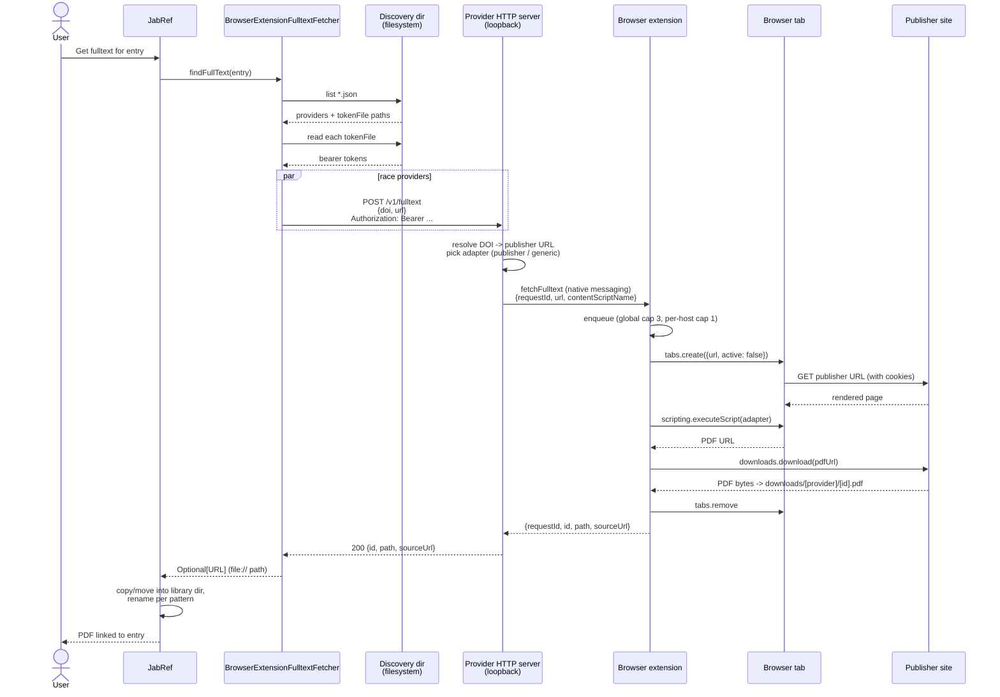

<!-- markdownlint-disable-file MD022 -->
# Browser-Extension Fulltext Provider Protocol

A loopback HTTP protocol by which JabRef requests fulltext PDFs from a locally-running browser-extension companion. The companion uses the user's already-authenticated browser session to obtain a PDF that JabRef cannot reach directly (paywall, anti-bot, 418, institutional SSO).

The protocol is **provider-agnostic**. Any browser-extension companion that implements it can serve JabRef. JabRef itself ships a single, vendor-neutral consumer (`BrowserExtensionFulltextFetcher`).

The requirement identifiers use the `bxf` (browser-extension-fulltext) prefix and are intentionally **protocol-scoped, not repository-scoped**: every implementor traces its own implementation against the same `req~bxf.*~N` identifiers. Each implementor runs its own OpenFastTrace pipeline; the identifier space is shared, tracing is per-repo. A revision bump (e.g. `~1` → `~2`) is a protocol-version event affecting every implementor.

This file is the **canonical copy**. Verbatim copies live alongside provider implementations to support cross-repo tracing. Edits must land in this file first; provider repositories sync afterwards.

## Requirement levels

The key words **MUST**, **MUST NOT**, **REQUIRED**, **SHALL**, **SHALL NOT**, **SHOULD**, **SHOULD NOT**, **RECOMMENDED**, **MAY**, and **OPTIONAL** in this document are to be interpreted as described in [RFC 2119](https://www.rfc-editor.org/rfc/rfc2119) and [RFC 8174](https://www.rfc-editor.org/rfc/rfc8174): they carry normative force only when written in all capitals. The same words in lower case are used in their ordinary English sense and impose no requirement.

## Message format
`req~bxf.message-format~1`

All request and response bodies are UTF-8 encoded JSON. Clients and providers MUST set `Content-Type: application/json` on every request and response that carries a body. A provider MUST reject a request whose body is not well-formed JSON with `400 bad-request`. Unknown JSON fields are ignored per [Versioning](#versioning), so that backwards-compatible additions do not break existing peers.

## Happy-path flow



Notes:

- The race step fans out one HTTP request per discovered provider. The first `200` wins; losing requests are cancelled by closing their TCP connections (see [`req~bxf.cancellation~1`](#cancellation-via-connection-close)).
- Adapter selection (publisher-specific vs generic fallback) and the per-publisher concurrency cap both live on the provider side; JabRef does not know which publisher adapters a provider supports.
- The provider returns a local file path; JabRef wraps it as a `file://` URL so its existing attach pipeline copies the PDF into the library's file directory and renames it per the configured pattern.

## Discovery directory
`req~bxf.discovery-dir~1`

JabRef enumerates provider discovery files from a well-known directory at fetcher initialization:

| Platform | Path                                                                                                 |
| -------- | ---------------------------------------------------------------------------------------------------- |
| Windows  | `%APPDATA%\JabRef\fulltext-providers\*.json`                                                         |
| Linux    | `$XDG_CONFIG_HOME/jabref/fulltext-providers/*.json` (default `~/.config/jabref/fulltext-providers/`) |
| macOS    | `~/Library/Application Support/JabRef/fulltext-providers/*.json`                                     |

Each provider drops exactly one JSON file at install time. The filename is provider-chosen (for example `<provider-name>.json`) and MUST be unique across providers. Files with parse errors are skipped and logged at warn level; they do not abort the enumeration.

## Discovery file schema
`req~bxf.discovery-schema~1`

Each discovery file contains a single JSON object with these fields:

```json
{
  "name": "example-provider",
  "displayName": "Example Provider",
  "port": 17893,
  "tokenFile": "/path/to/provider/fulltext.token",
  "protocolVersion": 1
}
```

| Field             | Type    | Required | Notes                                                                                                                        |
| ----------------- | ------- | -------- | ---------------------------------------------------------------------------------------------------------------------------- |
| `name`            | string  | yes      | machine identifier; `[a-z0-9-]+`; unique across providers; chosen by each provider implementation                            |
| `displayName`     | string  | yes      | shown in JabRef's preferences UI; chosen by each provider implementation                                                     |
| `port`            | integer | yes      | loopback TCP port; provider-chosen; may change between runs (provider rewrites the discovery file on startup)                |
| `tokenFile`       | string  | yes      | absolute path to a file containing a single line: the bearer token; JabRef skips providers whose `tokenFile` is not absolute |
| `protocolVersion` | integer | yes      | MUST be `1` for this revision                                                                                                |

The discovery file is provider-managed. The provider rewrites it whenever the port changes and removes it on uninstall. JabRef treats the values as authoritative; it does not cache them across sessions.

## Loopback binding
`req~bxf.loopback-bind~1`

Every endpoint binds `127.0.0.1` only. Providers MUST NOT expose the HTTP server on a routable interface. The protocol assumes single-machine deployment; cross-host scenarios (for example a Linux JabRef talking to a provider in a Windows VM) are explicitly out of scope for version 1.

## Authentication: bearer token
`req~bxf.auth-bearer~1`

Every request carries an `Authorization: Bearer <token>` header. The token value is the contents of the `tokenFile` named in the discovery JSON. JabRef reads the file at fetcher init and re-reads on token failure (401) once before treating the provider as unreachable.

Providers MUST reject requests with a missing or wrong token with HTTP `401`. The token file MUST be created with user-only filesystem permissions (`0600` on POSIX; current-user-only ACL on Windows).

## Origin check
`req~bxf.origin-check~1`

Providers MUST reject any request whose `Origin` header is set to anything other than absent or the literal string `null` with HTTP `403`. Loopback callers (JabRef, `curl`) do not set `Origin`; a set origin implies a browser is calling, which is not the intended client. This is the primary defense against malicious web pages reaching the provider via the user's browser.

## Versioning
`req~bxf.versioning~1`

All endpoints are prefixed `/v1`. Breaking changes go to `/v2`; providers MAY serve both during a transition. Backwards-compatible additions (new optional fields, new error codes) ship within `/v1`. Clients MUST ignore unknown fields. The `GET /v1/health` response includes a `protocolVersion` integer (currently `1`) so clients can detect a provider that only serves a future version.

## Endpoint: GET /v1/health
`req~bxf.health~1`

`GET /v1/health` is a minimal liveness probe. On success it returns HTTP `200` with:

```json
{ "ok": true, "name": "example-provider", "protocolVersion": 1 }
```

JabRef calls this once per session per provider before sending the first fetch and on a configurable interval to update the "provider reachable" indicator in the UI.

## Endpoint: POST /v1/fulltext
`req~bxf.fetch~1`

`POST /v1/fulltext` requests a PDF for a paper.

Request body:

```json
{
  "doi": "10.1109/SANER60148.2024.00014",
  "url": "https://ieeexplore.ieee.org/document/10589877"
}
```

At least one of `doi` or `url` MUST be present. If both are present, the provider SHOULD prefer `doi` (a more stable identifier) and fall back to `url` only when the DOI cannot be resolved.

Success response (HTTP `200`):

```json
{
  "id": "f3a1d2…",
  "path": "/path/to/provider/fulltext-cache/f3a1d2.pdf",
  "sourceUrl": "https://ieeexplore.ieee.org/stampPDF/getPDF.jsp?tp=&arnumber=10589877"
}
```

| Field       | Type   | Required | Notes                                                                                                     |
| ----------- | ------ | -------- | --------------------------------------------------------------------------------------------------------- |
| `id`        | string | yes      | opaque, provider-chosen; used by the optional DELETE call                                                 |
| `path`      | string | yes      | absolute path to a readable PDF file on local disk; JabRef ignores responses whose `path` is not absolute |
| `sourceUrl` | string | no       | URL the PDF was fetched from; informational                                                               |

The file at `path` MUST be a readable PDF (not an HTML error page) when the response is sent. JabRef copies or moves it into the library's file directory via its existing attach pipeline.

## Endpoint: error responses
`req~bxf.fetch-errors~1`

Non-success responses carry a structured error code:

```json
{ "error": "<short-code>", "message": "<human-readable>" }
```

Defined short codes:

| Code             | HTTP status | Meaning                                                                                       |
| ---------------- | ----------- | --------------------------------------------------------------------------------------------- |
| `no-pdf-found`   | 404         | provider opened the page but could not extract a PDF                                          |
| `no-adapter`     | 404         | provider has no adapter for this DOI's publisher and no generic fallback succeeded            |
| `auth-required`  | 403         | provider's browser session is not authenticated for this publisher                            |
| `not-reachable`  | 502         | DOI redirect failed or page would not load                                                    |
| `timeout`        | 504         | fetch exceeded provider's internal timeout                                                    |
| `busy`           | 503         | safety valve: provider's queue is overflowing (see [`req~bxf.safety-valve~1`](#safety-valve)) |
| `bad-request`    | 400         | malformed request body                                                                        |
| `internal-error` | 500         | provider bug; see `message`                                                                   |

The HTTP status is advisory. Because JabRef treats every non-`200` response as a soft miss, the machine-readable `error` code — not the status line — is the authoritative failure discriminator; the status codes above are chosen for correct HTTP semantics rather than to drive client control flow. JabRef logs the `error` and `message` and proceeds to the next fetcher in `FulltextFetchers`. Specifically, JabRef does **not** retry `503 busy` (see [`req~bxf.sync-hold~1`](#sync-hold-no-retry)).

## Endpoint: DELETE /v1/fulltext/{id} (optional cleanup)
`req~bxf.cleanup~1`

`DELETE /v1/fulltext/{id}` tells the provider that JabRef has consumed the file and the provider MAY delete its copy. Providers MUST also expire cached files on a TTL (suggested 1 hour) so a missing DELETE call does not leak files indefinitely.

Response: HTTP `204 No Content`. The endpoint is idempotent — a second DELETE on the same `id` also returns `204`.

JabRef MAY omit the DELETE call; providers MUST NOT rely on it.

## Concurrency caps in the provider
`req~bxf.concurrency-cap~1`

The provider holds the HTTP connection open for the full duration of the fetch. Long-running fetches (paywalled pages, slow tabs) may block the connection for minutes. Clients MUST configure a long client-side socket timeout (suggested 5 minutes); on timeout the client treats the result as a soft miss.

Providers SHOULD cap concurrent fetches (each request opens a browser tab). Suggested defaults: a global cap of 3 concurrent fetches, plus a per-publisher cap of 1 (most publishers throttle aggressively against parallel requests from the same client). When a cap is hit, providers SHOULD queue incoming requests internally (FIFO) and continue to hold the client's connection until the request reaches the front of the queue and completes.

## Synchronous hold, no client retry
`req~bxf.sync-hold~1` <a id="sync-hold-no-retry"></a>

Clients (JabRef) issue a single synchronous `POST /v1/fulltext` per fetch attempt. Clients MUST NOT retry `503 busy`, MUST NOT poll for completion, and MUST NOT require a callback URL. The provider holds the connection until completion (success or error) or until the client's socket timeout fires.

JabRef races multiple registered providers in parallel via separate concurrent HTTP requests and uses the first successful response, cancelling the rest by closing their connections.

## Safety valve: 503 busy
`req~bxf.safety-valve~1` <a id="safety-valve"></a>

`503 busy` is a safety valve, not a normal flow-control mechanism. Providers MAY return `503 busy` if the internal queue exceeds a sane depth (suggested 50) or if the browser-side queue has stalled and the provider judges the request will not complete within the client timeout. A well-behaved provider SHOULD rarely emit it; a misbehaving one that emits it constantly makes itself invisible to clients without breaking them.

## Cancellation via connection close
`req~bxf.cancellation~1`

Cancellation flows out-of-band. When JabRef closes the TCP connection (the losing fetchers in `FulltextFetchers#findFullTextPDF` after a winner is chosen), the provider MUST treat the closed connection as a signal to abort the underlying browser tab if the fetch has not finished and dequeue any pending work tied to that connection.

Implementations that cannot detect mid-request client disconnect (for example `HttpListener` on .NET) MAY rely on the provider-side safety-valve timer to fire abort instead; this satisfies the requirement at the cost of higher abort latency.

## Security model
`req~bxf.security~1`

- Bind 127.0.0.1 only; no LAN exposure.
- Bearer token from a file the provider writes with user-only ACL or permissions (`0600` on POSIX; ACL with current-user-only on Windows). The token MUST be at least 256 bits of entropy, base64-encoded.
- `Origin` header check rejects browser-initiated calls.
- No CORS headers; the protocol is not for browser use.
- No CSRF protection beyond the Origin and bearer checks; the bearer is the CSRF defense because a malicious page cannot read the token file.

Threat model: another user on the same machine MUST NOT be able to drive fulltext fetches against the current user's browser session. The token file's ACL is the primary defense.

## Non-goals (informational)

This section is informational and carries no `req~` identifier.

- Streaming PDF bytes through HTTP. Version 1 returns a file path. A future version may add `Accept: application/pdf` to receive the bytes directly, needed for cross-host topologies (JabRef on host A, provider on host B).
- Querying the library, adding entries, citation-key lookup. These are the reverse direction (browser → JabRef) and use JabRef's existing `jabsrv` HTTP API on port 23119.
- Authenticating to publishers. The provider relies on the user's already logged-in browser session.

## Implementation references

- **JabRef-side consumer** — `BrowserExtensionFulltextFetcher.java` (registered in `WebFetchers#getFullTextFetchers`) consumes this protocol on JabRef's behalf.
- **Provider implementations** — each provider repository keeps a verbatim copy of this file for cross-repo tracing and tracks its own derived obligations there.
