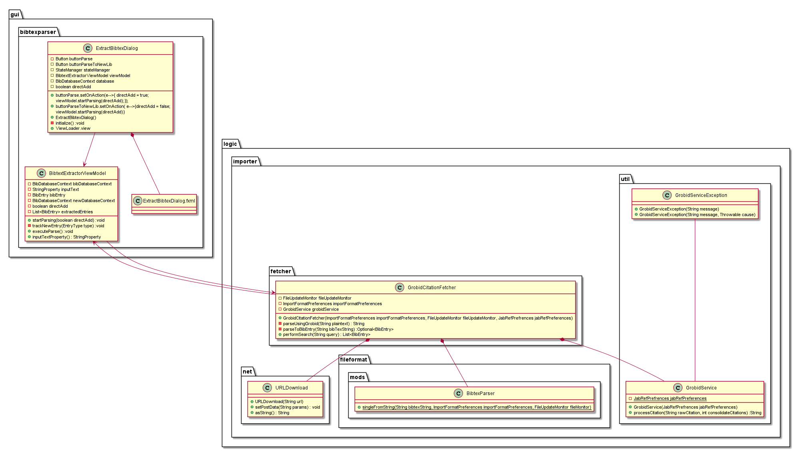
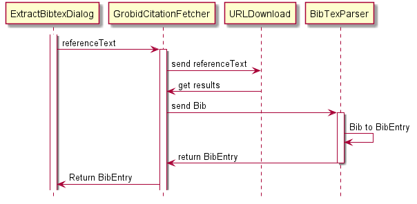
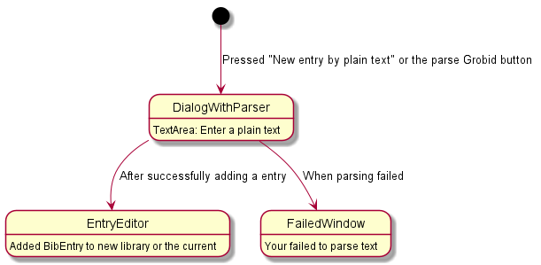
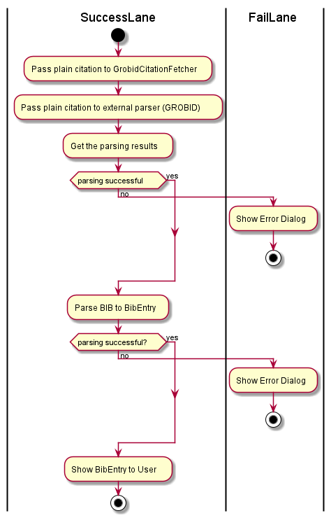

# Technical documentation

## Table of Contents
1. [Introduction](#1-Introduction)  
1.1 [Objective](#1.1-Objective)  
1.2 [Related documents](#1.2-Related-documents)
2. [Project overview](#2-Project-overview)
3. [Design goals](#3-Design-goals)
4. [Feature behaviour](#4-Feature-behaviour)
5. [Design](#5-Design)  
5.1 [Static](#5.1-Static)  
5.2 [Dynamic](#5.2-Dynamic)  
5.3 [Logic](#5.3-Logic)

## **1 Introduction** 
### **1.1 Objective**
This document should help all developers of JabRef and the project by explaining the design and functionality of the feature. After reading this document, the reader should have a better understanding of how the design and functionality of the feature are justified, focusing on the most important concepts.

### **1.2 Related documents**
- [Specification book](../SpecificationBook.md) with [glossary](../Glossary.md)
- [Mockup](../MockUp.pdf)

In case you stumble over an unfamiliar term, please refer to the glossary.

## **2 Project overview**
The feature is an expansion to the existing open source reference manager called **JabRef**. The main goal of the feature is to make it possible for the user to add a new plain text reference (citation) to his existing database. To do so, the user has to:

- Press on the corresponding button in the drop-down context menu or the toolbar button. (A pop-up window opens)
- Paste the plain text reference into the pop-up window.
- Press on the "Parse"-button.
    - The user also has the option to parse multiple text references.
    - The parser filters all relevant references from the text reference.
    - An appropriate BibEntry with the results of the parser is created.
- If the parser succeeded: The user can see and change the entry.
    - If the entry already exists a message is shown.
- Else: An error message is shown.

The external Parser (GROBID) is integrated over a server-client interface. The server is implemented by the GROBID-developers.
The corresponding JabRef-client is part of the project. The request to the server is send via a http POST. The servers answer are the details about the reference, also filled with additional information, which is obtained over GROBID's database.

## **3 Design goals**
- The design must correspond to the JabRef coding conventions.
- The design must use only libraries, which are available as free software.
- The design must be practical and modular.
- The design should be available in multiple languages.
- The design must contain enough self-tests to eliminate any bugs.
- The design must not change the existing design of JabRef

## **4 Feature behaviour**
The feature has only one purpose, which is the inclusion of new BibEntries to already existing JabRef databases by parsing a plain text reference by the external parser GROBID.
The behaviour of the feature is as follows:

- The user can access to the feature over JabRef's GUI.
- The first pop-up window contains a box where the user can paste the plain reference. The window comes with the buttons "Parse" and "Cancel".
    - The "Cancel" button closes the feature, nothing else happens.
    - The "Parse" button sends the entered Text to the external Parser.
- When the external parser is ready, and the response comes back from the server, the feature converts this reply into a BibEntry.
    - The BibEntry is displayed to the user.
    - The user can change the entry if needed.
    - The user can decide if he wants to keep or discard this BibEntry.
- After this process the user can start the process again from the GUI.

If specific conditions are met, the feature behaves slightly different:

- If the user does not enter anything and presses on the "Parse" button, an error message is displayed.
- If the user parses a reference, that is already in the library, the feature shows an information message.

## **5 Design**
The design, which is created in awareness of the goals specified [here](3-Design-goals), is fully integrated in the software JabRef. There are mainly two components: The GUI-integration and the feature logic. The feature logic uses a client to communicate with the external parser. The design is further detailed out on the following UML-diagrams.

### **5.1 Static**
This diagram shows the java classes involved in the feature with their respective links.

### **5.2 Dynamic**
The following diagrams allow some deeper insights into the working principle of the feature.  

**The parsing process**:  

**GUI interaction process**:  

**Track plain reference to BibEntry**:  

### **5.3 Logic** (THESE OCL CONSTRAINS ARE OUT OF DATE)
To explain the logic some further, we formulated 8 logic constrains:

- **context** ParserPipeline::parseUsingGrobid **post:** self.grobidPostService != null
- **context** HttpPostService **inv:** self.url != null
- **context** ParserPipelineException **inv:** self.detailMessage != null
- **context** ExtractBibtexDialog **inv:** stateManager != null and stateManager.getActiveDatabase() != null
- **context** ExtractBibtexDialog::initialize **post:** self.viewModel != null and self.textViewModel != null
- **context** BibtexExtractorViewModel::startParsing **pre:** self.inputText.getValue() != null and self.bibDatabaseContext.getDatabase() != null
- **context** BibtexExtractortViewModel::startParsing **post:** !self.bibDatabaseContext.getDatabase().getEntries().isEmpty()
- **context** BibtexExtractorViewModel::inputTextProperty **pre:** self.inputText != null
