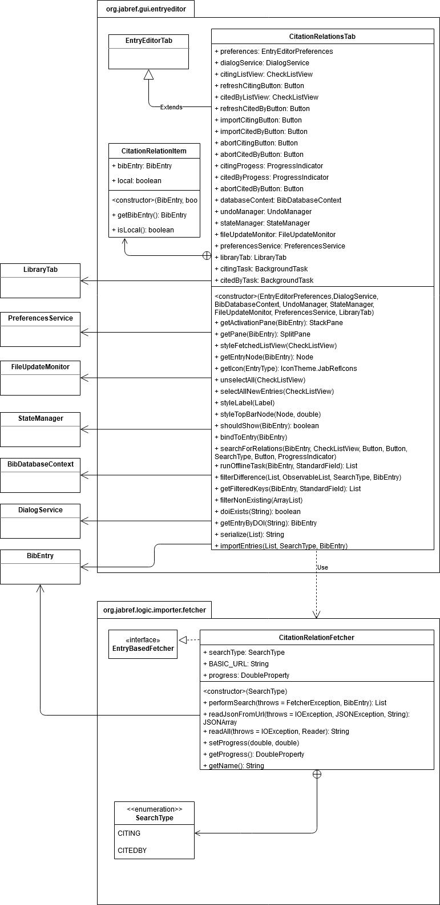
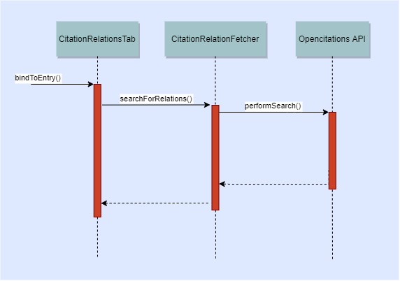
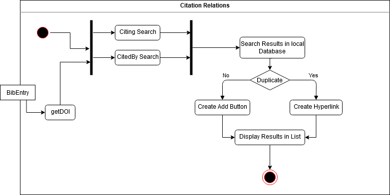
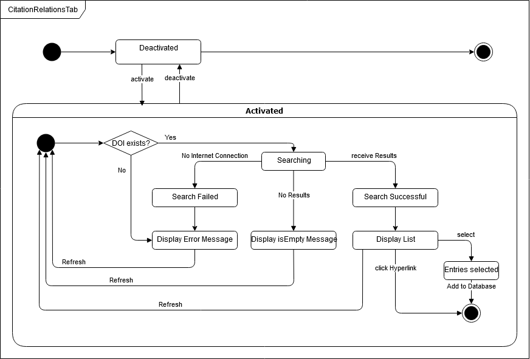
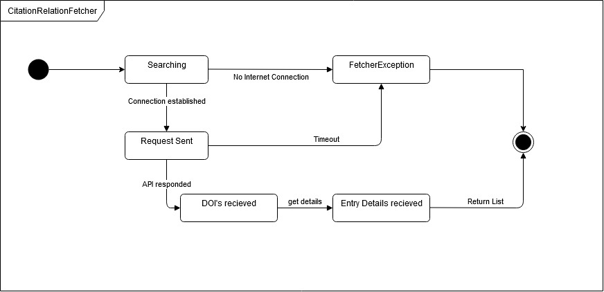

# Technical Documentation

| Version | Projectname | Authors | Status | Date | Commentary |
| ------- | ----------- | ------- | ------ | ----- | --------- |
|  0.1    | Citation Relations | Raphael Kreft| In development | 06.11.2020 | [Projektwebseite](https://unibas-marcelluethi.github.io/software-engineering/project/project-summary.html) , [JabRef Website](https://www.jabref.org/)|
|||Olivier Mattmann||||
|||Matias Carballo||||
|||Tim Bachmann||||

## 1 Introduction

## 1.1 Purpose

This document proposes a technical solution to the specification described in the Specification book.

**Target Group**:

* Developers, specifically the authors of this document
* JabRef Maintainer, specially @koppor

## 1.2 Relations to other documents

* [Specification Book](https://github.com/RaphaelKreft/jabref/blob/docs/docs/sweng/pflichtenheft.md)
* [Glossary](https://github.com/RaphaelKreft/jabref/blob/docs/docs/sweng/glossar.md)
* [ADR-0018](https://github.com/RaphaelKreft/jabref/blob/docs/docs/sweng/0018-use-opencitationsApi-for-citationrelations.md)

The Specification book describes the project, and specifies the requirements. It is the starting point for all following steps. The Glossary contains definitions of all important terms for the project. The architecture decisions document [MADR] (<https://github.com/adr/madr>) contains all important decisions about architecture and implementation of the project.

## 2. System Overview

The project "Citation Relations" is an extension to JabRef that is developed as part of the "Software Engineering" course at the University of Basel. The extension should make it possible for users to search for cited/citing articles, navigate the search results and import them into the Database

## 3. Design goals

* The design of the extension should be inserted into that of JabRef seamlessly
* The design of the UI should be intuitive to users
* The design of the extension should be easy to update
* The design should deliver acceptable performance
* The design should be easy to test

## 4. System behaviour

The extension can be used from a separate tab in the entry editor. The fuction of this extension can be activated and deactivated from this tab. If the extension is activated, citations will be searched for using the API when the user opens the tab. The articles our article cites will be shown in the left part of the tab. The articles that cite our article will be shown on the right side. The search results can be imported into our database via click.

## 5. Design

The following section describes the Mid-Level-Design of the extension using UML diagrams.

## 5.1 Static

Class Diagram of Citation Relations:

### 5.2 Dynamic

Sequence Diagram of Citation Relations:

Activity Diagram of Citation Relations:

State Diagram of CitationRelationTab:

State Diagram of CitationRelationFetcher:

### 5.3 Logic

The logical constraints are specified in this section

* **DOI Nummer benötigt für die Suche**

        context BibEntry inv: self.getField(StandardField.DOI) != NULL

* **Article is not part of the list if already in Database**

        context CitationRelationFetcher::performSearch():List<BibEntry>
        pre: Database.entries.contains(fetchedEntry)
        post: !(List<BibEntry>.contains(fetchedEntry))

* **Article is part of the list if not in Database**

        context CitationRelationFetcher::performSearch():List<BibEntry>        
        pre: !(Database.entries.contains(fetchedEntry))     
        post: List<BibEntry>.add(fetchedEntry)

* **Privacy Dialog must be accepted for search to take place**

        context CitationRelationTab::searchForRelations() inv: self.privacyDialogAccepted = true

* **Searc with valid DOI-Number**

        context CitationRelationFetcher::performSearch(BibEntry)        
        pre: BibEntry.getField(StandardField.DOI) != NULL       
        post: List<BibEntry>.notEmpty()

* **Search with invalid DOI-Number**

        context CitationRelationFetcher::performSearch(BibEntry):List<BibEntry>
        pre: BibEntry.getField(StandardField.DOI) != NULL and BibEntry.getField(StandardField.DOI).wrongFormat()
        post: List<BibEntry>.isEmpty()

* **Fetcher Name**

        context CitationRelationFetcher::getName()
        post: self.name = "CitationRelationFetcher"

* **CitationRelationFetcher needs SearchType**

        context CitationRelationFetcher inv: self.SearchType != NULL      
