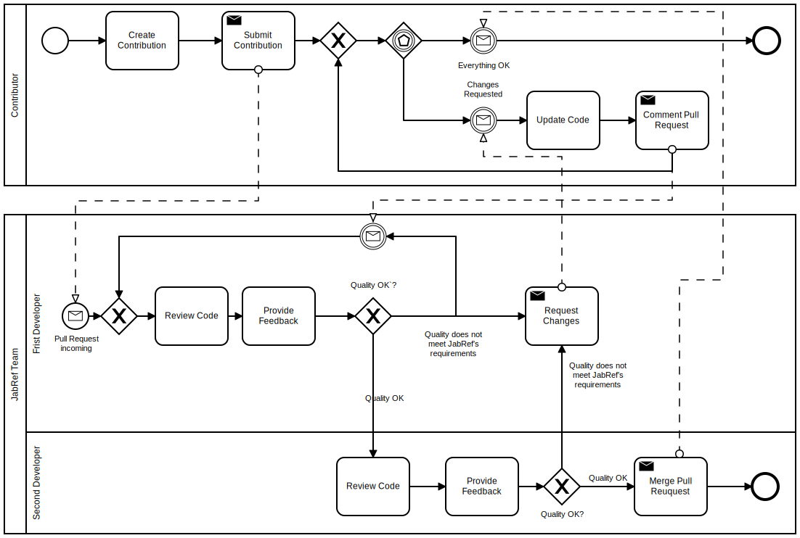
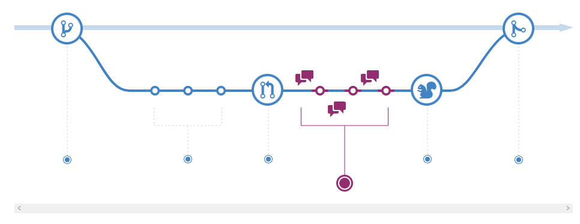
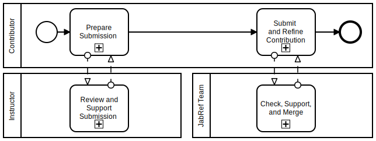

# JabRef and Software Engineering Training

By using JabRef as training object in exercises and labs, students can level-up their coding and project management skills. When taking part in JabRef development, one will learn modern Java coding practices, how code reviews work and how to properly address reviewing feedback.

## Why university instructors should cooperate with us?

* High-quality student education due to real-world tooling and real-world code base
* Sustainability of student works: No more thrown-away solved exercises: They now are incorporated in a real-world product
* No need to provision infra structure
* Visibility of your research groups
* No need to think about basic software engineering exercises anymore: JabRef cooperation partners have them.

## How to integrate JabRef in your class

1. Choose task from the board [Candidates for university projects](https://github.com/orgs/JabRef/projects/3/views/3).
   There, new functionality is categorized in small, medium, and large effort.
   Moreover, categorization on the main focus (UI, logic, or both),
   implementation effort, testing effort, and "issue understanding effort".
   The latter category is important, because some issues are "quick wins" and others need thorough thinking.

   In general, all issues of JabRef are free to take.
   Be aware that the difficulty of bugs and feature vary.
   For the brave, the [Bug Board](https://github.com/orgs/JabRef/projects/7) or the [Feature Board](https://github.com/JabRef/jabref/projects/6) provide other issue sources.
   Especially for Master students, these are excellent boards to find issues that train maintenance knowledge (which is essential for industry work).
   Finally, there is a [collection of good first issues](https://github.com/orgs/JabRef/projects/5), if you search for something to start guiding you though a focused aspect of JabRef's code.
2. Get in touch with the JabRef team to reserve issues for your student group and possibly to discuss details. We offer email, skype, [gitter.im](https://gitter.im/JabRef/jabref), discord. Get in touch with [@koppor](https://github.com/koppor/) to find the right channel and to start forming the success of your course.
3. Schedule tasks with students
4. Students implement code
5. Students review other student's code (recommended: students of a previous year's project review current year's project code)
6. Students address review feedback
7. Students submit pull request
8. Code reviews by JabRef maintainers
9. Students address feedback and learn more about good coding practices by incorporating feedback
10. Students update their pull request
11. Pull request is merged

For a near-to-perfect preparation and effect of the course, we ask you to get in touch with us **four weeks** in advance. Then, the JabRef team can a) learn about the starting skill level of the students, b) the aimed skill level at the end of the course, c) the amount of time the students are given to learn about and contribute to JabRef, d) check the [Candidates for university projects](https://github.com/orgs/JabRef/projects/3/views/3) for appropriate tasks (and fill it as needed), e) recommend appropriate features.

It is also possible to just direct students to our [Contribution Guide](https://devdocs.jabref.org/contributing.html#contribute-code). The learning effect may be lower as the time of the students has to be spent to a) learn about JabRef and b) select an appropriate issue.

Since a huge fraction of software costs is spent on [software maintenance](https://en.wikipedia.org/wiki/Software_maintenance), adding new features also educates in that aspect: perfective maintenance[1](teaching.md#LientzSwanson) is trained. When fixing bugs, corrective maintenance [2](teaching.md#LientzSwanson) is trained.

## Process for contributions

There is no special process for student contributions. We want to discuss it nevertheless to increase awareness of the time required from starting the contribution until the inclusion in a release of JabRef.

The process for accepting contributions is as below. The syntax is [BPMN](https://en.wikipedia.org/wiki/Business_Process_Model_and_Notation) modeled using [bpmn.io](https://bpmn.io).

In short, the contribution is **reviewed by two JabRef developers**. Typically, they have constructive feedback on their contribution. This means, that the contributors get comments on their contribution enabling them to level-up their coding skill. Incorporating improvements takes time, too. The benefit is two-fold: a) contributors improve their coding skills and b) JabRef's code quality improves. All in all, we ask to respect the aims of the JabRef team and to reserve time to incorporate the reviewer's comments.

GitHub describes that in their page [Understanding the GitHub flow](https://guides.github.com/introduction/flow/):

## Process for Java newcomers

Newcomers contributing in the context of a university teaching experience are invited to follow the process described above. In case the capacity of the instructing university allows, we propose a three-step approach. First, the contributors prepare their contribution as usual. Then, they submit the pull request _to a separate repository_. There, the instructor reviews the pull request and provides feedback. This happens in a loop until the instructor shows the green light. Then, the pull request can be submitted to the main JabRef repository. This will help to reduce the load on the JabRef team and improve the quality of the initial pull request.

## Past courses

> In case your course is missing, feel free to add it.

### English as course language

#### Harbin Institute of Technology (HIT), China

Course: Open Source Software Development, 2018, 2019

> In this course, students will be introduced to the processes and tools specific to Open Source Software development, and they will analyze existing projects to understand the architecture and processes of these projects. Besides, students will attempt to contribute source code to a large existing Open Source Software project.

#### King's College London

Course: BSc Computer Science Individual Project, 2022/2023

> Students experience the procedure of finding and fixing small and medium issues in an open source project.

#### Northern Arizona University (NAU), USA

Course [CS499 - Open Source Software Development](https://github.com/igorsteinmacher/CS499-OSS), 2018

> Students experience the process of getting involved in an Open Source project by engaging with a real project. Their goal is to make a "substantial" contribution to a project.

#### University of Tennessee, Knoxville, USA

Diversity awareness course by [Vandana Singh](https://sis.utk.edu/vandana/), 2022

#### University of Victoria, Canada

Course [SENG371: Software Evolution](https://heat.csc.uvic.ca/coview/course/2024011/SENG371) by [Roberto A. Bittencourt](https://sites.google.com/site/robertoabprof/)

> Introduces problems and solutions of long-term software maintenance/evolution and large-scale, long-lived software systems. Topics include software engineering techniques for programming-in-the-large, programming-in-the-many, legacy software systems, software architecture, software evolution, software maintenance, reverse engineering, program understanding, software visualization, advanced issues in object-oriented programming, design patterns, antipatterns, and client-server computing. Culminates in a team project.
>
> During the course, students work in small groups to solve three assignments, each assignment handling three JabRef issues. First assignment deals with small bug fixes. Second assignment handles testing and refactoring. Third assignment handles features or bug fixes that deal with both the GUI and the business logic.

### German as course language

#### Universität Basel, Switzerland

Course [10915-01: Software Engineering](https://dmi.unibas.ch/de/studium/computer-science-informatik/lehrangebot-hs18/vorlesung-software-engineering/), 2019 to 2023

* Lecture Materials: [https://github.com/unibas-marcelluethi/software-engineering](https://github.com/unibas-marcelluethi/software-engineering)
* Excercise touching JabRef:
  * General idea: identify a feature missing in JabRef and develop the specification, system design, and implementation of the feature.
  * Introduction to JabRef's code: [Exercise 5](https://github.com/unibas-marcelluethi/software-engineering/blob/master/docs/week5/exercises/practical-exercises.md): Introduction into JabRef code.
  * Prominent feature implemented: Parse full-text references using Grobid. PR [#5614](https://github.com/JabRef/jabref/pull/5614).

#### University of Stuttgart, Germany

Course "Softwarepraktikum" as part of the [BSc Informatik](https://www.uni-stuttgart.de/studium/bachelor/informatik-b.sc./), 2012

> A group of three students experienced the full software engineering process within one semester. They worked part-time for the project.

Course [Studienprojekt](https://www.f05.uni-stuttgart.de/informatik/studierende/bachelor/stupro/) as part of the [BSc Software Engineering](https://www.uni-stuttgart.de/en/study/study-programs/Software-Engineering-B.Sc-00001./), 2015/2016

> A group of nine students experienced the full software engineering process within one year. They worked part-time for the project.

Course "Programming and Software Development" as part of the [BSc Software Engineering](https://www.uni-stuttgart.de/en/study/study-programs/Software-Engineering-B.Sc-00001./), 2018

> One exercise to contribute a minor fix or feature to JabRef. Goal: learn contribution to an open-source project using git and GitHub.

### Swedish

#### KTH Royal Institute of Technology, Sweden

Course [DD2480 Software Engineering Fundamentals](https://www.kth.se/student/kurser/kurs/DD2480?l=en), 2020, 2024

> Groups of students from three to five persons experienced the whole software engineering process within a week: From the requirements' specification to the final pull request.

### Portuguese

#### Federal University of Technology, Paraná, Brazil

Course [Open Source Software](https://github.com/igorsteinmacher/DSL-UTFPR), 2013 to 2016

> Students are requested to contribute to an Open Source project to learn about the maintenance and evolution of software projects. This project is the predecessor of NAU's CS499.

## Praises and media coverage

* [O. Kopp et al.: JabRef: BibTeX-based literature management software, TUGboat 44(3)](https://doi.org/10.47397/tb/44-3/tb138kopp-jabref) - explains the motivation and the concept of the curated issues.
* "I have learnt more from this single pull request regarding production-ready code than I ever have from my three years of CS degree."
* JabRef mentioned as one of "Top 8 Open Source GitHub Projects to Level-Up Your Coding" by [CodeGym](https://codegym.cc/groups/posts/383-top-8-open-source-github-projects-to-level-up-your-coding).

(Please send us your praise if you enjoyed the experience)

## Notes

1. JabRef tries to achieve high code quality. This ultimately leads to improved software engineering knowledge of contributors. After contributing for JabRef, both coding and general software engineering skills will have increased. Our [development strategy](getting-into-the-code/development-strategy.md) provides more details.
2. We recommend to start early and constantly, since students working earlier and more often produce projects that are more correct and completed earlier at the same overall invested time [1](teaching.md#Ayaankazerouni).
3. Be aware that JabRef is run by volunteers. This implies that the development team cannot ensure to provide feedback on code within hours.
4. Be aware that from the first pull request to the final acceptance the typical time needed is two weeks.
5. Be aware that JabRef tries to achieve high code quality. This leads to code reviews requiring actions from the contributors. This also applies for code of students. Read on at our [Development Strategy](getting-into-the-code/development-strategy.md) for more details.

## References

[1](teaching.md#a1): [@ayaankazerouni](https://github.com/ayaankazerouni): [Developing Procrastination Feedback for Student Software Developers](https://medium.com/@ayaankazerouni/developing-procrastination-feedback-for-student-software-developers-1652de60db7f) [2](teaching.md#a2): Lientz B., Swanson E., 1980: Software Maintenance Management. Addison Wesley, Reading, MA.

<!-- markdownlint-disable-file MD012 -->
