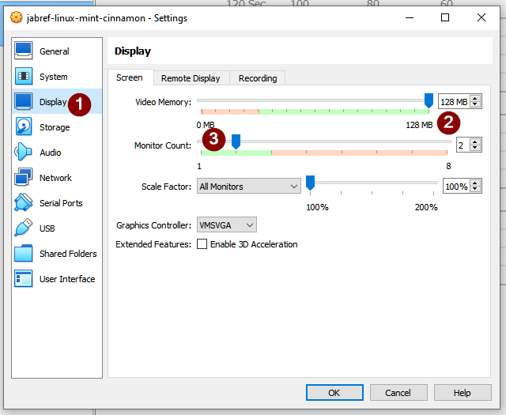

# Virtual Machines for testing JabRef

This folder contains directories making use of [Vagrant](https://www.vagrantup.com/) to install virtual machines on [VirtualBox](https://www.virtualbox.org/)

## Usage

### Prerequisites

1. [Install VirtualBox](https://www.virtualbox.org/wiki/Downloads)
    - Windows: `winget install -e --id Oracle.VirtualBox`
2. [Install Vagrant](https://developer.hashicorp.com/vagrant/install?product_intent=vagrant)
    - Windows: `winget install  -e --id Hashicorp.Vagrant`
3. [Install Vagrant Virtual Box Guest Additions Plugin](https://subscription.packtpub.com/book/cloud-and-networking/9781786464910/1/ch01lvl1sec12/enabling-virtualbox-guest-additions-in-vagrant).
   This helps ensururing that the guest additions of each box are automatically updated.
    - `vagrant plugin install vagrant-vbguest`

### Setup VM

1. `cd` into `{vmdir}`, e..g, `cd ubuntu`
2. Start the vm `vagrant up`
3. Restart the vm
4. Linux virtual machines: Store ssh configuration: `vagrant ssh-config > vagrant-ssh`

### Use VM

You can use the UI offered by the VirtualBox client.
On Linux, you can also do `ssh -Y -F vagrant-ssh default` to SSH into the machine.

If asked for a password, this is `vagrant`.

#### Multiple Screens

One can configure mulitple screen as the virtual machine settings of Virtual Box:
Navigate to "Display" (1), set "Video Memory" to the maximum value (2), and then adjust the number of displays (3).

In case you want to have a fixed resoltuion, one can pin the screen resolution as follows:
During running of Virutal Box,
(1) unselect "Auto-size Guest Display" and
(2) adjust the screen resolution to full HD

### Remove VM

Execute `vagrant destroy`.
Then, everything is removed.

## Available VMs

| VM                                              | JabRef  | Browser | LibreOffice | IntelliJ  |
|-------------------------------------------------|---------|---------|-------------| --------- |
| [`Debian 12`](debian-12/)                       | source  | Firefox | --          | yes       |
| [`fedora`](fedora/)                             | source  | --      | --          | --        |
| [`Linux Mint (Cinnamon)`](linux-mint-cinnamon/) | source  | Firefox | yes         | --        |
| [`ubuntu`](ubuntu/)                             | snap    | Firefox | yes         | --        |
| [`windows 10`](windows10/)                      | source  | Edge    | --          | --        |
| [`windows 11`](windows11/)                      | source  | Edge    | --          | --        |

## Troubleshooting

> VBoxManage.exe: error: Could not rename the directory '`C:\Users\$username\VirtualBox VMs\output-ubuntu_source_1720167378145_42641_1720548095320_67904`' to '`C:\Users\$username\VirtualBox VMs\jabref-ubuntu`' to save the settings file (`VERR_ALREADY_EXISTS`)

Solution: Delete folder `C:\Users\$username\VirtualBox VMs\jabref-ubuntu`

> How to use another JabRef snap image?

Solution: `snap refresh --edge jabref` (or `--stable`, ...).
More info on snaps is available at <https://snapcraft.io/docs/quickstart-tour>.

> `An error occurred during installation of VirtualBox Guest Additions 7.0.20. Some functionality may not work as intended.`

Install the guest additions manually by "Devices" > "Install Virtual Box Gueat Additions".

> I get a strange installation error.

Look at <https://stackoverflow.com/a/78040474/873282>.

> How can I update the guest additions?

They should be automatically updated during a reboot.
A manual update can be triggered by `vagrant vbguest --do install`.
